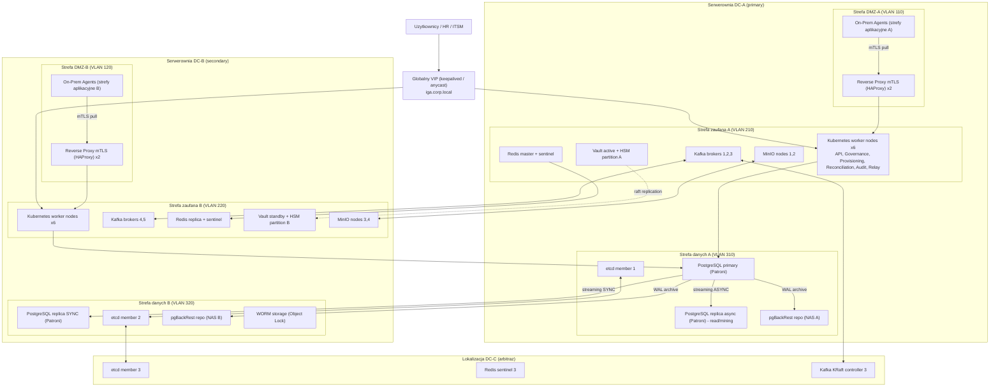

# 2. Architektura Systemu i Model C4

## 2.1 Zasady architektoniczne

1. **Baza danych jest źródłem prawdy, broker jest kanałem transportu.** Żaden komponent nie publikuje zdarzenia do Kafka/RabbitMQ bezpośrednio z transakcji biznesowej; zdarzenia trafiają do tabeli `outbox_event` w tej samej transakcji i są relayowane asynchronicznie (ADR-04).
2. **Stan konta w systemie docelowym jest modelowany jawnie jako automat**, a nie jako flaga boolowska. Spójność między IGA a systemem docelowym jest ostateczna (eventual) i obserwowalna przez stany `PENDING_*`, `VERIFIED_AUTOMATED`, `CONFIRMED_MANUAL`, `DRIFTED` (ADR-01).
3. **Każda operacja mutująca jest idempotentna** i identyfikowana kluczem `idempotency_key` wyprowadzonym deterministycznie z treści operacji.
4. **Separacja płaszczyzny sterowania od płaszczyzny wykonania.** Core (strefa zaufana) decyduje; agenci i konektory (DMZ / strefy aplikacyjne) wykonują i raportują. Agenci nigdy nie inicjują połączeń do bazy danych.
5. **Audyt jest produktem ubocznym transakcji, nie osobnym wywołaniem.** AuditEvent zapisywany jest w tej samej transakcji co zmiana stanu, a hash-chain domykany jest przez pojedynczy, serializowany proces Audit Sealer.
6. **Bezstanowość warstwy obliczeniowej.** API i workery nie trzymają stanu sesji ani zadań w pamięci dłużej niż czas pojedynczej operacji; cały stan trwały jest w PostgreSQL, stan ulotny (locki, cache) w Redis z TTL.

## 2.2 Diagram C4 Container

```mermaid
C4Container
    title IC IGA - Diagram kontenerow (C4 poziom 2)

    Person(end_user, "Uzytkownik biznesowy", "Sklada wnioski, akceptuje, recertyfikuje")
    Person(iga_admin, "Administrator IGA / Security Officer", "Zarzadza politykami, konektorami, wyjatkami SoD")
    Person(fulfiller, "Realizator zadan recznych", "Wykonuje operacje w aplikacjach bez API")
    Person(auditor, "Audytor", "Weryfikuje pakiety dowodowe, lancuch audytowy")

    System_Ext(hr_system, "System HR", "SAP SuccessFactors On-Prem / HCM; zrodlo zdarzen JML")
    System_Ext(idp, "Korporacyjny IdP", "OIDC/SAML; uwierzytelnianie uzytkownikow IGA")
    System_Ext(itsm, "ITSM", "ServiceNow / Jira SM; tickety dla zadan recznych i incydentow")
    System_Ext(siem, "SIEM", "Splunk / Elastic; odbiorca alertow bezpieczenstwa")
    System_Ext(targets_api, "Systemy docelowe z API", "AD, SAP, bazy danych, SCIM, REST/SOAP")
    System_Ext(targets_isolated, "Systemy w sieciach izolowanych", "Dostepne tylko przez agenta on-premise")
    System_Ext(tsa, "Time-Stamping Authority", "RFC 3161; kotwiczenie checkpointow audytu")
    System_Ext(worm, "Pamiec WORM", "Object Lock / NetApp SnapLock; kopia audytu")

    Container_Boundary(iga_core, "IC IGA - Strefa zaufana") {
        Container(web_ui, "Web UI", "TypeScript, React", "Portal samoobslugowy, konsola administracyjna, panel realizatora")
        Container(identity_api, "Identity Core API", "Python 3.11, FastAPI", "CRUD tozsamosci, kont, rol, uprawnien; API zarzadcze; autoryzacja scope-based")
        Container(hr_gateway, "HR Gateway", "Python 3.11, FastAPI + Kafka Producer", "Walidacja, normalizacja i idempotentne przyjecie zdarzen HR")
        Container(governance_engine, "Governance Engine", "Python 3.11, worker daemons", "JML orchestrator, wnioski, workflow akceptacji, kampanie recertyfikacyjne, wyjatki SoD")
        Container(policy_evaluator, "Policy / SoD Evaluator", "Python 3.11, in-process library + gRPC service", "Ewaluacja regul SoD, risk scoring, ABAC/PBAC; reguly skompilowane do bitsetow")
        Container(provisioning_engine, "Provisioning & Connector Engine", "Python 3.11, worker daemons", "Saga orchestrator, kolejka zadan, retry, circuit breaker, DLQ, SDK konektorow")
        Container(agent_gateway, "Agent Gateway", "Python 3.11, FastAPI, mTLS", "Endpoint pull dla agentow on-premise; leasing zadan; odbior raportow")
        Container(reconciliation_svc, "Reconciliation Service", "Python 3.11, worker daemons", "Agregacja stanu systemow docelowych, wykrywanie driftu, silnik polityk reakcji")
        Container(manual_fulfillment, "Manual Fulfillment Connector", "Python 3.11, modul Provisioning Engine", "Zadania reczne, dowody realizacji, import CSV/XLSX, closed-loop diff")
        Container(mining_engine, "Role Mining Engine", "Python 3.11, numpy, pyroaring", "Metody M1-M10, DatasetProfiler, Relaxation Cascade, Ensemble")
        Container(audit_service, "Audit Service", "Python 3.11, worker daemon (Sealer) + API", "Hash-chain, checkpointy Ed25519, weryfikacja, eksport WORM, pakiety dowodowe")
        Container(outbox_relay, "Outbox Relay", "Python 3.11, worker daemon", "Odczyt outbox_event FOR UPDATE SKIP LOCKED, publikacja do brokera, oznaczanie published_at")
        Container(scheduler, "Scheduler", "Python 3.11, APScheduler + Redis lock", "Harmonogramy reconciliation, wygaszanie dostepow czasowych, eskalacje SLA, retencja")

        ContainerQueue(event_bus, "Asynchronous Event Bus", "Apache Kafka 3.6 (5 brokerow, RF=3)", "Topiki: hr.events, iga.domain-events, provisioning.tasks, provisioning.results, reconciliation.deltas, audit.events, dlq.*")
        ContainerDb(postgres, "PostgreSQL 15 (Patroni HA)", "PostgreSQL 15, 1 primary + 2 repliki", "Model danych IGA, outbox, audit chain, historia uprawnien (partycjonowana)")
        ContainerDb(redis, "Redis 7 (Sentinel)", "Redis", "Cache hierarchii rol, distributed locks, idempotency guards, rate limits")
        ContainerDb(object_store, "Object Storage", "MinIO (S3-compatible, on-prem)", "Zalaczniki dowodow, importy CSV, artefakty miningu, pakiety dowodowe")
        Container(vault, "HashiCorp Vault + HSM", "Vault 1.15, PKCS#11", "KEK, klucze Ed25519, Transit engine, PKI dla mTLS")
    }

    Container_Boundary(dmz, "DMZ / strefy aplikacyjne") {
        Container(onprem_agent, "On-Prem Agent", "Python 3.11, systemd service", "Pull zadan przez mTLS, wykonanie lokalne, raport wyniku; brak polaczen przychodzacych")
    }

    Rel(end_user, web_ui, "Uzywa", "HTTPS/TLS 1.3")
    Rel(iga_admin, web_ui, "Uzywa", "HTTPS/TLS 1.3")
    Rel(fulfiller, web_ui, "Realizuje zadania", "HTTPS/TLS 1.3")
    Rel(auditor, web_ui, "Pobiera pakiety dowodowe", "HTTPS/TLS 1.3")
    Rel(web_ui, identity_api, "REST/JSON", "HTTPS")
    Rel(web_ui, idp, "Logowanie OIDC", "HTTPS")
    Rel(identity_api, idp, "Walidacja tokenow JWT (JWKS)", "HTTPS")

    Rel(hr_system, hr_gateway, "Zdarzenia JML", "HTTPS webhook mTLS lub Kafka Connect")
    Rel(hr_gateway, event_bus, "Publikuje hr.events.v1", "Kafka protocol, SASL/mTLS")

    Rel(identity_api, postgres, "Odczyt/zapis", "libpq TLS")
    Rel(identity_api, redis, "Cache, locki", "RESP TLS")
    Rel(identity_api, policy_evaluator, "Pre-request SoD check", "in-process / gRPC")

    Rel(governance_engine, event_bus, "Konsumuje hr.events, iga.domain-events", "Kafka")
    Rel(governance_engine, postgres, "Transakcje biznesowe + outbox + audit", "libpq TLS")
    Rel(governance_engine, policy_evaluator, "Ocena SoD, risk scoring", "in-process")
    Rel(governance_engine, itsm, "Tickety eskalacyjne", "REST")

    Rel(outbox_relay, postgres, "SELECT FOR UPDATE SKIP LOCKED", "libpq TLS")
    Rel(outbox_relay, event_bus, "Publikuje zdarzenia domenowe i zadania", "Kafka")

    Rel(provisioning_engine, event_bus, "Konsumuje provisioning.tasks, publikuje provisioning.results", "Kafka")
    Rel(provisioning_engine, postgres, "Stan zadan, saga log", "libpq TLS")
    Rel(provisioning_engine, vault, "Odszyfrowanie DEK (Transit)", "HTTPS mTLS")
    Rel(provisioning_engine, targets_api, "Operacje provisioningowe", "SCIM 2.0 / REST / SOAP / LDAPS / JDBC")
    Rel(provisioning_engine, agent_gateway, "Kolejkuje zadania dla agentow", "in-process / DB")
    Rel(provisioning_engine, manual_fulfillment, "Deleguje zadania MANUAL", "in-process")
    Rel(manual_fulfillment, itsm, "Tworzy tickety realizacyjne", "REST")
    Rel(manual_fulfillment, object_store, "Zalaczniki dowodow, importy CSV", "S3 API")

    Rel(onprem_agent, agent_gateway, "Pull zadan, push wynikow", "HTTPS mTLS, long-polling")
    Rel(onprem_agent, targets_isolated, "Operacje lokalne", "protokoly natywne")

    Rel(reconciliation_svc, targets_api, "Odczyt stanu kont i uprawnien", "SCIM / REST / LDAPS / JDBC")
    Rel(reconciliation_svc, agent_gateway, "Zleca agregacje agentom", "in-process / DB")
    Rel(reconciliation_svc, postgres, "Snapshoty, delty, decyzje reakcji", "libpq TLS")
    Rel(reconciliation_svc, event_bus, "Publikuje reconciliation.deltas", "Kafka")
    Rel(reconciliation_svc, siem, "Alerty out-of-band, orphan", "Syslog TLS / HTTP Event Collector")

    Rel(mining_engine, postgres, "Odczyt snapshotu z repliki, zapis kandydatow", "libpq TLS")
    Rel(mining_engine, object_store, "Artefakty macierzy, relaxation_trace", "S3 API")

    Rel(audit_service, postgres, "Sealer: domyka bloki hash-chain", "libpq TLS")
    Rel(audit_service, vault, "Podpis Ed25519 checkpointow", "HTTPS mTLS")
    Rel(audit_service, tsa, "Znacznik czasu checkpointu", "RFC 3161 over HTTPS")
    Rel(audit_service, worm, "Eksport segmentow lancucha", "S3 Object Lock / NFS")

    Rel(scheduler, redis, "Lock lidera", "RESP TLS")
    Rel(scheduler, event_bus, "Publikuje zlecenia harmonogramowe", "Kafka")

    UpdateLayoutConfig($c4ShapeInRow="4", $c4BoundaryInRow="1")
```



### 2.2.1 Odpowiedzialności kontenerów i kontrakty wejścia/wyjścia

| Kontener | Wejście | Wyjście | Stan trwały | Skalowanie |
|---|---|---|---|---|
| Identity Core API | HTTPS REST (OpenAPI 3.1), JWT z IdP | Odpowiedzi REST, zapisy do DB + outbox w jednej transakcji | Brak (bezstanowy) | Poziome, 4–12 replik za HAProxy |
| HR Gateway | Webhook HTTPS mTLS lub konsument Kafka Connect z HR | Topic `hr.events.v1` z kluczem `hr_person_id` | Tabela `hr_event_inbox` (dedup, 30 dni) | Poziome, 2–4 repliki |
| Governance Engine | Topiki `hr.events.v1`, `iga.domain-events.v1`, zlecenia schedulera | Mutacje DB + outbox | Brak poza DB | Poziome, grupa konsumentów Kafka (partycje = 48) |
| Policy / SoD Evaluator | Wywołanie in-process (biblioteka) lub gRPC `Evaluate(EvaluationRequest)` | `EvaluationResult` | Skompilowany zestaw reguł w pamięci, odświeżany na zdarzenie `policy.revision.published` | W procesie wywołującego; dodatkowo 2 repliki gRPC dla UI |
| Provisioning & Connector Engine | Topic `provisioning.tasks.v1` | Topic `provisioning.results.v1`, mutacje `provisioning_task`, `account` | Brak poza DB | Poziome; partycje per `connector_pool`, limit równoległości per konektor |
| Agent Gateway | HTTPS mTLS od agentów (`GET /agent/v1/tasks/lease`, `POST /agent/v1/tasks/{id}/result`) | Zadania w leasingu | Tabela `agent_task_lease` | Poziome, 2–4 repliki w strefie zaufanej, publikowane do DMZ przez reverse proxy |
| Reconciliation Service | Zlecenia schedulera, żądania ad-hoc z API | Snapshoty, `reconciliation_delta`, decyzje reakcji → outbox | Snapshoty w DB (partycjonowane) i Parquet w MinIO | Poziome, równoległość per konektor |
| Manual Fulfillment Connector | Zadania `integration_mode=MANUAL`, uploady CSV/XLSX | `manual_task`, tickety ITSM, diff | DB + MinIO | Jak Provisioning Engine |
| Role Mining Engine | Zlecenie `mining_run` (parametry, zakres) | `role_candidate`, `candidate_member`, `rejected_candidate`, `relaxation_trace` | Artefakty w MinIO | Pionowe (32 vCPU / 256 GB), 1 run naraz per klaster, kolejka |
| Audit Service | Odczyt `audit_event` niezapieczętowanych | Bloki hash-chain, checkpointy, eksport WORM | DB | Sealer: dokładnie 1 instancja aktywna (lock Redis + advisory lock PG); API weryfikacji: poziome |
| Outbox Relay | Tabela `outbox_event` | Broker | DB | 2–6 instancji, SKIP LOCKED gwarantuje brak duplikacji odczytu |
| Scheduler | Cron wewnętrzny | Zlecenia na broker / DB | Tabela `scheduled_job_run` | 2 instancje, lider przez Redis lock z fencing token |

## 2.3 Topologia wdrożenia On-Premise i High Availability

### 2.3.1 Rozmieszczenie w serwerowniach



### 2.3.2 Model HA per komponent

| Komponent | Model | Mechanizm przełączania | Czas przełączenia | Uwagi |
|---|---|---|---|---|
| Identity Core API, HR Gateway, Agent Gateway, Web UI | **Active-Active** w obu DC | Kubernetes Deployment, replika min. 2 per DC, VIP keepalived + health-check `/healthz/ready` | < 5 s (usunięcie z puli LB) | Bezstanowe; sesje w JWT, nie po stronie serwera |
| Governance Engine, Provisioning Engine, Reconciliation Service | **Active-Active** (grupy konsumentów Kafka) | Rebalans partycji Kafka po utracie konsumenta (`session.timeout.ms=30000`) | < 45 s | Przetwarzanie idempotentne, więc podwójne dostarczenie po rebalansie jest bezpieczne |
| Outbox Relay | **Active-Active** | `FOR UPDATE SKIP LOCKED` | natychmiast | Brak lidera; każda instancja pobiera inne wiersze |
| Audit Sealer | **Active-Passive** (dokładnie 1 aktywny) | PostgreSQL advisory lock `pg_try_advisory_lock(hashtext('audit_sealer'))` trzymany przez sesję + Redis lock z fencing token jako drugi poziom | < 30 s (TTL locka) | Serializacja jest wymogiem poprawności łańcucha |
| Scheduler | **Active-Passive** | Redis `SET NX PX 15000` z odnowieniem co 5 s, fencing token zapisywany w `scheduled_job_run` | < 15 s | Każdy job idempotentny po `(job_name, scheduled_for)` |
| PostgreSQL | **Active-Passive** z automatycznym failoverem | Patroni (etcd kworum 3 węzłów w 3 lokalizacjach), `synchronous_mode: true`, `synchronous_mode_strict: false`, `synchronous_standby_names` = replika w DC-B | < 60 s (ttl=30, loop_wait=10, retry_timeout=10) | Replika w DC-A asynchroniczna, przeznaczona do odczytów raportowych i miningu (`hot_standby_feedback=on`) |
| Kafka | **Active-Active** klaster rozciągnięty | KRaft 3 kontrolery (DC-A, DC-B, DC-C), 5 brokerów (3 DC-A, 2 DC-B), `replication.factor=3`, `min.insync.replicas=2`, `acks=all`, rack awareness (`broker.rack`) | Lider partycji przełączany < 10 s | Alternatywa RabbitMQ: klaster 3 węzłów z quorum queues (patrz 5.3) |
| Redis | **Active-Passive** | Sentinel (3 w 3 lokalizacjach), `min-replicas-to-write 1` | < 10 s | Cache odtwarzalny; locki używają fencing tokens, więc utrata locka po failoverze nie łamie poprawności |
| Vault | **Active-Standby** (Raft) | Integrated storage Raft 3 węzły, auto-unseal z HSM PKCS#11 | < 10 s | Klucze nigdy nie opuszczają HSM (klucze podpisu Ed25519, KEK) |
| MinIO | **Active-Active** erasure coding | 4 węzły × 4 dyski, parzystość EC:4 (tolerancja utraty 2 węzłów lub 4 dowolnych dysków) | natychmiast dla odczytu i zapisu | Rozciągnięty między DC-A i DC-B; site replication jako opcja dodatkowa |
| HSM | **Active-Active** | 2 partycje w klastrze HA producenta (np. Thales Luna HA group) | natychmiast | Kopia zapasowa kluczy w sejfie offline (ceremonia kluczy) |

### 2.3.3 Separacja stref sieciowych

| Strefa | VLAN | Zawartość | Dozwolony ruch przychodzący | Dozwolony ruch wychodzący |
|---|---|---|---|---|
| Użytkownicy / sieć korporacyjna | N/A | Przeglądarki, HR, ITSM | — | HTTPS 443 do VIP IGA |
| DMZ | 110 / 120 | Reverse proxy mTLS, agenci | 443 od agentów (mTLS), 443 od reverse proxy do Agent Gateway | Agenci: do systemów izolowanych (porty natywne), do reverse proxy 443. **Brak** ruchu do VLAN 310/320 |
| Strefa zaufana | 210 / 220 | Kubernetes, Kafka, Redis, Vault, MinIO | 443 od VIP, 443 od reverse proxy (tylko do Agent Gateway), 9093 Kafka wewnętrznie | Do strefy danych (5432), do systemów docelowych z API (porty per konektor przez firewall z allowlistą per `application_id`), do IdP, ITSM, SIEM, TSA |
| Strefa danych | 310 / 320 | PostgreSQL, etcd, pgBackRest, WORM | 5432 od strefy zaufanej (tylko role aplikacyjne), 2379/2380 etcd między członkami, 5432 replikacja między DC | WAL archive do NAS, replikacja |
| Arbitraż | DC-C | etcd, sentinel, KRaft controller | Porty klastrowe od DC-A/DC-B | Jak wyżej |

Reguły firewall między strefami są egzekwowane sprzętowo (firewall L4) oraz dodatkowo przez NetworkPolicy w Kubernetes. Każdy konektor ma własną regułę wychodzącą z adresem docelowym; zmiana reguły wymaga zmiany w rejestrze aplikacji (`application.connector_config.network_target`) i jest audytowana.

### 2.3.4 Zachowanie przy partycji sieci między DC-A i DC-B

| Scenariusz | Zachowanie | Gwarancja |
|---|---|---|
| Utrata łącza DC-A ↔ DC-B, DC-C widzi oba | etcd: kworum zachowuje DC-A + DC-C → primary PG pozostaje w DC-A. Patroni przełącza `synchronous_mode` na tryb degradowany (zapis kontynuowany bez repliki sync po `synchronous_mode_strict=false`), alert P1 (SLO-14). Kafka: partycje z ISR tylko w DC-B stają się niedostępne do zapisu (min.insync=2), producenci retry'ują | Brak split-brain, brak utraty potwierdzonych zapisów; degradacja RPO z 0 do czasu partycji (sygnalizowana) |
| Utrata całego DC-A | etcd kworum DC-B + DC-C → Patroni promuje PG_B1 (sync, zero utraty). Kafka: kontrolery DC-B + DC-C, brokery DC-B (2) → partycje z RF=3 mają co najmniej 1 replikę w DC-B dzięki rack awareness; min.insync=2 niespełnione dla części partycji → tymczasowa niedostępność zapisu do czasu ręcznego obniżenia `min.insync.replicas=1` (runbook RB-07) lub przywrócenia DC-A | RPO 0, RTO < 15 min z runbookiem |
| Utrata DC-C (arbitraż) | Brak wpływu funkcjonalnego, kworum DC-A + DC-B | — |
| Partycja DMZ ↔ strefa zaufana | Agenci nie mogą pobrać zadań; leasingi wygasają (TTL 300 s); zadania wracają do kolejki; po przywróceniu agent odbiera ponownie z tym samym `idempotency_key` | At-least-once bez duplikacji efektów |

## 2.4 Sizing, pojemność i partycjonowanie

### 2.4.1 Założenia wolumetryczne

| Encja | Liczność bazowa | Przyrost roczny | Średni rozmiar wiersza (dane) | Narzut indeksów | Uwagi |
|---|---|---|---|---|---|
| `identity` | 140 000 (100 000 aktywnych + 40 000 historycznych) | +12 000 netto | 4 KB (JSONB atrybutów HR) | ×1,8 | SCD2 w `identity_revision` |
| `identity_revision` | 1 400 000 | +1 200 000 | 3 KB | ×1,3 | Średnio 10 rewizji / tożsamość / rok (mover, zmiana atrybutów) |
| `account` | 1 500 000 | +150 000 | 2 KB | ×2,0 | Indeksy: `(application_id, native_id)`, `identity_id`, `state` |
| `entitlement_def` | 450 000 | +30 000 | 1 KB | ×1,5 | Definicje uprawnień we wszystkich aplikacjach |
| `entitlement_assignment` | 5 000 000 | +500 000 | 0,5 KB | ×2,2 | Bieżący stan; indeksy na `account_id`, `entitlement_id`, `(identity_id, entitlement_id)`, `valid_to` częściowy |
| `entitlement_assignment_history` | 0 | +110 000 000 | 0,4 KB | ×1,25 (BRIN + 1 btree) | ok. 300 000 zmian / dzień (JML, reconciliation, wnioski); partycjonowana miesięcznie |
| `provisioning_task` | 0 | +40 000 000 | 1,5 KB (payload JSONB) | ×1,4 | ok. 110 000 / dzień; partycjonowana miesięcznie, retencja 24 mies. w DB, dalej archiwum |
| `outbox_event` | rolling | 3 000 000 / dzień | 1 KB | ×1,3 | Retencja 7 dni (po publikacji), partycje dzienne |
| `audit_event` | 0 | +420 000 000 | 1,2 KB | ×1,3 (BRIN na `occurred_at`, btree na `event_id`, `actor_id`, hash) | ok. 35 000 000 / miesiąc; partycjonowana miesięcznie; retencja 7 lat (SOX) |
| `audit_checkpoint` | 0 | +525 600 | 0,5 KB | ×1,2 | 1 checkpoint / minutę |
| `reconciliation_snapshot_entry` | rolling | 90 dni × 1 000 000 delt / dzień | 0,3 KB | ×1,3 | Pełne snapshoty w Parquet w MinIO (4 GB skompresowane / tydzień, retencja 13 tygodni) |
| `certification_item` | 0 | +6 000 000 | 1 KB | ×1,5 | 4 kampanie kwartalne × 1,5 mln pozycji |
| `access_request` + `access_request_item` | 0 | +1 500 000 + 4 500 000 | 2 KB + 0,8 KB | ×1,5 | |
| `manual_task` | 0 | +900 000 | 2 KB | ×1,5 | 470 aplikacji manualnych |
| mining (`role_candidate`, `candidate_member`, `rejected_candidate`) | per run | 24 runy / rok × (10 000 kandydatów + 2 000 000 członkostw) | 0,2 KB | ×1,5 | Retencja 24 runy |

### 2.4.2 Szacunki storage (PostgreSQL + MinIO + WORM)

Wartości obejmują dane, indeksy i 20 % narzutu na bloat / free space map. Kompresja TOAST dla JSONB uwzględniona współczynnikiem 0,7 dla payloadów.

| Grupa | Rok 1 | Rok 3 | Rok 5 | Komentarz |
|---|---|---|---|---|
| Model bieżący (identity, account, entitlement_def, entitlement_assignment, role, policy) | 18 GB | 24 GB | 30 GB | Wzrost liniowy ok. 10 %/rok |
| `identity_revision` | 6 GB | 16 GB | 26 GB | |
| `entitlement_assignment_history` | 66 GB | 198 GB | 330 GB | Retencja 7 lat, w DB pełna |
| `provisioning_task` | 100 GB | 200 GB | 200 GB | Retencja 24 mies. w DB; starsze partycje odłączane i eksportowane do Parquet w MinIO (ok. 15 GB / rok skompresowane) |
| `audit_event` + `audit_block` + `audit_checkpoint` | 785 GB | 2 355 GB | 3 925 GB | 420 mln × 1,2 KB × 1,3 × 1,2 = 785 GB / rok; retencja 7 lat w DB (partycje > 3 lat przenoszone na wolniejszy tablespace SAN tier 2) |
| `certification_*`, `access_request_*`, `manual_task` | 20 GB | 60 GB | 100 GB | |
| `outbox_event` (rolling 7 dni) | 27 GB | 27 GB | 27 GB | Stały |
| `reconciliation_*` (rolling 90 dni) | 35 GB | 35 GB | 35 GB | Stały |
| mining | 8 GB | 8 GB | 8 GB | Rolling 24 runy |
| **PostgreSQL razem (primary)** | **1,07 TB** | **2,93 TB** | **4,69 TB** | Każda replika tyle samo; 3 kopie = ×3 |
| WAL + pgBackRest (14 dni pełne + przyrostowe, 30 dni WAL) | 450 GB | 900 GB | 1 200 GB | WAL ok. 25 GB / dzień |
| MinIO (załączniki dowodów ok. 300 KB × 900 000 / rok, importy CSV, Parquet snapshoty, artefakty miningu, pakiety dowodowe) | 420 GB | 1 100 GB | 1 800 GB | Erasure coding EC:4 → surowa pojemność ×2 |
| WORM (eksport segmentów audit chain, skompresowany zstd ×0,35) | 275 GB | 825 GB | 1 375 GB | Retencja 7 lat, Object Lock Compliance mode |

Zalecana alokacja początkowa SAN dla strefy danych: 8 TB (tier 1 NVMe) na węzeł PostgreSQL z planem rozszerzenia do 12 TB w roku 4; tier 2 (SAS) 6 TB na węzeł dla partycji audytowych starszych niż 36 miesięcy (tablespace `ts_audit_cold`).

### 2.4.3 Strategia partycjonowania

Wszystkie tabele o charakterze append-only lub czasowym są partycjonowane deklaratywnie metodą **RANGE po kolumnie czasowej**, z partycjami tworzonymi z wyprzedzeniem 3 okresów przez job `partition_maintenance` (pg_partman lub własny job schedulera) i odłączanymi (`DETACH PARTITION CONCURRENTLY`) po upływie retencji.

| Tabela | Klucz partycjonowania | Granulacja | Retencja w DB | Indeksy per partycja | Uzasadnienie |
|---|---|---|---|---|---|
| `audit_event` | `occurred_at` | miesiąc | 84 miesiące | BRIN `(occurred_at)` pages_per_range=32; btree `(event_id)` UNIQUE; btree `(actor_id, occurred_at)`; btree `(subject_type, subject_id, occurred_at)`; GIN `(payload jsonb_path_ops)` tylko dla ostatnich 3 partycji | Zapytania audytowe są prawie zawsze ograniczone czasowo; BRIN daje < 1 % narzutu na 500 GB / rok |
| `audit_block` | `sealed_at` | miesiąc | 84 miesiące | btree `(block_no)` UNIQUE, btree `(block_hash)` | Weryfikacja łańcucha iteruje sekwencyjnie po `block_no` |
| `outbox_event` | `created_at` | dzień | 7 dni po publikacji | btree częściowy `(created_at) WHERE published_at IS NULL`; btree `(aggregate_id)` | Relay czyta tylko niepublikowane; partycja dzienna umożliwia `DROP PARTITION` zamiast DELETE i eliminuje bloat |
| `entitlement_assignment_history` | `valid_from` | miesiąc | 84 miesiące | BRIN `(valid_from)`; btree `(identity_id, valid_from)`; btree `(entitlement_id, valid_from)` | Pytania „kto miał X w dniu D” i „co miał Y w dniu D” |
| `provisioning_task` | `created_at` | miesiąc | 24 miesiące | btree `(state, next_attempt_at) WHERE state IN ('QUEUED','RETRY_WAIT')` częściowy; btree `(idempotency_key)` UNIQUE; btree `(saga_id)`; btree `(account_id, created_at)` | Worker pobiera po stanie i czasie; unikalność idempotency_key per partycja jest wystarczająca, bo klucz zawiera znacznik daty utworzenia (sekcja 5.3.2) |
| `reconciliation_snapshot_entry` | `snapshot_at` | tydzień | 13 tygodni | btree `(run_id, application_id, native_id)` | |
| `reconciliation_delta` | `detected_at` | miesiąc | 36 miesięcy | btree `(application_id, delta_type, state)` | Delty są dowodem dla audytu |
| `hr_event_inbox` | `received_at` | dzień | 30 dni | btree `(dedup_key)` UNIQUE | |
| `identity_revision` | brak partycjonowania | — | bezterminowo | btree `(identity_id, revision_no)` UNIQUE; btree `(identity_id, valid_to) WHERE valid_to IS NULL` | Rozmiar umiarkowany, zapytania po tożsamości |
| `certification_item` | `campaign_id` (LIST) | kampania | bezterminowo (dowód) | btree `(reviewer_id, state)`; btree `(subject_identity_id)` | Kampania jest naturalną jednostką cyklu życia; LIST pozwala na `DETACH` zamkniętej kampanii do archiwum |

Przykładowa definicja DDL dla `audit_event`:

```sql
CREATE TABLE audit_event (
    event_id        uuid        NOT NULL,
    occurred_at     timestamptz NOT NULL,
    event_type      text        NOT NULL,
    actor_type      text        NOT NULL,
    actor_id        uuid,
    actor_session_id text,
    subject_type    text        NOT NULL,
    subject_id      uuid,
    correlation_id  uuid        NOT NULL,
    causation_id    uuid,
    payload         jsonb       NOT NULL,
    payload_hash    bytea       NOT NULL,
    pii_key_id      uuid,
    block_no        bigint,
    CONSTRAINT audit_event_pk PRIMARY KEY (occurred_at, event_id)
) PARTITION BY RANGE (occurred_at);

CREATE TABLE audit_event_2026_10 PARTITION OF audit_event
    FOR VALUES FROM ('2026-10-01') TO ('2026-11-01');

CREATE INDEX audit_event_2026_10_brin ON audit_event_2026_10 USING brin (occurred_at) WITH (pages_per_range = 32);
CREATE UNIQUE INDEX audit_event_2026_10_event_id ON audit_event_2026_10 (event_id);
CREATE INDEX audit_event_2026_10_actor ON audit_event_2026_10 (actor_id, occurred_at);
CREATE INDEX audit_event_2026_10_subject ON audit_event_2026_10 (subject_type, subject_id, occurred_at);
CREATE INDEX audit_event_2026_10_block ON audit_event_2026_10 (block_no);

REVOKE UPDATE, DELETE, TRUNCATE ON audit_event FROM PUBLIC, iga_app, iga_worker;
GRANT INSERT, SELECT ON audit_event TO iga_app, iga_worker;
GRANT UPDATE (block_no) ON audit_event TO iga_audit_sealer;
```

Jedyna dozwolona aktualizacja na `audit_event` to ustawienie `block_no` przez rolę `iga_audit_sealer` (przypisanie zdarzenia do zapieczętowanego bloku). Trigger `audit_event_immutable` odrzuca każdą zmianę pozostałych kolumn.

### 2.4.4 Strategia indeksowania (zasady ogólne)

1. **Indeksy częściowe dla stanów przejściowych.** Kolejki (`provisioning_task`, `outbox_event`, `manual_task`) mają indeksy wyłącznie na wierszach „do przetworzenia”; wiersze zakończone nie obciążają indeksu.
2. **BRIN dla kolumn monotonicznych czasowo** w tabelach append-only (`audit_event`, `entitlement_assignment_history`).
3. **Indeksy pokrywające (INCLUDE)** dla gorących zapytań: `entitlement_assignment (identity_id) INCLUDE (entitlement_id, valid_to, source)` eliminuje heap fetch podczas oceny SoD.
4. **GIN jsonb_path_ops** tylko tam, gdzie zapytania po atrybutach JSONB są wymagane (atrybuty HR w `identity`, payload w ostatnich partycjach audytu).
5. **Brak indeksów na kolumnach o niskiej kardynalności bez warunku częściowego** (np. `state` samodzielnie).
6. **Autovacuum agresywny** dla tabel kolejkowych: `autovacuum_vacuum_scale_factor=0.01`, `autovacuum_vacuum_cost_delay=2ms`, `fillfactor=70` dla `provisioning_task` (HOT updates).

### 2.4.5 Buforowanie i optymalizacja zapytań grafowych (hierarchie ról i grup)

Hierarchia ról (rola biznesowa → role techniczne → uprawnienia) oraz hierarchia grup w systemach docelowych (zagnieżdżone grupy AD) są grafami skierowanymi acyklicznymi (DAG). Pytania zadawane setki razy na sekundę: „jaki jest efektywny zbiór uprawnień tożsamości I”, „które role zawierają uprawnienie E”, „czy nadanie roli R wprowadza uprawnienie z toksycznej pary”.

**Strategia trójwarstwowa:**

1. **Tabela domknięcia przechodniego (closure table) `role_closure(ancestor_role_id, descendant_role_id, depth)`** utrzymywana transakcyjnie przy każdej zmianie hierarchii. Dla 7 200 ról i średniej głębokości 3 tabela ma ok. 60 000 wierszy. Zapytanie o efektywne uprawnienia roli to pojedynczy JOIN bez rekurencji:

```sql
SELECT DISTINCT re.entitlement_id
FROM role_closure rc
JOIN role_entitlement re ON re.role_id = rc.descendant_role_id
WHERE rc.ancestor_role_id = $1
  AND re.revision_id = (SELECT current_revision_id FROM role WHERE role_id = re.role_id);
```

   Cykle są wykluczane triggerem `role_hierarchy_no_cycle`, który przed INSERT do `role_hierarchy(parent_role_id, child_role_id)` sprawdza `NOT EXISTS (SELECT 1 FROM role_closure WHERE ancestor_role_id = child AND descendant_role_id = parent)`.

2. **Zmaterializowany efektywny zbiór uprawnień per tożsamość** w tabeli `identity_effective_entitlement(identity_id, entitlement_id, source_kind, source_id, valid_to)` odświeżany przyrostowo przez zdarzenia domenowe (`role.assigned`, `role.revision.published`, `entitlement.assigned`). Dla 5 mln bezpośrednich + ok. 7 mln pośrednich uprawnień tabela ma ok. 12 mln wierszy (6 GB z indeksami). Odświeżenie po publikacji nowej rewizji roli o 2 000 członkach to ok. 40 ms (UPSERT wsadowy po `identity_id` z partycjonowaniem hash na 32 partycje dla równoległości).

3. **Cache Redis dla ewaluacji SoD**: bitset efektywnych uprawnień tożsamości zserializowany jako Roaring Bitmap (klucz `eff:{identity_id}:{entitlement_space_version}`, średnio 400 B, TTL 15 min, inwalidacja przez zdarzenie). Przy 100 000 tożsamości pełny cache zajmuje ok. 60 MB. Ewaluator SoD wykonuje `AND` bitsetu tożsamości z bitsetami reguł (sekcja 6.4) w czasie poniżej 1 ms.

**Grupy zagnieżdżone w systemach docelowych** (AD, LDAP): konektor podczas agregacji spłaszcza członkostwo do poziomu uprawnień efektywnych (`memberOf` rozwijane rekurencyjnie po stronie konektora z limitem głębokości 20 i detekcją cykli), zapisując zarówno członkostwo bezpośrednie, jak i efektywne z flagą `is_direct`. Dzięki temu IGA nigdy nie wykonuje rekurencji na grafie grup w czasie oceny polityk.

**Zapytania rekurencyjne (WITH RECURSIVE)** są dozwolone wyłącznie w operacjach administracyjnych (wizualizacja hierarchii, walidacja spójności closure table — job nocny porównujący closure z rekurencją na `role_hierarchy`).

### 2.4.6 Parametry PostgreSQL referencyjne (węzeł 32 vCPU / 256 GB RAM / NVMe)

| Parametr | Wartość | Uzasadnienie |
|---|---|---|
| `shared_buffers` | 64 GB | 25 % RAM |
| `effective_cache_size` | 192 GB | |
| `work_mem` | 64 MB (sesje OLTP), 1 GB (sesje mining/raportowe przez `ALTER ROLE iga_mining SET work_mem`) | |
| `maintenance_work_mem` | 4 GB | Budowa indeksów na partycjach |
| `max_connections` | 400 (za PgBouncer w trybie transaction, pula 2 000 połączeń klienckich) | |
| `wal_level` | `replica` | |
| `synchronous_commit` | `on` (remote_flush) dla transakcji biznesowych; `local` dla sesji mining | RPO 0 tam, gdzie ma znaczenie |
| `max_wal_size` | 64 GB | Burst JML |
| `checkpoint_completion_target` | 0,9 | |
| `random_page_cost` | 1,1 | NVMe |
| `effective_io_concurrency` | 200 | |
| `max_parallel_workers_per_gather` | 4 (OLTP), 16 (mining) | |
| `idle_in_transaction_session_timeout` | 30 s | Ochrona Outbox i kolejek |
| `statement_timeout` | 30 s (API), 10 min (workery), brak (mining) | |
| `log_min_duration_statement` | 500 ms | |
| `default_toast_compression` | `lz4` | Szybsza kompresja JSONB |

## 2.5 Przepływ danych między strefami (zasada „nic nie wchodzi do Core z DMZ”)

Jedynym punktem styku DMZ ze strefą zaufaną jest reverse proxy terminujące mTLS i przekazujące ruch wyłącznie do Agent Gateway na ścieżkach `/agent/v1/*`. Agent Gateway waliduje: certyfikat klienta (łańcuch do wewnętrznego CA IGA, brak odwołania przez OCSP stapling), zgodność `agent_id` z fingerprintem w rejestrze, ważność leasingu. Wszystkie dane z agentów (wyniki, snapshoty) są traktowane jako niezaufane wejście i walidowane schematem Pydantic przed zapisem.
