# 3. Modele Danych i Schematy (Data Model)

## 3.1 Konwencje modelu

| Konwencja | Reguła |
|---|---|
| Klucze główne | `uuid` v7 (monotoniczne czasowo, generowane w aplikacji przez `uuid6.uuid7()`), co zapewnia lokalność w indeksach B-tree i brak hot-spotu na ostatniej stronie |
| Czas | Wyłącznie `timestamptz` w UTC; strefa czasowa użytkownika stosowana tylko w prezentacji |
| Stany | Kolumna `state text` z ograniczeniem `CHECK (state IN (lista wartości))` generowanym z enumeracji Pythona; przejścia egzekwowane w kodzie przez automat i w DB przez trigger `enforce_transition(table, from_state, to_state)` czytający tabelę `state_transition_matrix` |
| Historia | Wzorzec SCD2 (`valid_from`, `valid_to`, `revision_no`) dla encji wymagających rekonstrukcji stanu „na dzień D”: `identity`, `role`, `policy`, `entitlement_assignment` |
| Niemutowalność | Tabele `*_revision`, `audit_*`, `*_history`, `outbox_event` (poza `published_at`), `rejected_candidate` nie przyjmują UPDATE/DELETE z ról aplikacyjnych |
| Soft delete | Nie stosowany dla encji nadzorowanych; zamiast tego stany terminalne (`RETIRED`, `DELETED_IN_TARGET`) |
| Atrybuty rozszerzalne | `jsonb` z walidacją JSON Schema w aplikacji; zabronione przechowywanie w JSONB kluczy obcych używanych do JOIN-ów |
| PII | Kolumny PII oznaczone komentarzem `COMMENT ON COLUMN identity.given_name IS 'PII'` (analogicznie dla każdej kolumny PII); w audycie PII występuje wyłącznie w formie zaszyfrowanej kluczem per tożsamość (`pii_key_id`) umożliwiającym krypto-shredding |

## 3.2 Schemat ERD

Schemat przedstawiony jest w dwóch widokach ze względu na czytelność; oba widoki opisują jedną bazę danych i łączą się przez encje `IDENTITY`, `ACCOUNT`, `ENTITLEMENT_DEF`, `ROLE`, `APPLICATION`.

### 3.2.1 Widok A: tożsamości, uprawnienia, polityki, nadzór

```mermaid
erDiagram
    IDENTITY ||--o{ IDENTITY_REVISION : "ma rewizje"
    IDENTITY ||--o{ ACCOUNT : "posiada"
    IDENTITY ||--o{ ROLE_ASSIGNMENT : "ma przypisane role"
    IDENTITY ||--o{ ENTITLEMENT_ASSIGNMENT : "ma uprawnienia"
    IDENTITY ||--o{ ACCESS_REQUEST : "sklada"
    IDENTITY ||--o{ SOD_EXCEPTION : "jest beneficjentem"
    IDENTITY ||--o{ IDENTITY_MERGE : "zostala scalona"
    IDENTITY }o--o| IDENTITY : "manager"

    APPLICATION ||--o{ ACCOUNT : "zawiera"
    APPLICATION ||--o{ ENTITLEMENT_DEF : "definiuje"
    APPLICATION ||--o{ FULFILLMENT_GROUP : "obsluguje"
    APPLICATION ||--o| CONNECTOR_CREDENTIAL : "uwierzytelnia sie"
    APPLICATION }o--|| IDENTITY : "owner"

    ACCOUNT ||--o{ ENTITLEMENT_ASSIGNMENT : "nosi"
    ACCOUNT ||--o{ ACCOUNT_STATE_HISTORY : "zmienia stan"

    ENTITLEMENT_DEF ||--o{ ENTITLEMENT_ASSIGNMENT : "jest przypisane"
    ENTITLEMENT_DEF ||--o{ ROLE_ENTITLEMENT : "wchodzi w sklad roli"
    ENTITLEMENT_DEF ||--o{ POLICY_RULE_OPERAND : "wystepuje w regule"
    ENTITLEMENT_DEF ||--o{ ENTITLEMENT_DEF_REVISION : "ma rewizje"
    ENTITLEMENT_ASSIGNMENT ||--o{ ENTITLEMENT_ASSIGNMENT_HISTORY : "historia"

    ROLE ||--o{ ROLE_REVISION : "ma rewizje"
    ROLE_REVISION ||--o{ ROLE_ENTITLEMENT : "zawiera"
    ROLE ||--o{ ROLE_HIERARCHY : "parent"
    ROLE ||--o{ ROLE_HIERARCHY : "child"
    ROLE ||--o{ ROLE_CLOSURE : "ancestor"
    ROLE ||--o{ ROLE_CLOSURE : "descendant"
    ROLE ||--o{ ROLE_ASSIGNMENT : "jest przypisana"
    ROLE ||--o{ BIRTHRIGHT_RULE : "nadawana automatycznie"

    POLICY ||--o{ POLICY_REVISION : "ma rewizje"
    POLICY_REVISION ||--o{ POLICY_RULE : "zawiera"
    POLICY_RULE ||--o{ POLICY_RULE_OPERAND : "operandy"
    POLICY_RULE ||--o{ SOD_VIOLATION : "wykryta"
    SOD_VIOLATION }o--o| SOD_EXCEPTION : "zlagodzona przez"

    ACCESS_REQUEST ||--|{ ACCESS_REQUEST_ITEM : "pozycje"
    ACCESS_REQUEST ||--o{ APPROVAL_STEP : "sciezka akceptacji"
    ACCESS_REQUEST_ITEM }o--o| ROLE : "o role"
    ACCESS_REQUEST_ITEM }o--o| ENTITLEMENT_DEF : "o uprawnienie"
    ACCESS_REQUEST_ITEM ||--o{ SOD_VIOLATION : "generuje"
    APPROVAL_STEP }o--|| IDENTITY : "approver"

    CERTIFICATION_CAMPAIGN ||--|{ CERTIFICATION_ITEM : "pozycje"
    CERTIFICATION_CAMPAIGN ||--o| CAMPAIGN_SIGNOFF_PACKAGE : "dowod zamkniecia"
    CERTIFICATION_ITEM }o--|| IDENTITY : "reviewer"
    CERTIFICATION_ITEM }o--|| IDENTITY : "subject"
    CERTIFICATION_ITEM }o--o| ENTITLEMENT_ASSIGNMENT : "dotyczy"
    CERTIFICATION_ITEM }o--o| ROLE_ASSIGNMENT : "dotyczy"
    CERTIFICATION_ITEM ||--o{ CERTIFICATION_DECISION : "decyzje"

    IDENTITY {
        uuid identity_id PK
        text hr_person_id UK "klucz z HR, stabilny przez rehire"
        text identity_status "PRE_HIRE ACTIVE SUSPENDED LEAVING TERMINATED ARCHIVED"
        bigint hr_state_version "monotoniczny numer wersji stanu z HR"
        text employee_type "EMPLOYEE CONTRACTOR SERVICE"
        text given_name "PII"
        text family_name "PII"
        text primary_email "PII"
        text org_unit_code
        text job_code
        text location_code
        uuid manager_identity_id FK
        date hire_date
        date termination_date "null gdy brak"
        timestamptz effective_termination_at
        jsonb hr_attributes "atrybuty ABAC, walidowane schematem"
        uuid pii_key_id "klucz DEK do krypto-shreddingu"
        int risk_score "0-100 wyliczany"
        timestamptz created_at
        timestamptz updated_at
    }

    IDENTITY_REVISION {
        uuid revision_id PK
        uuid identity_id FK
        bigint revision_no
        bigint hr_state_version
        timestamptz valid_from
        timestamptz valid_to "null = biezaca"
        jsonb snapshot "pelny stan tozsamosci"
        bytea snapshot_hash
        uuid caused_by_event_id FK
    }

    IDENTITY_MERGE {
        uuid merge_id PK
        uuid surviving_identity_id FK
        uuid merged_identity_id FK
        text reason "REHIRE DUPLICATE"
        jsonb former_entitlements_snapshot
        uuid approved_by FK
        timestamptz merged_at
    }

    APPLICATION {
        uuid application_id PK
        text app_code UK "np ERP AD SAP_FI"
        text display_name
        text integration_mode "AUTOMATED MANUAL HYBRID"
        text connector_type "SCIM2 REST SOAP DB AGENT LDAP MANUAL"
        text criticality_class "A B C"
        uuid owner_identity_id FK
        jsonb connector_config "bez sekretow"
        int sla_fulfillment_hours
        text drift_policy "AUTO_REVERT NOTIFY TICKET ADOPT"
        bool supports_delta_aggregation
        timestamptz created_at
    }

    CONNECTOR_CREDENTIAL {
        uuid credential_id PK
        uuid application_id FK
        text kek_key_id "identyfikator KEK w Vault"
        bytea wrapped_dek "DEK owiniety KEK"
        bytea ciphertext "AES-256-GCM"
        bytea nonce
        bytea auth_tag
        int schema_version
        timestamptz rotated_at
        timestamptz expires_at
    }

    FULFILLMENT_GROUP {
        uuid group_id PK
        uuid application_id FK
        text group_name
        text itsm_assignment_group
        int sla_hours
        text escalation_identity_id
    }

    ACCOUNT {
        uuid account_id PK
        uuid application_id FK
        uuid identity_id FK "null = orphan lub niezlinkowane"
        text native_id "identyfikator w systemie docelowym"
        text account_kind "PERSONAL SERVICE SHARED TECHNICAL"
        text state "automat stanu konta"
        text verification_source "VERIFIED_AUTOMATED CONFIRMED_MANUAL UNVERIFIED"
        timestamptz last_verified_at
        timestamptz last_login_at
        jsonb native_attributes
        text correlation_rule_id
        float correlation_confidence
        timestamptz created_at
        timestamptz updated_at
    }

    ACCOUNT_STATE_HISTORY {
        uuid history_id PK
        uuid account_id FK
        text from_state
        text to_state
        text trigger "nazwa zdarzenia"
        uuid provisioning_task_id FK
        timestamptz changed_at
    }

    ENTITLEMENT_DEF {
        uuid entitlement_id PK
        uuid application_id FK
        text namespace "APP:MODULE:ACTION"
        text native_name
        jsonb qualifier "ograniczenia drobnoziarniste"
        text risk_level "LOW MEDIUM HIGH CRITICAL"
        bool is_privileged
        bool requires_owner_approval
        uuid owner_identity_id FK
        uuid current_revision_id FK
        text lifecycle_state "ACTIVE DEPRECATED RETIRED"
        timestamptz created_at
    }

    ENTITLEMENT_DEF_REVISION {
        uuid revision_id PK
        uuid entitlement_id FK
        int revision_no
        jsonb definition_snapshot
        bytea definition_hash
        uuid published_by FK
        timestamptz published_at
    }

    ENTITLEMENT_ASSIGNMENT {
        uuid assignment_id PK
        uuid identity_id FK
        uuid account_id FK
        uuid entitlement_id FK
        text source_kind "ROLE DIRECT_REQUEST BIRTHRIGHT RECONCILED_ADOPTED EXCEPTION"
        uuid source_id "role_assignment_id lub request_item_id"
        timestamptz valid_from
        timestamptz valid_to "null = bezterminowe"
        text state "automat stanu przypisania"
        uuid sod_exception_id FK
        timestamptz last_certified_at
        timestamptz created_at
    }

    ENTITLEMENT_ASSIGNMENT_HISTORY {
        uuid history_id PK
        uuid assignment_id FK
        uuid identity_id FK
        uuid entitlement_id FK
        text from_state
        text to_state
        text reason
        uuid caused_by_event_id
        timestamptz valid_from
        timestamptz valid_to
    }

    ROLE {
        uuid role_id PK
        text role_code UK
        text role_type "BIRTHRIGHT BUSINESS TECHNICAL APP_SCOPED EXCEPTION RESIDUAL"
        text display_name
        uuid owner_identity_id FK
        uuid current_revision_id FK
        text lifecycle_state "DRAFT ACTIVE DEPRECATED RETIRED"
        text risk_level
        bool auto_promote_forbidden
        uuid origin_candidate_id FK "jesli z miningu"
        timestamptz created_at
    }

    ROLE_REVISION {
        uuid revision_id PK
        uuid role_id FK
        int revision_no
        jsonb definition_snapshot "uprawnienia, atrybuty, ABAC guard"
        bytea definition_hash
        uuid published_by FK
        uuid approved_by FK
        timestamptz published_at
        text change_reason
    }

    ROLE_ENTITLEMENT {
        uuid revision_id FK
        uuid entitlement_id FK
        bool is_mandatory
    }

    ROLE_HIERARCHY {
        uuid parent_role_id FK
        uuid child_role_id FK
        timestamptz created_at
    }

    ROLE_CLOSURE {
        uuid ancestor_role_id FK
        uuid descendant_role_id FK
        int depth
    }

    ROLE_ASSIGNMENT {
        uuid role_assignment_id PK
        uuid identity_id FK
        uuid role_id FK
        uuid role_revision_id FK "rewizja obowiazujaca w chwili nadania"
        text source_kind "BIRTHRIGHT REQUEST MANUAL_ADMIN MINING_PROMOTION"
        uuid source_id
        timestamptz valid_from
        timestamptz valid_to
        text state
        timestamptz created_at
    }

    BIRTHRIGHT_RULE {
        uuid rule_id PK
        uuid role_id FK
        jsonb attribute_predicate "ABAC: org_unit_code job_code location"
        int priority
        bool enabled
    }

    POLICY {
        uuid policy_id PK
        text policy_code UK
        text policy_type "SOD RISK ABAC_GUARD TIME_BOUND"
        text enforcement "PREVENTIVE DETECTIVE BOTH"
        uuid owner_identity_id FK
        uuid current_revision_id FK
        text lifecycle_state
    }

    POLICY_REVISION {
        uuid revision_id PK
        uuid policy_id FK
        int revision_no
        jsonb definition_snapshot
        bytea definition_hash
        uuid approved_by_security FK
        uuid approved_by_compliance FK
        timestamptz published_at
    }

    POLICY_RULE {
        uuid rule_id PK
        uuid revision_id FK
        text rule_code
        text rule_kind "TOXIC_PAIR TOXIC_SET CROSS_APP ATTRIBUTE_GUARD"
        text severity "LOW MEDIUM HIGH CRITICAL"
        jsonb condition "wyrazenie w DSL polityk"
        text remediation "BLOCK REQUIRE_EXCEPTION NOTIFY"
        int max_exception_days
    }

    POLICY_RULE_OPERAND {
        uuid rule_id FK
        int operand_group "A lub B strona konfliktu"
        uuid entitlement_id FK
        uuid role_id FK "alternatywnie rola"
    }

    SOD_VIOLATION {
        uuid violation_id PK
        uuid rule_id FK
        uuid policy_revision_id FK
        uuid identity_id FK
        text detection_mode "PREVENTIVE DETECTIVE"
        uuid request_item_id FK
        jsonb conflicting_assignments
        bytea policy_snapshot_hash
        text state "OPEN MITIGATED REMEDIATED ACCEPTED_RISK"
        uuid sod_exception_id FK
        timestamptz detected_at
    }

    SOD_EXCEPTION {
        uuid exception_id PK
        uuid identity_id FK
        uuid rule_id FK
        text justification
        jsonb mitigating_controls
        uuid requested_by FK
        uuid approved_by_ciso FK
        uuid approved_by_owner FK
        timestamptz valid_from
        timestamptz valid_to "obowiazkowa"
        text state "REQUESTED APPROVED ACTIVE EXPIRED REVOKED"
        timestamptz created_at
    }

    ACCESS_REQUEST {
        uuid request_id PK
        uuid requester_identity_id FK
        uuid beneficiary_identity_id FK
        text state "automat wniosku"
        int risk_score
        text risk_tier "LOW MEDIUM HIGH CRITICAL"
        text business_justification
        timestamptz requested_valid_from
        timestamptz requested_valid_to
        jsonb approval_path_snapshot
        uuid saga_id FK
        timestamptz submitted_at
        timestamptz closed_at
    }

    ACCESS_REQUEST_ITEM {
        uuid item_id PK
        uuid request_id FK
        text item_kind "ROLE ENTITLEMENT ACCOUNT"
        uuid role_id FK
        uuid entitlement_id FK
        uuid application_id FK
        text operation "GRANT REVOKE EXTEND"
        text state
        int item_risk_score
        timestamptz valid_from
        timestamptz valid_to
    }

    APPROVAL_STEP {
        uuid step_id PK
        uuid request_id FK
        int step_order
        text step_kind "MANAGER APP_OWNER ENTITLEMENT_OWNER SECURITY_OFFICER CISO"
        uuid approver_identity_id FK
        uuid delegated_to FK
        text decision "PENDING APPROVED REJECTED ESCALATED EXPIRED SKIPPED"
        text decision_comment
        text step_up_amr "metody MFA przy decyzji"
        timestamptz due_at
        timestamptz decided_at
    }

    CERTIFICATION_CAMPAIGN {
        uuid campaign_id PK
        text campaign_type "MANAGER APP_OWNER ROLE_MEMBERSHIP HIGH_RISK"
        text name
        text state "automat kampanii"
        jsonb scope_definition
        uuid policy_revision_id FK
        timestamptz starts_at
        timestamptz due_at
        int reminder_days_before
        int escalation_after_days
        text default_action_on_expiry "REVOKE KEEP ESCALATE"
        uuid created_by FK
        timestamptz closed_at
    }

    CERTIFICATION_ITEM {
        uuid item_id PK
        uuid campaign_id FK
        uuid reviewer_identity_id FK
        uuid original_reviewer_identity_id FK
        uuid subject_identity_id FK
        uuid entitlement_assignment_id FK
        uuid role_assignment_id FK
        text state "PENDING DECIDED DELEGATED REASSIGNED ESCALATED EXPIRED REMEDIATING CLOSED"
        text reassignment_reason "REVIEWER_LEFT NO_MANAGER SELF_REVIEW SLA"
        timestamptz due_at
        timestamptz decided_at
    }

    CERTIFICATION_DECISION {
        uuid decision_id PK
        uuid item_id FK
        uuid decided_by FK
        text action "APPROVE REVOKE DELEGATE REASSIGN"
        text comment
        uuid delegate_to FK
        uuid provisioning_task_id FK
        timestamptz decided_at
    }

    CAMPAIGN_SIGNOFF_PACKAGE {
        uuid package_id PK
        uuid campaign_id FK
        bytea manifest_hash "SHA-256 manifestu"
        bytea signature_ed25519
        text signing_key_id
        bytea tsa_token "RFC 3161"
        text object_store_uri
        bigint audit_block_no_from
        bigint audit_block_no_to
        timestamptz generated_at
    }
```



### 3.2.2 Widok B: provisioning, outbox, audyt, reconciliation, mining

```mermaid
erDiagram
    ACCESS_REQUEST ||--o| SAGA : "realizowany przez"
    SAGA ||--|{ SAGA_STEP : "kroki"
    SAGA_STEP ||--o| PROVISIONING_TASK : "wykonuje"
    PROVISIONING_TASK }o--|| ACCOUNT : "dotyczy"
    PROVISIONING_TASK }o--|| APPLICATION : "w aplikacji"
    PROVISIONING_TASK ||--o{ PROVISIONING_ATTEMPT : "proby"
    PROVISIONING_TASK ||--o| MANUAL_TASK : "realizacja reczna"
    PROVISIONING_TASK ||--o| DLQ_ENTRY : "trafia do DLQ"
    PROVISIONING_TASK ||--o| AGENT_TASK_LEASE : "leasing agenta"
    MANUAL_TASK ||--o{ MANUAL_TASK_EVIDENCE : "dowody"
    MANUAL_TASK }o--|| FULFILLMENT_GROUP : "przypisane do"
    OUTBOX_EVENT }o--|| AUDIT_EVENT : "skorelowane"
    AUDIT_EVENT }o--o| AUDIT_BLOCK : "zapieczetowane w"
    AUDIT_BLOCK ||--o| AUDIT_CHECKPOINT : "podpisane"
    AUDIT_BLOCK ||--o| AUDIT_WORM_EXPORT : "wyeksportowane"
    RECONCILIATION_RUN ||--o{ RECONCILIATION_SNAPSHOT_ENTRY : "wpisy"
    RECONCILIATION_RUN ||--o{ RECONCILIATION_DELTA : "delty"
    RECONCILIATION_DELTA ||--o| REACTION_DECISION : "reakcja"
    REACTION_DECISION ||--o| PROVISIONING_TASK : "auto-revert"
    RECONCILIATION_DELTA }o--o| ACCOUNT : "dotyczy"
    MANUAL_IMPORT ||--o{ RECONCILIATION_DELTA : "generuje"
    MINING_RUN ||--o{ ROLE_CANDIDATE : "produkuje"
    MINING_RUN ||--o{ REJECTED_CANDIDATE : "odrzuca"
    MINING_RUN ||--o{ RELAXATION_TRACE : "slad rozluzniania"
    MINING_RUN ||--|| DATASET_PROFILE : "profil wejscia"
    ROLE_CANDIDATE ||--|{ CANDIDATE_MEMBER : "czlonkowie"
    ROLE_CANDIDATE ||--|{ CANDIDATE_ENTITLEMENT : "uprawnienia"
    ROLE_CANDIDATE }o--o| ROLE_CANDIDATE : "parent_candidate"
    ROLE_CANDIDATE ||--o{ CANDIDATE_METHOD_VOTE : "glosy metod"
    ROLE_CANDIDATE }o--o| ROLE : "promowany do"

    SAGA {
        uuid saga_id PK
        text saga_type "ACCESS_REQUEST_FULFILLMENT JML_MOVER JML_LEAVER CERT_REVOKE"
        text state "RUNNING COMPENSATING COMPLETED COMPENSATED FAILED_MANUAL"
        uuid correlation_id
        jsonb context
        int current_step
        timestamptz started_at
        timestamptz finished_at
    }

    SAGA_STEP {
        uuid step_id PK
        uuid saga_id FK
        int step_order
        text step_kind "PROVISION COMPENSATE NOTIFY"
        uuid provisioning_task_id FK
        uuid compensating_task_id FK
        text state "PENDING RUNNING DONE FAILED COMPENSATED SKIPPED"
        timestamptz finished_at
    }

    PROVISIONING_TASK {
        uuid task_id PK
        text idempotency_key UK
        uuid saga_id FK
        uuid account_id FK
        uuid application_id FK
        text operation "CREATE_ACCOUNT ENABLE DISABLE DELETE ADD_ENTITLEMENT REMOVE_ENTITLEMENT UPDATE_ATTRIBUTES RESET_CREDENTIAL"
        text fulfillment_mode "AUTOMATED AGENT MANUAL"
        text priority "EMERGENCY HIGH NORMAL LOW"
        text state "automat zadania"
        jsonb payload
        bytea payload_hmac
        int attempt_count
        timestamptz next_attempt_at
        text last_error_class "TRANSIENT PERMANENT"
        text last_error_message
        uuid correlation_id
        timestamptz created_at
        timestamptz started_at
        timestamptz completed_at
    }

    PROVISIONING_ATTEMPT {
        uuid attempt_id PK
        uuid task_id FK
        int attempt_no
        text outcome "SUCCESS TRANSIENT_FAILURE PERMANENT_FAILURE TIMEOUT CIRCUIT_OPEN"
        int duration_ms
        text error_code
        text error_message
        text worker_id
        timestamptz started_at
    }

    AGENT_TASK_LEASE {
        uuid lease_id PK
        uuid task_id FK
        text agent_id
        text agent_cert_fingerprint
        bigint fencing_token
        timestamptz leased_at
        timestamptz expires_at
        timestamptz released_at
    }

    DLQ_ENTRY {
        uuid dlq_id PK
        uuid task_id FK
        text reason_class "PERMANENT MAX_RETRIES POISON HMAC_MISMATCH"
        text reason_detail
        jsonb last_payload
        text state "OPEN TRIAGED REPLAYED DISCARDED"
        uuid triaged_by FK
        text triage_note
        uuid replayed_task_id FK
        timestamptz created_at
        timestamptz resolved_at
    }

    MANUAL_TASK {
        uuid manual_task_id PK
        uuid provisioning_task_id FK
        uuid group_id FK
        uuid assignee_identity_id FK
        text state "OPEN IN_PROGRESS DONE REJECTED CANNOT_FULFILL CANCELLED EXPIRED"
        text itsm_ticket_id
        text instruction_rendered
        timestamptz sla_due_at
        int escalation_level
        timestamptz opened_at
        timestamptz closed_at
    }

    MANUAL_TASK_EVIDENCE {
        uuid evidence_id PK
        uuid manual_task_id FK
        text evidence_kind "ITSM_TICKET ATTACHMENT TEXT_CONFIRMATION"
        text itsm_ticket_id
        text object_store_uri
        bytea content_sha256
        text mime_type
        uuid submitted_by FK
        timestamptz submitted_at
    }

    MANUAL_IMPORT {
        uuid import_id PK
        uuid application_id FK
        text file_format "CSV XLSX"
        text object_store_uri
        bytea file_sha256
        uuid uploaded_by FK
        int rows_total
        int rows_matched
        int rows_delta
        text state "UPLOADED VALIDATED DIFFED APPLIED REJECTED"
        timestamptz uploaded_at
    }

    OUTBOX_EVENT {
        uuid event_id PK
        text aggregate_type
        uuid aggregate_id
        text event_type
        int schema_version
        jsonb payload
        bytea payload_hmac
        text partition_key
        uuid correlation_id
        uuid causation_id
        timestamptz created_at
        timestamptz published_at "null = do publikacji"
        int publish_attempts
    }

    AUDIT_EVENT {
        uuid event_id PK
        timestamptz occurred_at
        text event_type
        text actor_type "USER SYSTEM AGENT CONNECTOR"
        uuid actor_id
        text actor_session_id
        text subject_type
        uuid subject_id
        uuid correlation_id
        uuid causation_id
        jsonb payload
        bytea payload_hash "SHA-256"
        uuid pii_key_id
        bigint block_no FK
    }

    AUDIT_BLOCK {
        bigint block_no PK
        bytea prev_hash
        bytea block_hash "SHA-256"
        bytea events_merkle_root
        int event_count
        timestamptz first_event_at
        timestamptz last_event_at
        timestamptz sealed_at
        text sealer_instance_id
        bigint sealer_fencing_token
    }

    AUDIT_CHECKPOINT {
        uuid checkpoint_id PK
        bigint block_no FK
        bytea block_hash
        bytea signature_ed25519
        text signing_key_id
        bytea tsa_token
        text tsa_serial
        timestamptz tsa_time
        timestamptz created_at
    }

    AUDIT_WORM_EXPORT {
        uuid export_id PK
        bigint block_no_from
        bigint block_no_to
        text worm_object_uri
        bytea segment_sha256
        timestamptz retain_until
        timestamptz exported_at
        timestamptz last_verified_at
    }

    RECONCILIATION_RUN {
        uuid run_id PK
        uuid application_id FK
        text mode "FULL DELTA ADHOC MANUAL_IMPORT"
        text state "SCHEDULED RUNNING DIFFING REACTING COMPLETED FAILED PARTIAL"
        int accounts_read
        int entitlements_read
        int deltas_found
        text watermark_in
        text watermark_out
        timestamptz started_at
        timestamptz finished_at
    }

    RECONCILIATION_SNAPSHOT_ENTRY {
        uuid entry_id PK
        uuid run_id FK
        uuid application_id FK
        text native_id
        jsonb native_attributes
        jsonb native_entitlements
        bytea entry_hash
        timestamptz snapshot_at
    }

    RECONCILIATION_DELTA {
        uuid delta_id PK
        uuid run_id FK
        uuid application_id FK
        uuid account_id FK
        text native_id
        text delta_type "ORPHAN_ACCOUNT UNMANAGED_ACCOUNT OOB_ENTITLEMENT_ADDED OOB_ENTITLEMENT_REMOVED ATTRIBUTE_DRIFT ACCOUNT_MISSING SHARED_ACCOUNT_DETECTED MANUAL_MISMATCH"
        jsonb expected
        jsonb observed
        text state "DETECTED REACTED ACKNOWLEDGED CLOSED SUPPRESSED"
        timestamptz detected_at
    }

    REACTION_DECISION {
        uuid decision_id PK
        uuid delta_id FK
        text reaction "AUTO_REVERT NOTIFY_SECURITY CREATE_TICKET ADOPT_LINK QUARANTINE IGNORE"
        text decided_by_policy
        uuid provisioning_task_id FK
        text itsm_ticket_id
        uuid linked_identity_id FK
        timestamptz decided_at
    }

    MINING_RUN {
        uuid run_id PK
        text mode "AUTO EXPLICIT"
        jsonb scope "filtry populacji i aplikacji"
        jsonb requested_methods
        jsonb effective_methods
        jsonb parameters
        text state "PROFILING MINING CONSOLIDATING SOD_SPLITTING SCORING COMPLETED FAILED"
        int identities_count
        int entitlements_count
        bigint cells_count
        float coverage_ratio
        float wsc_before
        float wsc_after
        text artifacts_uri
        timestamptz started_at
        timestamptz finished_at
    }

    DATASET_PROFILE {
        uuid run_id PK
        float density
        int n_identities
        int m_entitlements
        float mean_user_degree
        float median_user_degree
        float gini_entitlement_degree
        float attribute_cardinality_org
        float attribute_cardinality_job
        float attribute_purity
        float mean_pairwise_jaccard
        int n_singletons
        int n_zero_jaccard_users
        int n_applications
        jsonb per_application_stats
    }

    ROLE_CANDIDATE {
        uuid candidate_id PK
        uuid run_id FK
        text candidate_type "BIRTHRIGHT BUSINESS TECHNICAL APP_SCOPED EXCEPTION RESIDUAL"
        text proposed_code
        jsonb attribute_signature "dla BIRTHRIGHT i M1"
        int member_count
        int entitlement_count
        float support
        float confidence
        float cohesion_jaccard
        float consensus_score
        float wsc_contribution
        float noise_ratio
        bool sod_clean
        uuid split_from_candidate_id FK
        uuid parent_candidate_id FK
        bool auto_promote_forbidden
        text primary_method "M1..M10"
        jsonb relaxation_level
        text state "PROPOSED UNDER_REVIEW ACCEPTED REJECTED PROMOTED MERGED"
        uuid promoted_role_id FK
    }

    CANDIDATE_MEMBER {
        uuid candidate_id FK
        uuid identity_id FK
        float membership_strength "udzial uprawnien kandydata posiadanych"
        bool is_exact_match
    }

    CANDIDATE_ENTITLEMENT {
        uuid candidate_id FK
        uuid entitlement_id FK
        float coverage "udzial czlonkow posiadajacych"
    }

    CANDIDATE_METHOD_VOTE {
        uuid candidate_id FK
        text method "M1..M10"
        float method_score
        float jaccard_to_consensus
    }

    REJECTED_CANDIDATE {
        uuid rejected_id PK
        uuid run_id FK
        text method
        text rejection_reason "BELOW_SUPPORT DUPLICATE SUBSUMED SOD_UNSPLITTABLE NOISE_EXCEEDED MIN_MEMBERS"
        jsonb candidate_snapshot
        jsonb metrics
        timestamptz rejected_at
    }

    RELAXATION_TRACE {
        uuid trace_id PK
        uuid run_id FK
        text method
        int stage
        jsonb parameters_before
        jsonb parameters_after
        int candidates_before
        int candidates_after
        float coverage_before
        float coverage_after
        text trigger_reason
        timestamptz at
    }
```



## 3.3 Model uprawnień: hybryda RBAC / ABAC / PBAC

### 3.3.1 Warstwy modelu

| Warstwa | Encje | Odpowiada na pytanie | Mechanizm nadawania |
|---|---|---|---|
| **Entitlement (atom)** | `ENTITLEMENT_DEF`, `ENTITLEMENT_ASSIGNMENT` | Co technicznie konto może zrobić w systemie docelowym | Bezpośrednio (wniosek, adopcja z reconciliation) lub przez rolę |
| **Rola techniczna** (`TECHNICAL`, `APP_SCOPED`) | `ROLE`, `ROLE_REVISION`, `ROLE_ENTITLEMENT` | Spójny pakiet uprawnień w jednej aplikacji | Wniosek, rola biznesowa (hierarchia) |
| **Rola biznesowa** (`BUSINESS`) | `ROLE_HIERARCHY`, `ROLE_CLOSURE` | Co wynika ze stanowiska / funkcji biznesowej w wielu aplikacjach | Wniosek, birthright |
| **Rola birthright** (`BIRTHRIGHT`) + ABAC | `BIRTHRIGHT_RULE.attribute_predicate` | Co przysługuje automatycznie z atrybutów HR | Automatycznie w JML, cofane deterministycznie przy zmianie atrybutów |
| **Polityki PBAC** | `POLICY`, `POLICY_RULE` | Czego nie wolno łączyć (SoD), kto musi zatwierdzić, jak długo może trwać | Ewaluacja w czasie wniosku (preventive) i reconciliation (detective) |
| **Wyjątek** (`EXCEPTION`) | `SOD_EXCEPTION`, rola typu `EXCEPTION` | Dostęp nadany świadomie wbrew polityce, z kontrolami łagodzącymi i datą końca | Dual-control (CISO + właściciel), zawsze czasowy |

### 3.3.2 Uprawnienia drobnoziarniste (Fine-grained Entitlements)

Identyfikator uprawnienia jest hierarchicznym namespace'em `APP:MODULE:ACTION` przechowywanym w `ENTITLEMENT_DEF.namespace`, a ograniczenia ilościowe i kontekstowe są w `qualifier jsonb` o ustalonym schemacie:

```json
{
  "$schema": "https://ic-iga.corp.local/schemas/entitlement-qualifier/v1.json",
  "type": "object",
  "additionalProperties": false,
  "properties": {
    "limit": {
      "type": "object",
      "additionalProperties": false,
      "required": ["op", "value", "unit"],
      "properties": {
        "op": { "enum": ["<", "<=", "=", ">=", ">"] },
        "value": { "type": "number" },
        "unit": { "type": "string", "pattern": "^[A-Z]{3}$|^COUNT$|^PERCENT$" }
      }
    },
    "scope": {
      "type": "object",
      "additionalProperties": false,
      "properties": {
        "company_codes": { "type": "array", "items": { "type": "string" }, "uniqueItems": true },
        "plants": { "type": "array", "items": { "type": "string" }, "uniqueItems": true },
        "cost_centers": { "type": "array", "items": { "type": "string" }, "uniqueItems": true },
        "data_classification_max": { "enum": ["PUBLIC", "INTERNAL", "CONFIDENTIAL", "RESTRICTED"] }
      }
    },
    "temporal": {
      "type": "object",
      "additionalProperties": false,
      "properties": {
        "allowed_hours_utc": { "type": "array", "items": { "type": "integer", "minimum": 0, "maximum": 23 } },
        "allowed_weekdays": { "type": "array", "items": { "type": "integer", "minimum": 1, "maximum": 7 } }
      }
    }
  }
}
```

Przykład `ERP:AP:Approve:Limit<10k`:

```json
{
  "entitlement_id": "018f3a2e-7c1b-7d4e-9a2f-0c6d1e8b5a90",
  "application_id": "018f3a2e-0000-7000-8000-000000000011",
  "namespace": "ERP:AP:APPROVE_INVOICE",
  "native_name": "Z_AP_APPROVE_LT10K",
  "qualifier": { "limit": { "op": "<", "value": 10000, "unit": "PLN" }, "scope": { "company_codes": ["PL01", "PL02"] } },
  "risk_level": "HIGH",
  "is_privileged": false,
  "requires_owner_approval": true
}
```

Dwa uprawnienia o tym samym `namespace`, ale różnych `qualifier.limit` są odrębnymi atomami; reguła SoD może odwoływać się do całego namespace'u (`ERP:AP:APPROVE_INVOICE:*`) albo do konkretnego atomu. Ewaluator rozwija wildcard do zbioru `entitlement_id` w momencie kompilacji rewizji polityki, więc w czasie ewaluacji nie ma dopasowywania wzorców (sekcja 6.4).

### 3.3.3 Hierarchie ról

- `ROLE_HIERARCHY` przechowuje krawędzie bezpośrednie, `ROLE_CLOSURE` domknięcie przechodnie (sekcja 2.4.5).
- Rola biznesowa **nie zawiera** uprawnień bezpośrednio; jej rewizja ma pustą listę `ROLE_ENTITLEMENT` i wyłącznie dzieci w hierarchii. Wymuszane constraintem: `CHECK (role_type <> 'BUSINESS' OR NOT EXISTS entitlements)` realizowanym triggerem przy publikacji rewizji.
- Maksymalna głębokość hierarchii: 4 (BUSINESS → BUSINESS → TECHNICAL → APP_SCOPED). Trigger odrzuca krawędź tworzącą głębokość > 4.
- Efektywne uprawnienia tożsamości = suma uprawnień ze wszystkich ról w domknięciu wszystkich przypisanych ról (w rewizjach obowiązujących) ∪ przypisań bezpośrednich. Materializowane w `identity_effective_entitlement`.

### 3.3.4 Dostęp czasowy (Time-bound assignments)

| Element | Mechanizm |
|---|---|
| Granice | `valid_from`, `valid_to` na `ROLE_ASSIGNMENT`, `ENTITLEMENT_ASSIGNMENT`, `SOD_EXCEPTION`, `ACCESS_REQUEST_ITEM` |
| Maksymalny czas | Polityka `TIME_BOUND` per `risk_level`: CRITICAL ≤ 90 dni, HIGH ≤ 180 dni, MEDIUM ≤ 365 dni, LOW bezterminowo lub ≤ 730 dni; walidacja przy składaniu wniosku |
| Wygaszanie | Job schedulera `expire_time_bound_assignments` co 5 min: `SELECT assignment_id FROM entitlement_assignment WHERE valid_to <= now() AND state = 'ACTIVE' FOR UPDATE SKIP LOCKED LIMIT 5000` → przejście `ACTIVE → EXPIRING` → emisja `provisioning_task(REMOVE_ENTITLEMENT)` → po potwierdzeniu `EXPIRED` |
| Przypomnienia | 14, 7, 1 dzień przed `valid_to` do beneficjenta i managera; możliwość złożenia wniosku `EXTEND` (nowa ocena SoD i akceptacja) |
| Przyszłe wejście w życie | `valid_from > now()`: stan `SCHEDULED`; job `activate_scheduled_assignments` emituje provisioning w dniu `valid_from` o 00:00 UTC lub o godzinie wskazanej |
| Wyjątki SoD | `valid_to` **obowiązkowe** (`NOT NULL`), maksymalnie `POLICY_RULE.max_exception_days` od `valid_from`; brak możliwości przedłużenia bez nowego pełnego wniosku |

### 3.3.5 Wersjonowanie ról i definicji uprawnień

- Każda zmiana definicji roli tworzy nową, niemutowalną `ROLE_REVISION` z `definition_snapshot` (pełna lista uprawnień, atrybuty, ABAC guard) i `definition_hash = SHA-256(canonical_json(snapshot))`. `ROLE.current_revision_id` wskazuje rewizję obowiązującą.
- `ROLE_ASSIGNMENT.role_revision_id` zapisuje rewizję obowiązującą w chwili nadania. Po publikacji nowej rewizji Governance Engine uruchamia **propagację**: dla każdego aktywnego przypisania roli oblicza diff uprawnień między rewizjami i emituje zadania provisioningowe; po zakończeniu aktualizuje `role_revision_id` przypisania. Do tego czasu stan jest obserwowalny jako `ROLE_ASSIGNMENT.state = 'REVISION_PROPAGATING'`.
- Pytanie audytowe „jakie uprawnienia dawała rola R w dniu D” jest odpowiadane przez `ROLE_REVISION WHERE role_id = R AND published_at <= D ORDER BY published_at DESC LIMIT 1`.
- Analogicznie `ENTITLEMENT_DEF_REVISION` dla zmian `qualifier`, `risk_level`, `owner`. Zmiana `risk_level` na wyższy automatycznie uruchamia mini-kampanię `HIGH_RISK` dla aktualnych posiadaczy (sekcja 4.4).
- Rewizje polityk (`POLICY_REVISION`) wymagają dwóch akceptacji (`approved_by_security`, `approved_by_compliance`); każdy `SOD_VIOLATION` i każdy `EvaluationResult` zapisuje `policy_snapshot_hash` rewizji użytej do oceny.

## 3.4 Kontrakty struktur kluczowych encji (Pydantic v2)

Wszystkie modele są definiowane w pakiecie `ic_iga.contracts` i stanowią jedyne źródło prawdy dla schematów API (OpenAPI generowany z modeli), payloadów zdarzeń (JSON Schema eksportowany przez `model_json_schema()` do rejestru schematów Kafka) oraz walidacji wejścia z agentów. Konfiguracja bazowa:

```python
from __future__ import annotations

from datetime import date, datetime
from enum import StrEnum
from typing import Annotated, Literal
from uuid import UUID

from pydantic import (
    AwareDatetime,
    BaseModel,
    ConfigDict,
    Field,
    StringConstraints,
    field_validator,
    model_validator,
)


class ContractModel(BaseModel):
    model_config = ConfigDict(
        extra="forbid",
        frozen=True,
        str_strip_whitespace=True,
        validate_default=True,
        ser_json_bytes="base64",
        json_schema_extra={"$schema": "https://json-schema.org/draft/2020-12/schema"},
    )


Code = Annotated[str, StringConstraints(pattern=r"^[A-Z0-9][A-Z0-9_:.\-]{1,127}$")]
NonEmptyStr = Annotated[str, StringConstraints(min_length=1, max_length=4000)]
Sha256Hex = Annotated[str, StringConstraints(pattern=r"^[0-9a-f]{64}$")]
```

### 3.4.1 `Identity`

```python
class IdentityStatus(StrEnum):
    PRE_HIRE = "PRE_HIRE"
    ACTIVE = "ACTIVE"
    SUSPENDED = "SUSPENDED"
    LEAVING = "LEAVING"
    TERMINATED = "TERMINATED"
    ARCHIVED = "ARCHIVED"


class EmployeeType(StrEnum):
    EMPLOYEE = "EMPLOYEE"
    CONTRACTOR = "CONTRACTOR"
    SERVICE = "SERVICE"


class HrAttributes(ContractModel):
    """Atrybuty ABAC pochodzące z HR. Klucze są stabilne; wartości są kodami słownikowymi HR."""

    company_code: Code
    org_unit_code: Code
    org_unit_path: list[Code] = Field(min_length=1, max_length=12, description="Od korzenia do liścia")
    job_code: Code
    job_family: Code
    location_code: Code
    country_iso2: Annotated[str, StringConstraints(pattern=r"^[A-Z]{2}$")]
    cost_center: Code
    employment_percent: Annotated[int, Field(ge=1, le=100)] = 100
    is_people_manager: bool = False
    custom: dict[Code, str | int | bool] = Field(default_factory=dict, max_length=32)


class Identity(ContractModel):
    identity_id: UUID
    hr_person_id: Annotated[str, StringConstraints(min_length=1, max_length=64)]
    identity_status: IdentityStatus
    hr_state_version: Annotated[int, Field(ge=0, description="Monotoniczny numer wersji stanu HR; odrzuca zdarzenia starsze")]
    employee_type: EmployeeType
    given_name: NonEmptyStr
    family_name: NonEmptyStr
    primary_email: Annotated[str, StringConstraints(pattern=r"^[^@\s]+@[^@\s]+\.[^@\s]+$", max_length=254)] | None = None
    manager_identity_id: UUID | None = None
    hire_date: date
    termination_date: date | None = None
    effective_termination_at: AwareDatetime | None = None
    hr_attributes: HrAttributes
    risk_score: Annotated[int, Field(ge=0, le=100)] = 0
    pii_key_id: UUID
    created_at: AwareDatetime
    updated_at: AwareDatetime

    @model_validator(mode="after")
    def _termination_consistency(self) -> "Identity":
        if self.identity_status in (IdentityStatus.LEAVING, IdentityStatus.TERMINATED, IdentityStatus.ARCHIVED):
            if self.termination_date is None or self.effective_termination_at is None:
                raise ValueError("LEAVING/TERMINATED/ARCHIVED wymaga termination_date i effective_termination_at")
        if self.identity_status == IdentityStatus.ACTIVE and self.effective_termination_at is not None:
            if self.effective_termination_at <= self.updated_at:
                raise ValueError("ACTIVE z effective_termination_at w przeszłości jest niespójne")
        if self.manager_identity_id == self.identity_id:
            raise ValueError("Tożsamość nie może być własnym managerem")
        return self
```

Zdarzenie HR, które wywołuje zmianę tożsamości (kontrakt wejściowy HR Gateway):

```python
class HrEventType(StrEnum):
    HIRE = "HIRE"
    REHIRE = "REHIRE"
    CHANGE = "CHANGE"
    TERMINATE = "TERMINATE"
    TERMINATE_IMMEDIATE = "TERMINATE_IMMEDIATE"
    CANCEL_TERMINATION = "CANCEL_TERMINATION"
    SUSPEND = "SUSPEND"
    RESUME = "RESUME"


class HrEvent(ContractModel):
    event_id: UUID
    hr_person_id: Annotated[str, StringConstraints(min_length=1, max_length=64)]
    event_type: HrEventType
    hr_state_version: Annotated[int, Field(ge=0)]
    effective_at: AwareDatetime
    emitted_at: AwareDatetime
    employee_type: EmployeeType
    given_name: NonEmptyStr
    family_name: NonEmptyStr
    primary_email: str | None = None
    manager_hr_person_id: str | None = None
    hire_date: date
    termination_date: date | None = None
    hr_attributes: HrAttributes
    source_system: Code
    signature_hmac_sha256: Sha256Hex

    @property
    def dedup_key(self) -> str:
        return f"{self.source_system}:{self.hr_person_id}:{self.hr_state_version}:{self.event_type}"
```

### 3.4.2 `ProvisioningTask`

```python
class ProvisioningOperation(StrEnum):
    CREATE_ACCOUNT = "CREATE_ACCOUNT"
    ENABLE = "ENABLE"
    DISABLE = "DISABLE"
    DELETE = "DELETE"
    ADD_ENTITLEMENT = "ADD_ENTITLEMENT"
    REMOVE_ENTITLEMENT = "REMOVE_ENTITLEMENT"
    UPDATE_ATTRIBUTES = "UPDATE_ATTRIBUTES"
    RESET_CREDENTIAL = "RESET_CREDENTIAL"


class FulfillmentMode(StrEnum):
    AUTOMATED = "AUTOMATED"
    AGENT = "AGENT"
    MANUAL = "MANUAL"


class TaskPriority(StrEnum):
    EMERGENCY = "EMERGENCY"
    HIGH = "HIGH"
    NORMAL = "NORMAL"
    LOW = "LOW"


class ProvisioningTaskState(StrEnum):
    QUEUED = "QUEUED"
    LEASED = "LEASED"
    IN_PROGRESS = "IN_PROGRESS"
    RETRY_WAIT = "RETRY_WAIT"
    AWAITING_MANUAL = "AWAITING_MANUAL"
    AWAITING_VERIFICATION = "AWAITING_VERIFICATION"
    SUCCEEDED = "SUCCEEDED"
    FAILED_PERMANENT = "FAILED_PERMANENT"
    DEAD_LETTERED = "DEAD_LETTERED"
    CANCELLED = "CANCELLED"
    COMPENSATED = "COMPENSATED"


class ErrorClass(StrEnum):
    TRANSIENT = "TRANSIENT"
    PERMANENT = "PERMANENT"


class EntitlementRef(ContractModel):
    entitlement_id: UUID
    namespace: Code
    native_name: NonEmptyStr


class ProvisioningPayload(ContractModel):
    """Treść operacji przekazywana do konektora. Nigdy nie zawiera sekretów."""

    native_id: str | None = Field(default=None, description="Null dla CREATE_ACCOUNT, gdy system docelowy generuje identyfikator")
    desired_attributes: dict[Code, str | int | bool | None] = Field(default_factory=dict, max_length=128)
    entitlements: list[EntitlementRef] = Field(default_factory=list, max_length=500)
    expected_pre_state: dict[str, str] = Field(default_factory=dict, description="Opcjonalne warunki optimistic concurrency, np. etag SCIM")
    manual_instruction_template_id: Code | None = None


class ProvisioningTask(ContractModel):
    task_id: UUID
    idempotency_key: Annotated[str, StringConstraints(min_length=16, max_length=200)]
    saga_id: UUID | None = None
    account_id: UUID | None = Field(default=None, description="Null dopóki konto nie zostanie utworzone i skorelowane")
    identity_id: UUID | None = None
    application_id: UUID
    operation: ProvisioningOperation
    fulfillment_mode: FulfillmentMode
    priority: TaskPriority = TaskPriority.NORMAL
    state: ProvisioningTaskState
    payload: ProvisioningPayload
    payload_hmac: Sha256Hex
    attempt_count: Annotated[int, Field(ge=0, le=1000)] = 0
    max_attempts: Annotated[int, Field(ge=1, le=1000)] = 12
    next_attempt_at: AwareDatetime | None = None
    lease_expires_at: AwareDatetime | None = None
    last_error_class: ErrorClass | None = None
    last_error_code: str | None = None
    last_error_message: Annotated[str, StringConstraints(max_length=4000)] | None = None
    correlation_id: UUID
    causation_id: UUID | None = None
    created_at: AwareDatetime
    started_at: AwareDatetime | None = None
    completed_at: AwareDatetime | None = None

    @model_validator(mode="after")
    def _state_invariants(self) -> "ProvisioningTask":
        ent_ops = {ProvisioningOperation.ADD_ENTITLEMENT, ProvisioningOperation.REMOVE_ENTITLEMENT}
        if self.operation in ent_ops and not self.payload.entitlements:
            raise ValueError(f"{self.operation} wymaga niepustej listy entitlements")
        if self.operation != ProvisioningOperation.CREATE_ACCOUNT and self.account_id is None:
            raise ValueError("Operacje inne niż CREATE_ACCOUNT wymagają account_id")
        if self.state == ProvisioningTaskState.RETRY_WAIT and self.next_attempt_at is None:
            raise ValueError("RETRY_WAIT wymaga next_attempt_at")
        if self.state == ProvisioningTaskState.LEASED and self.lease_expires_at is None:
            raise ValueError("LEASED wymaga lease_expires_at")
        if self.state == ProvisioningTaskState.AWAITING_MANUAL and self.fulfillment_mode != FulfillmentMode.MANUAL:
            raise ValueError("AWAITING_MANUAL tylko dla fulfillment_mode=MANUAL")
        if self.state in (ProvisioningTaskState.SUCCEEDED, ProvisioningTaskState.FAILED_PERMANENT,
                          ProvisioningTaskState.DEAD_LETTERED, ProvisioningTaskState.CANCELLED,
                          ProvisioningTaskState.COMPENSATED) and self.completed_at is None:
            raise ValueError("Stan terminalny wymaga completed_at")
        return self
```

Deterministyczne wyprowadzenie `idempotency_key` (sekcja 5.3.2):

```python
import hashlib
import json


def derive_idempotency_key(
    application_id: UUID,
    operation: ProvisioningOperation,
    account_native_id: str | None,
    identity_id: UUID | None,
    entitlement_ids: list[UUID],
    desired_attributes: dict,
    intent_id: UUID,
) -> str:
    """intent_id = identyfikator decyzji biznesowej (request_item_id, jml_decision_id, reaction_decision_id).
    Dwie decyzje o identycznej treści, ale z różnych intencji, są różnymi operacjami (np. ponowne nadanie po cofnięciu)."""
    canonical = json.dumps(
        {
            "app": str(application_id),
            "op": operation.value,
            "acct": account_native_id,
            "idn": str(identity_id) if identity_id else None,
            "ents": sorted(str(e) for e in entitlement_ids),
            "attrs": desired_attributes,
            "intent": str(intent_id),
        },
        sort_keys=True,
        separators=(",", ":"),
        ensure_ascii=True,
    )
    return "pt1:" + hashlib.sha256(canonical.encode("utf-8")).hexdigest()
```

### 3.4.3 `AuditEvent`

```python
class ActorType(StrEnum):
    USER = "USER"
    SYSTEM = "SYSTEM"
    AGENT = "AGENT"
    CONNECTOR = "CONNECTOR"


class AuditEventType(StrEnum):
    IDENTITY_CREATED = "identity.created"
    IDENTITY_UPDATED = "identity.updated"
    IDENTITY_STATUS_CHANGED = "identity.status_changed"
    IDENTITY_MERGED = "identity.merged"
    ACCOUNT_STATE_CHANGED = "account.state_changed"
    ACCOUNT_LINKED = "account.linked"
    ENTITLEMENT_ASSIGNED = "entitlement.assigned"
    ENTITLEMENT_REVOKED = "entitlement.revoked"
    ROLE_ASSIGNED = "role.assigned"
    ROLE_REVOKED = "role.revoked"
    ROLE_REVISION_PUBLISHED = "role.revision_published"
    POLICY_REVISION_PUBLISHED = "policy.revision_published"
    REQUEST_SUBMITTED = "request.submitted"
    REQUEST_DECIDED = "request.decided"
    APPROVAL_DECIDED = "approval.decided"
    SOD_VIOLATION_DETECTED = "sod.violation_detected"
    SOD_EXCEPTION_DECIDED = "sod.exception_decided"
    PROVISIONING_TASK_STATE_CHANGED = "provisioning.task_state_changed"
    MANUAL_TASK_STATE_CHANGED = "manual.task_state_changed"
    MANUAL_EVIDENCE_SUBMITTED = "manual.evidence_submitted"
    RECONCILIATION_DELTA_DETECTED = "reconciliation.delta_detected"
    RECONCILIATION_REACTION = "reconciliation.reaction"
    CERTIFICATION_DECIDED = "certification.decided"
    CERTIFICATION_CAMPAIGN_STATE_CHANGED = "certification.campaign_state_changed"
    MINING_RUN_COMPLETED = "mining.run_completed"
    MINING_CANDIDATE_PROMOTED = "mining.candidate_promoted"
    ADMIN_PRIVILEGE_CHANGED = "admin.privilege_changed"
    BREAK_GLASS_USED = "admin.break_glass_used"
    PII_ERASED = "privacy.pii_erased"
    AUDIT_CHAIN_VERIFIED = "audit.chain_verified"
    AUDIT_CHAIN_TAMPER_DETECTED = "audit.chain_tamper_detected"


class AuditEvent(ContractModel):
    event_id: UUID
    occurred_at: AwareDatetime
    event_type: AuditEventType
    actor_type: ActorType
    actor_id: UUID | None = Field(default=None, description="Null tylko dla actor_type=SYSTEM")
    actor_session_id: Annotated[str, StringConstraints(max_length=128)] | None = None
    actor_amr: list[Literal["pwd", "otp", "hwk", "mfa", "pop"]] = Field(default_factory=list, description="Authentication Methods References z tokenu")
    subject_type: Code
    subject_id: UUID | None = None
    correlation_id: UUID
    causation_id: UUID | None = None
    payload: dict = Field(description="Dane zdarzenia; PII wyłącznie w polu payload.pii_encrypted")
    payload_hash: Sha256Hex = Field(description="SHA-256(canonical_json(payload))")
    pii_key_id: UUID | None = Field(default=None, description="Klucz DEK użyty do zaszyfrowania payload.pii_encrypted; krypto-shredding")
    policy_snapshot_hash: Sha256Hex | None = Field(default=None, description="Dla zdarzeń decyzyjnych: hash rewizji polityki użytej do oceny")
    block_no: int | None = Field(default=None, ge=0, description="Numer bloku hash-chain po zapieczętowaniu")

    @model_validator(mode="after")
    def _actor_rules(self) -> "AuditEvent":
        if self.actor_type != ActorType.SYSTEM and self.actor_id is None:
            raise ValueError("actor_id wymagane dla aktorów innych niż SYSTEM")
        if self.event_type in (AuditEventType.APPROVAL_DECIDED, AuditEventType.SOD_EXCEPTION_DECIDED,
                               AuditEventType.CERTIFICATION_DECIDED) and self.actor_type != ActorType.USER:
            raise ValueError("Decyzje nadzorcze muszą mieć aktora typu USER")
        if self.event_type in (AuditEventType.SOD_VIOLATION_DETECTED, AuditEventType.REQUEST_DECIDED,
                               AuditEventType.SOD_EXCEPTION_DECIDED) and self.policy_snapshot_hash is None:
            raise ValueError("Zdarzenia decyzyjne wymagają policy_snapshot_hash")
        return self

    @field_validator("payload")
    @classmethod
    def _no_plain_pii(cls, v: dict) -> dict:
        forbidden = {"given_name", "family_name", "primary_email", "pesel", "national_id", "phone"}
        found = forbidden.intersection(v.keys())
        if found:
            raise ValueError(f"PII w postaci jawnej w payload: {sorted(found)}; użyj payload.pii_encrypted")
        return v
```

Canonical JSON do haszowania: RFC 8785 (JSON Canonicalization Scheme) implementowany biblioteką `rfc8785`; identyczna kanonizacja po stronie weryfikatora (sekcja 8.1).

### 3.4.4 `RoleCandidate`

```python
class CandidateType(StrEnum):
    BIRTHRIGHT = "BIRTHRIGHT"
    BUSINESS = "BUSINESS"
    TECHNICAL = "TECHNICAL"
    APP_SCOPED = "APP_SCOPED"
    EXCEPTION = "EXCEPTION"
    RESIDUAL = "RESIDUAL"


class MiningMethod(StrEnum):
    M1_ATTRIBUTE_LIFT = "M1"
    M2_FREQUENT_CLOSED_ITEMSETS = "M2"
    M3_JACCARD_HAC = "M3"
    M4_FCA = "M4"
    M5_GREEDY_SET_COVER = "M5"
    M6_NAMESPACE_HIERARCHY = "M6"
    M7_PEER_GROUP_KNN = "M7"
    M8_SEMANTIC_TFIDF = "M8"
    M9_BOOLEAN_MATRIX_FACTORIZATION = "M9"
    M10_SINGLETON_FALLBACK = "M10"


class CandidateState(StrEnum):
    PROPOSED = "PROPOSED"
    UNDER_REVIEW = "UNDER_REVIEW"
    ACCEPTED = "ACCEPTED"
    REJECTED = "REJECTED"
    PROMOTED = "PROMOTED"
    MERGED = "MERGED"


class AttributeSignature(ContractModel):
    """Predykat ABAC opisujący populację kandydata (dla BIRTHRIGHT / M1)."""

    attributes: dict[Code, list[str]] = Field(min_length=1, max_length=6)
    lift: Annotated[float, Field(ge=0.0)]
    precision: Annotated[float, Field(ge=0.0, le=1.0)]
    recall: Annotated[float, Field(ge=0.0, le=1.0)]


class CandidateMember(ContractModel):
    identity_id: UUID
    membership_strength: Annotated[float, Field(ge=0.0, le=1.0)]
    is_exact_match: bool


class CandidateEntitlement(ContractModel):
    entitlement_id: UUID
    coverage: Annotated[float, Field(ge=0.0, le=1.0)]


class MethodVote(ContractModel):
    method: MiningMethod
    method_score: Annotated[float, Field(ge=0.0, le=1.0)]
    jaccard_to_consensus: Annotated[float, Field(ge=0.0, le=1.0)]


class RelaxationLevel(ContractModel):
    stage: Annotated[int, Field(ge=0, le=6)]
    min_support: Annotated[float, Field(gt=0.0, le=1.0)]
    min_jaccard: Annotated[float, Field(ge=0.0, le=1.0)]
    min_members: Annotated[int, Field(ge=1)]
    max_noise_ratio: Annotated[float, Field(ge=0.0, le=1.0)]


class RoleCandidate(ContractModel):
    candidate_id: UUID
    run_id: UUID
    candidate_type: CandidateType
    proposed_code: Code
    primary_method: MiningMethod
    method_votes: list[MethodVote] = Field(min_length=1, max_length=10)
    attribute_signature: AttributeSignature | None = None
    members: list[CandidateMember] = Field(min_length=1)
    entitlements: list[CandidateEntitlement] = Field(min_length=1)
    support: Annotated[float, Field(gt=0.0, le=1.0, description="|members| / |populacja zakresu|")]
    confidence: Annotated[float, Field(ge=0.0, le=1.0, description="Średnia coverage uprawnień wśród członków")]
    cohesion_jaccard: Annotated[float, Field(ge=0.0, le=1.0)]
    consensus_score: Annotated[float, Field(ge=0.0, le=1.0)]
    wsc_contribution: Annotated[float, Field(ge=0.0)]
    noise_ratio: Annotated[float, Field(ge=0.0, le=1.0)]
    sod_clean: bool
    sod_violations_checked_against: Sha256Hex
    split_from_candidate_id: UUID | None = None
    parent_candidate_id: UUID | None = None
    auto_promote_forbidden: bool
    relaxation_level: RelaxationLevel
    state: CandidateState = CandidateState.PROPOSED
    promoted_role_id: UUID | None = None

    @model_validator(mode="after")
    def _typology_rules(self) -> "RoleCandidate":
        n = len(self.members)
        if self.candidate_type == CandidateType.EXCEPTION:
            if n != 1:
                raise ValueError("EXCEPTION musi mieć dokładnie 1 członka")
            if not self.auto_promote_forbidden:
                raise ValueError("EXCEPTION wymaga auto_promote_forbidden=True")
        if self.candidate_type == CandidateType.BIRTHRIGHT and self.attribute_signature is None:
            raise ValueError("BIRTHRIGHT wymaga attribute_signature")
        if self.candidate_type == CandidateType.RESIDUAL and self.primary_method != MiningMethod.M10_SINGLETON_FALLBACK:
            raise ValueError("RESIDUAL powstaje wyłącznie z M10")
        if self.candidate_type in (CandidateType.BUSINESS, CandidateType.TECHNICAL) and n < 2:
            raise ValueError("BUSINESS/TECHNICAL wymaga co najmniej 2 członków")
        if not self.sod_clean and self.state in (CandidateState.ACCEPTED, CandidateState.PROMOTED):
            raise ValueError("Kandydat z naruszeniem SoD nie może być zaakceptowany ani promowany")
        if self.parent_candidate_id == self.candidate_id:
            raise ValueError("Kandydat nie może być własnym rodzicem")
        return self
```

## 3.5 Egzekwowanie automatów stanów w bazie danych

Macierz przejść jest przechowywana w tabeli referencyjnej i egzekwowana triggerem, co uniemożliwia obejście automatu przez bezpośrednie operacje SQL:

```sql
CREATE TABLE state_transition_matrix (
    entity      text NOT NULL,
    from_state  text NOT NULL,
    to_state    text NOT NULL,
    PRIMARY KEY (entity, from_state, to_state)
);

CREATE OR REPLACE FUNCTION enforce_state_transition() RETURNS trigger
LANGUAGE plpgsql AS $$
BEGIN
    IF TG_OP = 'UPDATE' AND NEW.state IS DISTINCT FROM OLD.state THEN
        IF NOT EXISTS (
            SELECT 1 FROM state_transition_matrix
            WHERE entity = TG_TABLE_NAME AND from_state = OLD.state AND to_state = NEW.state
        ) THEN
            RAISE EXCEPTION 'Niedozwolone przejście % : % -> %', TG_TABLE_NAME, OLD.state, NEW.state
                USING ERRCODE = 'check_violation';
        END IF;
    END IF;
    RETURN NEW;
END $$;

CREATE TRIGGER provisioning_task_transition
    BEFORE UPDATE OF state ON provisioning_task
    FOR EACH ROW EXECUTE FUNCTION enforce_state_transition();
```

Zawartość `state_transition_matrix` jest generowana z definicji automatów w kodzie (`ic_iga.domain.statemachines`) podczas migracji Alembic, a test integracyjny porównuje zawartość tabeli z definicjami w Pythonie, aby zapobiec rozjazdowi.
