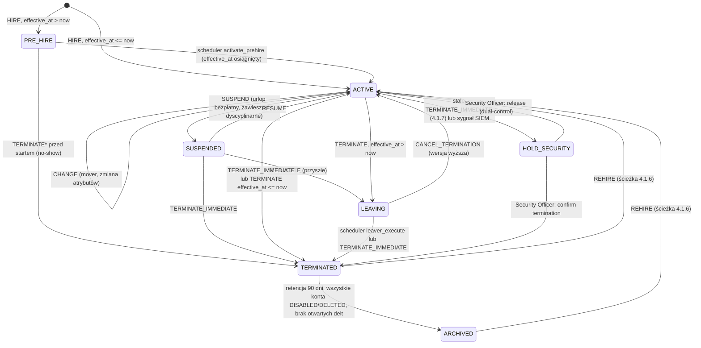
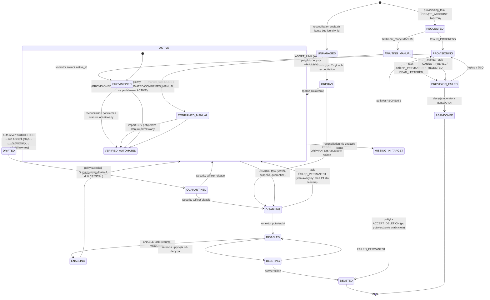
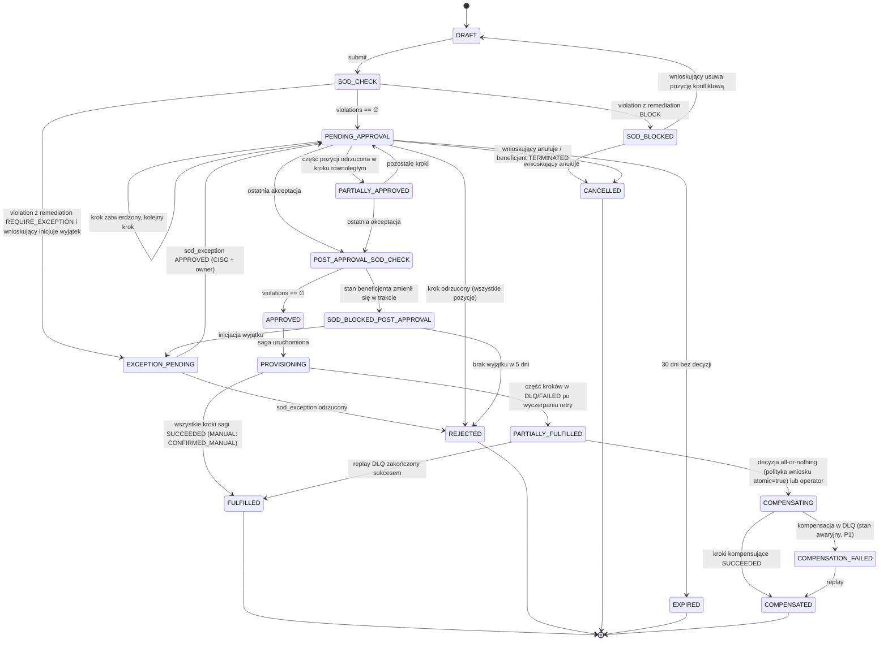

# 4. Przepływy Podstawowe IGA (Core Workflows) & Automaty Stanów

Konwencje wspólne dla wszystkich automatów w tym rozdziale:

- **Guard** oznacza warunek, który musi być spełniony, aby przejście zostało wykonane; niespełnienie guardu nie jest błędem, lecz pozostawia encję w stanie bieżącym i emituje zdarzenie `*.transition_rejected` do audytu.
- **Kompensacja** oznacza operację odwracającą skutki uboczne wykonane w stanie, z którego następuje wyjście awaryjne.
- **Stan awaryjny** jest stanem nieterminalnym wymagającym interwencji człowieka, zawsze z przypisanym SLA eskalacji i właścicielem.
- Każde przejście zapisuje wiersz w tabeli `*_state_history` oraz `audit_event` w tej samej transakcji.

## 4.1 JML sterowany zdarzeniami z HR

### 4.1.1 Diagram sekwencji: Joiner

```mermaid
sequenceDiagram
    autonumber
    participant HR as System HR
    participant GW as HR Gateway
    participant K as Kafka hr.events.v1
    participant GE as Governance Engine (JML Orchestrator)
    participant PE as Policy/SoD Evaluator
    participant DB as PostgreSQL
    participant OR as Outbox Relay
    participant KP as Kafka provisioning.tasks.v1
    participant PV as Provisioning Engine
    participant AD as System docelowy (AD)
    participant MF as Manual Fulfillment Connector

    HR->>GW: POST /hr/v1/events (HIRE, hr_state_version=1, HMAC)
    GW->>GW: Weryfikacja HMAC, walidacja HrEvent (Pydantic)
    GW->>DB: INSERT hr_event_inbox (dedup_key) ON CONFLICT DO NOTHING
    alt duplikat
        GW-->>HR: 200 OK (idempotent, already_received=true)
    else nowe zdarzenie
        GW->>K: produce(key=hr_person_id, value=HrEvent)
        GW-->>HR: 202 Accepted
    end
    K->>GE: consume (partycja = hash(hr_person_id))
    GE->>DB: BEGIN; SELECT identity FOR UPDATE WHERE hr_person_id
    alt tożsamość nie istnieje
        GE->>DB: INSERT identity (PRE_HIRE lub ACTIVE wg effective_at), identity_revision rev 1
    else istnieje w TERMINATED/ARCHIVED
        GE->>GE: ścieżka REHIRE (4.1.6)
    end
    GE->>DB: SELECT birthright_rule WHERE enabled ORDER BY priority
    GE->>GE: Ewaluacja predykatów ABAC na hr_attributes → zbiór ról birthright B
    GE->>PE: evaluate(identity, target_set = entitlements(B), mode=PREVENTIVE)
    PE-->>GE: EvaluationResult (violations=[], risk)
    alt konflikt SoD wewnątrz birthright
        GE->>DB: INSERT sod_violation(state=OPEN), audit_event; wyklucz rolę o niższym priorytecie
    end
    GE->>DB: INSERT role_assignment × |B| (state=PENDING_PROVISIONING, source=BIRTHRIGHT)
    GE->>DB: INSERT saga(JML_JOINER) + saga_step per aplikacja
    GE->>DB: INSERT provisioning_task per (aplikacja, operacja) z idempotency_key
    GE->>DB: INSERT outbox_event(identity.created, role.assigned, provisioning.task_created)
    GE->>DB: INSERT audit_event × n; COMMIT
    GE->>K: commit offset
    OR->>DB: SELECT outbox_event WHERE published_at IS NULL FOR UPDATE SKIP LOCKED LIMIT 500
    OR->>KP: produce(provisioning.task_created, key=application_id)
    OR->>DB: UPDATE outbox_event SET published_at=now()
    KP->>PV: consume
    PV->>DB: UPDATE provisioning_task SET state=IN_PROGRESS WHERE state=QUEUED (CAS)
    PV->>AD: LDAPS: create user, set attributes, add to groups
    AD-->>PV: entryUUID
    PV->>DB: INSERT account(native_id=entryUUID, state=PROVISIONED, verification_source=UNVERIFIED)
    PV->>DB: UPDATE provisioning_task SET state=SUCCEEDED; UPDATE saga_step; outbox(provisioning.task_succeeded); audit
    PV->>MF: zadanie dla aplikacji MANUAL (SAP legacy) → manual_task(OPEN), ticket ITSM
    Note over GE,MF: Saga JML_JOINER przechodzi w COMPLETED gdy wszystkie kroki AUTOMATED są SUCCEEDED,<br/>a kroki MANUAL są co najmniej AWAITING_MANUAL (nie blokują zamknięcia sagi JML)
```

### 4.1.2 Diagram sekwencji: Mover

```mermaid
sequenceDiagram
    autonumber
    participant K as Kafka hr.events.v1
    participant GE as Governance Engine (JML Orchestrator)
    participant PE as Policy/SoD Evaluator
    participant DB as PostgreSQL
    participant PV as Provisioning Engine
    participant MGR as Nowy manager

    K->>GE: CHANGE (org_unit_code: FIN-AP → FIN-AR, job_code: AP_CLERK → AR_SPECIALIST, hr_state_version=7)
    GE->>DB: BEGIN; SELECT identity FOR UPDATE
    GE->>GE: guard: event.hr_state_version (7) > identity.hr_state_version (6)
    GE->>DB: INSERT identity_revision rev 7; UPDATE identity (atrybuty, manager)
    GE->>GE: B_old = birthright(hr_attributes_rev6), B_new = birthright(hr_attributes_rev7)
    GE->>GE: revoke_set = B_old \ B_new; grant_set = B_new \ B_old
    GE->>DB: SELECT efektywne uprawnienia (identity_effective_entitlement) incl. direct i exceptions
    GE->>PE: evaluate(identity, target_set = (current \ ent(revoke_set)) ∪ ent(grant_set), mode=PREVENTIVE)
    PE-->>GE: violations=[{rule=SOD-FIN-017, A=ERP:AP:APPROVE_INVOICE, B=ERP:AR:POST_RECEIPT}]
    Note over GE: Konflikt: uprawnienie z puli bezpośredniej (DIRECT_REQUEST) ze starego działu vs nowa rola birthright
    GE->>DB: INSERT sod_violation(detection_mode=PREVENTIVE, state=OPEN)
    GE->>GE: Polityka mover: strona konfliktu NIE będąca birthright nowego działu jest cofana natychmiast
    GE->>DB: UPDATE entitlement_assignment(ERP:AP:APPROVE_INVOICE) state=REVOKING; role_assignment(revoke_set) state=REVOKING
    GE->>DB: INSERT role_assignment(grant_set) state=PENDING_PROVISIONING
    GE->>DB: SELECT pozostałe przypisania DIRECT_REQUEST nadane gdy org_unit=FIN-AP → mover_review_item (micro-cert, 14 dni)
    GE->>DB: INSERT saga(JML_MOVER): kroki REMOVE_ENTITLEMENT (priorytet HIGH) przed ADD_ENTITLEMENT
    GE->>DB: INSERT provisioning_task × n; outbox; audit; COMMIT
    PV->>PV: Wykonuje najpierw kroki REVOKE (ordering guard w sadze), potem GRANT
    PV->>DB: Aktualizacje stanów, sod_violation → REMEDIATED po potwierdzeniu REMOVE
    GE->>MGR: Powiadomienie: 3 pozycje do przeglądu w 14 dni (micro-certification MOVER_REVIEW)
```

Reguła deterministyczna rozstrzygania konfliktu SoD podczas Mover (w kolejności):

1. Jeśli konflikt zachodzi między dwiema rolami birthright nowego stanowiska: błąd konfiguracji birthright; żadna z nich nie jest nadawana automatycznie, powstaje `sod_violation(state=OPEN)` przypisany do właściciela polityki, ticket P2.
2. Jeśli konflikt zachodzi między rolą birthright nowego stanowiska a uprawnieniem pochodzącym ze starego kontekstu (birthright stary, DIRECT_REQUEST, wyjątek): strona stara jest cofana natychmiast (`REVOKING`), birthright nowy nadawany.
3. Jeśli konflikt zachodzi między rolą birthright nowego stanowiska a aktywnym `SOD_EXCEPTION` beneficjenta: wyjątek jest unieważniany (`REVOKED`, powód `CONTEXT_CHANGED`), uprawnienie z wyjątku cofane, CISO powiadamiany.
4. Uprawnienia DIRECT_REQUEST niekonfliktowe nadane w starym kontekście pozostają aktywne i trafiają do micro-certyfikacji nowego managera z domyślną akcją `REVOKE` po 14 dniach braku decyzji.

### 4.1.3 Diagram sekwencji: Leaver natychmiastowy vs z datą przyszłą

```mermaid
sequenceDiagram
    autonumber
    participant K as Kafka hr.events.v1
    participant GE as Governance Engine
    participant DB as PostgreSQL
    participant SCH as Scheduler
    participant PV as Provisioning Engine
    participant IDP as IdP (sesje)
    participant SIEM as SIEM

    rect rgb(255, 235, 235)
        Note over K,SIEM: Wariant A: TERMINATE_IMMEDIATE (emergency offboarding)
        K->>GE: TERMINATE_IMMEDIATE (effective_at = now, hr_state_version=12)
        GE->>DB: BEGIN; identity FOR UPDATE; guard wersji
        GE->>DB: UPDATE identity status=TERMINATED, effective_termination_at=now()
        GE->>DB: SELECT wszystkie account WHERE identity_id AND state NOT IN (DISABLED, DELETED)
        GE->>DB: INSERT provisioning_task(DISABLE, priority=EMERGENCY) per konto AUTOMATED/AGENT
        GE->>DB: INSERT provisioning_task(DISABLE, MANUAL) per konto MANUAL → manual_task(SLA 4h)
        GE->>DB: UPDATE access_request PENDING → CANCELLED (reason=BENEFICIARY_TERMINATED)
        GE->>DB: UPDATE certification_item WHERE reviewer_id → REASSIGN (4.4.4)
        GE->>DB: UPDATE sod_exception ACTIVE → REVOKED; approval_step PENDING (jako approver) → ESCALATED
        GE->>DB: outbox(identity.status_changed, provisioning.task_created×n); audit; COMMIT
        GE->>IDP: POST /sessions/revoke (identity sub) przez konektor IdP (zadanie EMERGENCY)
        PV->>PV: Kolejka EMERGENCY ma dedykowaną partycję i pulę workerów (brak head-of-line blocking)
        PV->>DB: account.state → DISABLING → DISABLED (po potwierdzeniu)
        GE->>SIEM: Zdarzenie leaver.emergency_completed z czasem T_disable_all (SLO-04)
        SCH->>DB: Po 30 dniach: provisioning_task(DELETE) dla kont klasy B/C; klasa A po 90 dniach (retencja dowodowa)
    end

    rect rgb(235, 245, 255)
        Note over K,SIEM: Wariant B: TERMINATE z datą przyszłą (effective_at = T+21 dni)
        K->>GE: TERMINATE (effective_at = 2026-10-31T22:00:00Z, hr_state_version=9)
        GE->>DB: UPDATE identity status=LEAVING, termination_date, effective_termination_at
        GE->>DB: Blokada nowych wniosków z valid_to > effective_termination_at (guard w Access Request)
        GE->>DB: Skrócenie valid_to wszystkich aktywnych przypisań czasowych do effective_termination_at
        GE->>DB: INSERT scheduled_job(leaver_execute, run_at = effective_termination_at, identity_id)
        GE->>DB: outbox; audit; COMMIT
        Note over SCH: Dzień T-7 i T-1: powiadomienie managera z listą kont i zadań manualnych do zaplanowania
        SCH->>GE: run_at osiągnięty → leaver_execute(identity_id, expected_hr_state_version=9)
        GE->>DB: guard: identity.status == LEAVING AND hr_state_version == 9 (brak CANCEL_TERMINATION)
        GE->>GE: Ścieżka identyczna jak Wariant A, priority=HIGH zamiast EMERGENCY
    end
```

### 4.1.4 Automat stanu tożsamości



Macierz przejść stanu tożsamości z guardami i kompensacjami:

| Z | Do | Zdarzenie | Guard | Akcje / kompensacja |
|---|---|---|---|---|
| — | PRE_HIRE | HIRE | `effective_at > now()`; brak tożsamości o tym `hr_person_id` | INSERT identity, revision 1; konta tworzone dopiero w ACTIVE (opcjonalnie pre-provisioning AD z `accountDisabled=true` dla aplikacji z flagą `prehire_allowed`) |
| — | ACTIVE | HIRE | `effective_at <= now()` | Jak wyżej + birthright + provisioning |
| PRE_HIRE | ACTIVE | scheduler | `identity.hr_state_version` niezmieniony od zaplanowania lub zmieniony bez TERMINATE | Birthright + provisioning (ENABLE jeśli pre-provisioned) |
| ACTIVE | ACTIVE | CHANGE | `event.hr_state_version > identity.hr_state_version` | Mover (4.1.2); jeśli zmiana nie dotyka atrybutów birthright: tylko UPDATE_ATTRIBUTES w kontach |
| ACTIVE | SUSPENDED | SUSPEND | wersja wyższa | DISABLE kont klasy A i B (priority HIGH); klasa C wg `application.suspend_policy`; przypisania pozostają ACTIVE (brak revoke) |
| SUSPENDED | ACTIVE | RESUME | wersja wyższa | ENABLE kont; ponowna ewaluacja birthright (atrybuty mogły się zmienić); SoD check detective |
| ACTIVE | LEAVING | TERMINATE | `effective_at > now()`, wersja wyższa | Skrócenie `valid_to`, blokada wniosków, zaplanowanie `leaver_execute` |
| LEAVING | ACTIVE | CANCEL_TERMINATION | wersja wyższa | Anulowanie `scheduled_job`; przywrócenie `valid_to` z `identity_revision` sprzed TERMINATE (zapisane w snapshot) ale nie dłużej niż polityka TIME_BOUND; audyt |
| ACTIVE / SUSPENDED / LEAVING | TERMINATED | TERMINATE_IMMEDIATE / scheduler | wersja ≥ bieżąca (TERMINATE_IMMEDIATE nigdy nie jest odrzucany jako stale, patrz 4.1.7) | DISABLE wszystkich kont (EMERGENCY), rewokacja sesji IdP, anulowanie wniosków, reassign recertyfikacji, rewokacja wyjątków, eskalacja akceptacji |
| TERMINATED | ARCHIVED | scheduler | Wszystkie konta w DISABLED/DELETED, brak `reconciliation_delta` OPEN, brak `manual_task` OPEN, minęło 90 dni | Krypto-shredding PII po upływie retencji ustawowej (RODO) niezależnie od ARCHIVED; `identity_status` pozostaje w audycie |
| TERMINATED / ARCHIVED | ACTIVE | REHIRE | `hr_person_id` identyczny; wersja wyższa | Ścieżka 4.1.6 |
| ACTIVE | HOLD_SECURITY | stale TERMINATE_IMMEDIATE, sygnał SIEM `identity.compromised` | — | DISABLE kont klasy A (EMERGENCY), zachowanie przypisań, ticket P1 do Security Officer, SLA decyzji 4 h |
| HOLD_SECURITY | ACTIVE / TERMINATED | decyzja SO | dual-control (dwa różne `actor_id` z rolą `security_officer`) | ENABLE kont lub pełny leaver |

### 4.1.5 Automat stanu konta w systemie docelowym



### 4.1.6 Edge-case: Rehire (zatrudnienie powtórne)

| Aspekt | Reguła |
|---|---|
| Identyfikacja | Zdarzenie `REHIRE` lub `HIRE` z `hr_person_id` istniejącym w stanie `TERMINATED`/`ARCHIVED`. Jeśli HR nadaje nowy `hr_person_id` (polityka HR), korelacja probabilistyczna: zgodność `national_id_hash` (SHA-256 z solą per instalacja), `family_name` + `birth_date` ≥ 2 z 3 → kandydat do scalenia (`identity_merge` w stanie `PROPOSED`), decyzja administratora IGA w ciągu 48 h; do czasu decyzji nowa tożsamość działa niezależnie |
| Stan początkowy uprawnień | **Zawsze pusty.** Żadne dawne `role_assignment`/`entitlement_assignment` nie są reaktywowane. Birthright liczony od zera z nowych atrybutów HR |
| Dawne konta | Konta w stanie `DISABLED` w tej samej aplikacji: polityka per aplikacja `rehire_account_policy ∈ {REUSE, RECREATE}`. `REUSE` (AD, poczta): `ENABLE` + `UPDATE_ATTRIBUTES` + usunięcie wszystkich grup przed przywróceniem (konektor wykonuje `REMOVE_ENTITLEMENT` dla całego obserwowanego zbioru, potem `ADD_ENTITLEMENT` dla birthright). `RECREATE` (SAP, bazy): stare konto pozostaje `DISABLED`/`DELETED`, nowe tworzone. Konta `DELETED` nigdy nie są reaktywowane |
| Sugestie | `identity_merge.former_entitlements_snapshot` (zbiór sprzed terminacji) prezentowany managerowi jako propozycja koszyka wniosku; każda pozycja przechodzi pełny pre-request SoD i akceptację. Uprawnienia `CRITICAL` i te objęte wcześniej wyjątkiem SoD nie są sugerowane |
| Audyt | `identity.merged` (gdy scalanie) oraz `identity.status_changed(TERMINATED→ACTIVE, reason=REHIRE)` z referencją do `former_entitlements_snapshot_hash`; raport „rehire access review” dla Security Officera w ciągu 30 dni |
| Ryzyko | Rehire po < 30 dniach od terminacji oznaczany flagą `rapid_rehire=true` i generuje przegląd przez SO (typowy wektor „pseudo-terminacji” w celu resetu limitów) |

### 4.1.7 Edge-case: zdarzenia zduplikowane i nieuporządkowane

**Klucze idempotencji i wersjonowanie:**

- `hr_event_inbox.dedup_key = source_system:hr_person_id:hr_state_version:event_type` z `UNIQUE` → duplikat (retransmisja HR, redelivery Kafka) jest no-op na etapie Gateway; na etapie konsumenta Governance Engine ponowne przetworzenie tego samego `event_id` jest wykrywane przez `identity_revision.caused_by_event_id UNIQUE` i kończy się commitem offsetu bez zmian.
- Zdarzenie HR niesie **pełny snapshot stanu** (nie deltę), więc kolejność zdarzeń ma znaczenie tylko dla wyboru stanu końcowego, a nie dla poprawności pośrednich kroków. Reguła: **wygrywa najwyższy `hr_state_version`, nie czas dostarczenia**.
- Partycjonowanie Kafka po `hr_person_id` gwarantuje kolejność dostarczenia w ramach jednej tożsamości tylko wtedy, gdy producent zachowuje kolejność; HR Gateway tego nie zakłada.

**Macierz decyzji dla zdarzenia o wersji `v_e` wobec stanu `v_s`:**

| Relacja | Typ zdarzenia | Działanie |
|---|---|---|
| `v_e == v_s` | dowolny | Duplikat; no-op; audyt `hr.event_duplicate` |
| `v_e > v_s` | dowolny | Zastosuj snapshot (standardowa ścieżka). Jeśli `v_e > v_s + 1`: flaga `version_gap=true` w `identity_revision`, metryka `hr_version_gaps_total`; brak buforowania, bo snapshot jest kompletny |
| `v_e < v_s` | CHANGE, SUSPEND, RESUME, CANCEL_TERMINATION, HIRE | Stale; odrzuć; audyt `hr.event_stale` z obiema wersjami |
| `v_e < v_s` | TERMINATE (przyszłe) | Stale; odrzuć, ale jeśli bieżący stan to ACTIVE bez `termination_date`, wyślij zapytanie weryfikacyjne do HR (`GET /persons/{id}`) i audytuj rozbieżność |
| `v_e < v_s` | **TERMINATE_IMMEDIATE** | **Fail-safe**: nie odrzucaj. Przejście `ACTIVE → HOLD_SECURITY`, DISABLE kont klasy A (EMERGENCY), ticket P1 do Security Officera z obiema wersjami i wynikiem `GET /persons/{id}`; SO potwierdza terminację lub zwalnia blokadę (dual-control) |
| `v_e` brak (HR nie wersjonuje) | dowolny | Gateway wylicza wersję zastępczą z `emitted_at` jako epoch ms; kolizje tej samej milisekundy rozstrzygane kolejnością w `hr_event_inbox.received_seq`; konfiguracja oznaczona jako degradowana w raporcie zgodności |

**Reorder buffer (opcjonalny, dla HR bez pełnych snapshotów):** jeśli system HR dostarcza tylko delty, HR Gateway składa je w snapshot przez odczyt `GET /persons/{id}` z HR w momencie przyjęcia (źródło prawdy po stronie HR), a zdarzenie publikowane do Kafka zawsze zawiera snapshot. Delta nie jest nigdy przetwarzana bezpośrednio.

## 4.2 Access Requests & Dynamic Approval Workflow

### 4.2.1 Diagram sekwencji: wniosek z pre-request SoD i dynamiczną ścieżką

```mermaid
sequenceDiagram
    autonumber
    actor REQ as Wnioskujący (manager)
    participant UI as Web UI
    participant API as Identity Core API
    participant PE as Policy/SoD Evaluator
    participant RS as Risk Scorer
    participant DB as PostgreSQL
    participant GE as Governance Engine (Workflow)
    actor APP1 as Właściciel aplikacji
    actor CISO as CISO / Security Officer
    participant PV as Provisioning Engine

    REQ->>UI: Dodaje do koszyka: ROLE SAP_AP_CLERK, ENT ERP:AR:POST_RECEIPT, ENT CRM:EXPORT_ALL (beneficjent: J. Nowak)
    UI->>API: POST /requests/draft/evaluate {beneficiary, items}
    API->>DB: SELECT identity_effective_entitlement + pending items (request_item state IN PENDING*) dla beneficjenta
    API->>PE: evaluate(target_set = current ∪ pending ∪ requested, mode=PREVENTIVE, policy_revision=current)
    PE-->>API: violations=[SOD-FIN-017 (CRITICAL): SAP_AP_CLERK ⊃ ERP:AP:APPROVE_INVOICE × ERP:AR:POST_RECEIPT]
    API->>RS: score(beneficiary, items, violations)
    RS-->>API: request_risk=84 (CRITICAL), item_risks, routing_hints
    API-->>UI: PreCheckResult: item ERP:AR:POST_RECEIPT BLOCKED (remediation=REQUIRE_EXCEPTION), pozostałe OK, ścieżka: MANAGER→APP_OWNER(SAP)→APP_OWNER(CRM)→SECURITY_OFFICER
    REQ->>UI: Usuwa ERP:AR:POST_RECEIPT lub inicjuje wyjątek SoD (4.2.5)
    REQ->>UI: Submit (bez pozycji konfliktowej)
    UI->>API: POST /requests {items, justification, valid_to}
    API->>DB: BEGIN; INSERT access_request(state=SOD_CHECK)
    API->>PE: evaluate (ponownie, w transakcji, z blokadą advisory na beneficjenta)
    PE-->>API: violations=[]
    API->>DB: UPDATE access_request state=PENDING_APPROVAL, approval_path_snapshot; INSERT approval_step × 3; outbox; audit; COMMIT
    API-->>UI: 201 Created {request_id, path}
    GE->>APP1: Powiadomienie: krok 1 (MANAGER pominięty: wnioskujący jest managerem beneficjenta → SKIPPED, zapisane)
    APP1->>UI: Approve (step-up MFA wymagane dla risk_tier HIGH/CRITICAL)
    UI->>API: POST /requests/{id}/steps/{step}/decide {APPROVED, comment}
    API->>DB: guard: approver == step.approver OR delegat; approver != beneficiary; MFA amr zawiera otp|hwk
    API->>DB: UPDATE approval_step; jeśli ostatni → access_request state=APPROVED; INSERT saga(ACCESS_REQUEST_FULFILLMENT)
    API->>PE: Re-ewaluacja SoD po ostatniej akceptacji (stan mógł się zmienić w trakcie)
    PE-->>API: violations=[]
    API->>DB: provisioning_task × 2 (SAP: ADD_ENTITLEMENT via role; CRM: ADD_ENTITLEMENT); outbox; audit; COMMIT
    PV->>PV: Saga: krok SAP SUCCEEDED, krok CRM SUCCEEDED
    PV->>DB: access_request state=FULFILLED; outbox(request.fulfilled)
    GE->>REQ: Powiadomienie o realizacji z datą wygaśnięcia valid_to
```

### 4.2.2 Scoring ryzyka (Risk-based routing)

Wynik ryzyka wniosku `R ∈ [0, 100]` jest obliczany deterministycznie i zapisywany wraz z wektorem składowych w `access_request.risk_breakdown` (JSONB), aby audytor mógł odtworzyć decyzję routingu.

```
item_risk(i) = clamp(0, 100,
      base(i.risk_level)                       # LOW=10, MEDIUM=30, HIGH=60, CRITICAL=85
    + 10 · [i.is_privileged]
    + 10 · [i.application.criticality_class == 'A']
    + 15 · [i tworzy near-miss SoD: posiada A, wnioskuje o B' gdzie (A,B') w regule WARN]
    + 10 · [i.valid_to is NULL lub > 365 dni]
    +  5 · [operacja GRANT dla uprawnienia nieposiadanego przez ≥ 95 % peer-group beneficjenta]
    - 10 · [uprawnienie posiadane przez ≥ 80 % peer-group beneficjenta]
)

beneficiary_risk = clamp(0, 100,
      identity.risk_score                        # z profilu: liczba CRITICAL, liczba wyjątków, historia naruszeń
    + 20 · [identity.employee_type == CONTRACTOR]
    + 15 · [identity.identity_status == LEAVING]
    + 10 · [rapid_rehire]
)

R = clamp(0, 100, max_i(item_risk(i)) · 0.6 + mean_i(item_risk(i)) · 0.2 + beneficiary_risk · 0.2)
```

Peer-group = tożsamości o identycznym `(org_unit_code, job_code)`; przy liczności < 5 używany jest `(org_unit_path[-2], job_family)`; przy liczności < 5 składnik peer jest pomijany (zapis `peer_group_used=false`).

| `risk_tier` | Zakres R | Ścieżka bazowa | Wymagania dodatkowe |
|---|---|---|---|
| LOW | 0–24 | MANAGER | Auto-approve dozwolony, jeśli polityka aplikacji `auto_approve_low=true` i beneficjent ma ≥ 80 % peer coverage |
| MEDIUM | 25–49 | MANAGER → APP_OWNER (per aplikacja w koszyku) | — |
| HIGH | 50–74 | MANAGER → APP_OWNER → ENTITLEMENT_OWNER (dla HIGH/CRITICAL atomów) | Step-up MFA dla każdej decyzji |
| CRITICAL | 75–100 | MANAGER → APP_OWNER → ENTITLEMENT_OWNER → SECURITY_OFFICER | Step-up MFA, `valid_to` obowiązkowe ≤ 90 dni, komentarz ≥ 50 znaków |

### 4.2.3 Dynamiczne ścieżki akceptacji

Ścieżka jest **zmaterializowana w chwili submit** (`approval_path_snapshot`) i nie zmienia się wraz z późniejszymi zmianami polityk; zmiany struktury organizacyjnej w trakcie są obsługiwane przez reguły reassign:

| Sytuacja | Reguła |
|---|---|
| Wnioskujący jest managerem beneficjenta | Krok MANAGER → `SKIPPED` z adnotacją; nie skraca ścieżki poniżej 1 kroku ludzkiego (jeśli ścieżka = tylko MANAGER, krok przechodzi do managera wnioskującego) |
| Wnioskujący = beneficjent (self-request) | Krok MANAGER obowiązkowy, nie może być SKIPPED |
| Approver = beneficjent (np. właściciel aplikacji wnioskuje o dostęp do własnej aplikacji) | Krok przechodzi do zastępcy właściciela (`application.deputy_owner_identity_id`), a gdy brak, do Security Officera; nigdy self-approval (constraint DB: `CHECK (approver_identity_id <> beneficiary_identity_id)` przez trigger z JOIN na `access_request`) |
| Brak managera w HR | Krok MANAGER przechodzi do managera jednostki organizacyjnej (`org_unit.head_identity_id`); gdy brak, do właściciela procesu HR danej spółki; audytowane jako `approver_resolution=FALLBACK_ORG_HEAD` |
| Approver opuszcza organizację (`TERMINATED`) w trakcie | Wszystkie jego kroki `PENDING` → `ESCALATED` do zastępcy (delegat ustawiony przez approvera) albo do przełożonego approvera; zapis `original_approver_id` |
| Approver deleguje (urlop) | `approval_step.delegated_to`; delegat nie może być beneficjentem ani wnioskującym; delegacja czasowa z `valid_to` |
| SLA kroku przekroczone (domyślnie 3 dni robocze, 1 dzień dla EMERGENCY requests) | Przypomnienie po 50 % SLA, eskalacja do przełożonego approvera po 100 %, po 200 % do właściciela procesu; wniosek `EXPIRED` po 30 dniach bez decyzji |
| Zmiana risk_tier w trakcie (nowa rewizja polityki) | Ścieżka nie zmienia się, ale po ostatniej akceptacji wykonywana jest re-ewaluacja SoD na aktualnej rewizji; wykrycie konfliktu → `SOD_BLOCKED_POST_APPROVAL` i wymóg wyjątku |
| Wniosek wieloaplikacyjny | Kroki APP_OWNER dla różnych aplikacji są **równoległe** (ten sam `step_order`); krok uznany za zakończony, gdy wszyscy zdecydują; jedno REJECTED odrzuca tylko pozycje tej aplikacji (`access_request_item.state=REJECTED`), pozostałe kontynuują (`PARTIALLY_APPROVED`) |

### 4.2.4 Automat stanu wniosku



Guardy kluczowych przejść:

| Przejście | Guard |
|---|---|
| DRAFT → SOD_CHECK | `beneficiary.identity_status ∈ {ACTIVE, PRE_HIRE}`; każda pozycja `valid_to ≤ beneficiary.effective_termination_at` (jeśli LEAVING); `valid_to` zgodne z polityką TIME_BOUND; brak duplikatu pozycji wobec aktywnych przypisań (w przeciwnym razie pozycja oznaczana `ALREADY_HELD` i usuwana) |
| PENDING_APPROVAL → (krok zatwierdzony) | `actor == step.approver_identity_id OR actor == step.delegated_to`; `actor ∉ {beneficiary, requester}` dla kroków innych niż MANAGER przy self-request; `actor.amr ⊇ {otp lub hwk}` gdy `risk_tier ∈ {HIGH, CRITICAL}`; `step.state == PENDING`; `now() ≤ request.expires_at` |
| POST_APPROVAL_SOD_CHECK → APPROVED | `evaluate(current ∪ approved_items).violations == ∅` przy `pg_advisory_xact_lock(hash(beneficiary_id))` (serializacja równoległych wniosków tego samego beneficjenta) |
| PROVISIONING → FULFILLED | `∀ saga_step: state == DONE` gdzie dla kroków MANUAL `DONE ⇔ manual_task.state == DONE ∧ evidence ≥ 1` |

### 4.2.5 Procedura wyjątku SoD

```mermaid
sequenceDiagram
    autonumber
    actor REQ as Wnioskujący
    participant API as Identity Core API
    participant DB as PostgreSQL
    participant GE as Governance Engine
    actor OWN as Właściciel polityki / uprawnienia
    actor CISO as CISO
    participant SCH as Scheduler

    REQ->>API: POST /sod-exceptions {request_item_id, rule_id, justification, mitigating_controls[]}
    API->>DB: guard: rule.remediation == REQUIRE_EXCEPTION (nie BLOCK); max_exception_days > 0
    API->>DB: INSERT sod_exception(state=REQUESTED, valid_to = min(requested, valid_from + rule.max_exception_days))
    API->>DB: access_request state=EXCEPTION_PENDING; outbox; audit
    GE->>OWN: Zadanie akceptacji (krok 1 z 2)
    OWN->>API: Approve z komentarzem (step-up MFA)
    API->>DB: guard: OWN ≠ beneficjent, OWN ≠ wnioskujący
    GE->>CISO: Zadanie akceptacji (krok 2 z 2) z pełnym kontekstem: oba uprawnienia, kontrole łagodzące, historia
    CISO->>API: Approve (step-up MFA, hwk wymagane dla CRITICAL)
    API->>DB: guard: CISO ≠ OWN (dwie różne osoby), CISO ∈ rola security_officer
    API->>DB: sod_exception state=APPROVED→ACTIVE (gdy valid_from ≤ now); sod_violation state=MITIGATED; access_request state=PENDING_APPROVAL; audit(policy_snapshot_hash)
    SCH->>DB: Codziennie: wyjątki z valid_to - now() ∈ {30, 14, 7, 1} dni → powiadomienia beneficjent, manager, CISO
    SCH->>DB: valid_to osiągnięte: sod_exception state=EXPIRED; provisioning_task(REMOVE_ENTITLEMENT) dla strony wskazanej w exception.revoke_side; audit
    Note over SCH: Brak możliwości „przedłużenia” – nowy wyjątek wymaga pełnej ścieżki. Kontrole łagodzące muszą być potwierdzone raportem (np. przegląd 4-oczu transakcji) wgranym jako dowód przed upływem 50 % okresu, inaczej eskalacja do CISO.
```

Struktura `mitigating_controls` (JSON Schema):

```json
{
  "type": "array",
  "minItems": 1,
  "items": {
    "type": "object",
    "additionalProperties": false,
    "required": ["control_id", "control_type", "owner_identity_id", "frequency", "evidence_required_by"],
    "properties": {
      "control_id": { "type": "string", "pattern": "^MC-[A-Z0-9]{3,12}$" },
      "control_type": { "enum": ["DETECTIVE_REPORT_REVIEW", "DUAL_AUTHORIZATION", "TRANSACTION_LIMIT", "LOG_MONITORING", "PERIODIC_RECONCILIATION"] },
      "description": { "type": "string", "minLength": 20, "maxLength": 2000 },
      "owner_identity_id": { "type": "string", "format": "uuid" },
      "frequency": { "enum": ["DAILY", "WEEKLY", "MONTHLY"] },
      "evidence_required_by": { "type": "string", "format": "date" }
    }
  }
}
```

### 4.2.6 Edge-case'y wniosków

| Edge-case | Obsługa |
|---|---|
| Dwa równoległe wnioski dla tego samego beneficjenta, każdy osobno czysty, razem konfliktowe | Pre-check zawsze uwzględnia `pending` pozycje innych wniosków; w POST_APPROVAL_SOD_CHECK blokada advisory per beneficjent serializuje finalizację; drugi wniosek trafia do `SOD_BLOCKED_POST_APPROVAL` |
| Rola w koszyku otrzymuje nową rewizję w trakcie akceptacji | Pozycja zapisuje `role_revision_id` z chwili submit; po akceptacji, jeśli `current_revision ≠ snapshot`, system porównuje zbiory uprawnień: nadzbiór → re-ewaluacja SoD i ponowna akceptacja APP_OWNER tylko dla delty; podzbiór → kontynuacja z adnotacją |
| Beneficjent zmienia dział (Mover) w trakcie | Wniosek wraca do `SOD_CHECK` (nowy kontekst birthright), ścieżka przebudowywana (nowy manager), zachowane dotychczasowe decyzje APP_OWNER, jeśli aplikacje niezmienione |
| Wniosek o REVOKE własnego dostępu | Bez akceptacji, natychmiastowa saga; audyt |
| Wniosek o dostęp do aplikacji MANUAL | Krok sagi MANUAL; wniosek przechodzi w `FULFILLED` dopiero po `CONFIRMED_MANUAL`; SLA grupy realizatorów liczony od APPROVED |
| Wniosek EMERGENCY (incydent, break-glass) | Osobna ścieżka: `priority=EMERGENCY`, akceptacja jednoosobowa przez dyżurnego Security Officera, `valid_to ≤ 24 h`, obowiązkowy post-review w 72 h (kampania HIGH_RISK ad-hoc), audyt `admin.break_glass_used` |
