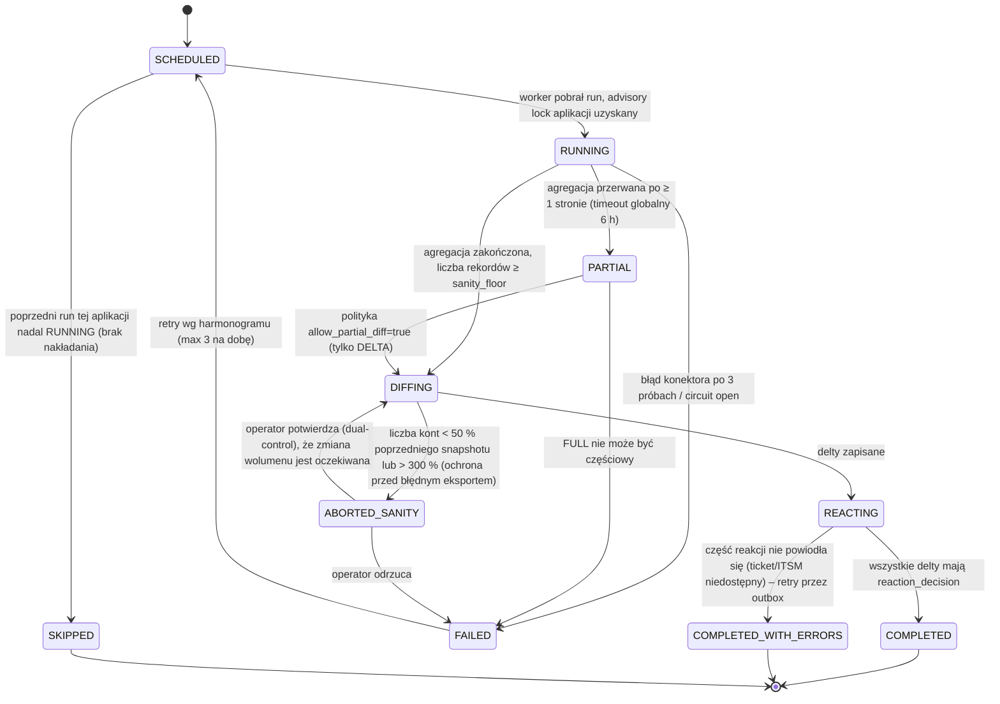
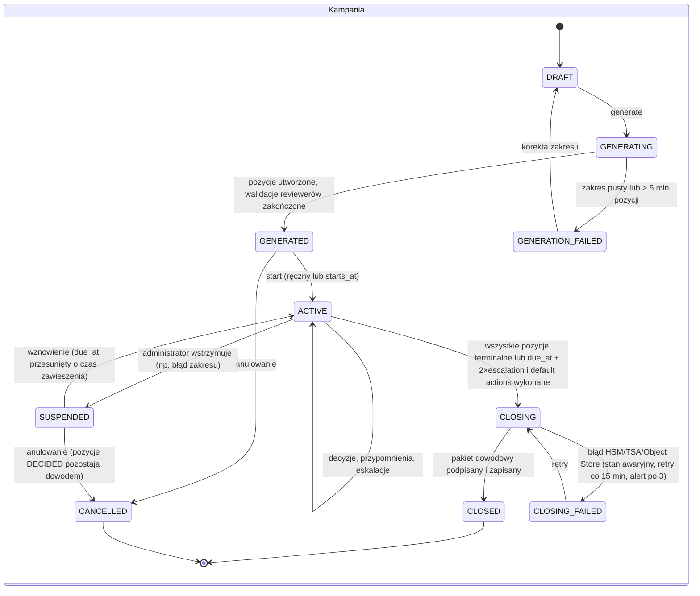

## 4.3 Reconciliation Loop (Pętla Uzgadniania)

### 4.3.1 Tryby pracy

| Tryb | Wyzwalacz | Zakres | Źródło danych | Częstotliwość referencyjna |
|---|---|---|---|---|
| FULL | Scheduler | Wszystkie konta i uprawnienia aplikacji | Konektor: pełny odczyt (SCIM `GET /Users?startIndex=1&count=1000` stronicowany, LDAP paged search, SQL `SELECT`), agent: pełny eksport | Klasa A: co noc; klasa B: co tydzień; klasa C: co miesiąc |
| DELTA | Scheduler | Zmiany od `watermark_in` | SCIM `filter=meta.lastModified gt`, AD `uSNChanged`/DirSync, SQL `updated_at >`, Kafka CDC z aplikacji | Klasa A: co 15 min; klasa B: co 4 h |
| ADHOC | API (`POST /reconciliation/runs`), zdarzenie `provisioning.task_succeeded` (weryfikacja pojedynczego konta), alert SIEM | Pojedyncze konto, pojedyncza aplikacja lub lista | Konektor: `GET /Users/{id}` | Na żądanie; po każdym zadaniu provisioningowym klasy A (closed-loop verify, opóźnienie 60 s) |
| MANUAL_IMPORT | Upload CSV/XLSX przez właściciela aplikacji MANUAL | Cała aplikacja | Plik | Zgodnie z SLA aplikacji (domyślnie co 30 dni, obowiązkowo przed kampanią) |

### 4.3.2 Diagram sekwencji: pętla uzgadniania z silnikiem reakcji

```mermaid
sequenceDiagram
    autonumber
    participant SCH as Scheduler
    participant RS as Reconciliation Service
    participant CN as Konektor / Agent
    participant TGT as System docelowy
    participant DB as PostgreSQL
    participant PE as Policy/SoD Evaluator
    participant RX as Reaction Policy Engine
    participant PV as Provisioning Engine
    participant ITSM as ITSM
    participant SIEM as SIEM

    SCH->>RS: start run (application_id, mode=FULL)
    RS->>DB: INSERT reconciliation_run(state=RUNNING), lock advisory per application
    RS->>CN: aggregate(application, watermark_in=null)
    loop stronicowanie 1000 rekordów
        CN->>TGT: odczyt konta + członkostwa (spłaszczone grupy zagnieżdżone)
        TGT-->>CN: strona wyników
        CN-->>RS: AggregatedAccount[] (Pydantic, walidacja)
        RS->>DB: COPY reconciliation_snapshot_entry (entry_hash = SHA-256(canonical))
    end
    RS->>DB: UPDATE run state=DIFFING
    RS->>DB: Diff zbiorowy w SQL: snapshot FULL OUTER JOIN expected_state (account + entitlement_assignment ACTIVE) ON native_id
    Note over RS,DB: expected_state uwzględnia zadania IN_PROGRESS/RETRY_WAIT jako „w toku” (grace), aby nie raportować własnych zmian jako driftu
    RS->>DB: INSERT reconciliation_delta per rozbieżność (typ, expected, observed)
    RS->>DB: UPDATE run state=REACTING
    loop per delta
        RS->>RX: decide(delta, application.drift_policy, entitlement.risk_level, account_kind)
        alt OOB_ENTITLEMENT_ADDED, klasa A, risk HIGH/CRITICAL
            RX->>PE: evaluate(identity, observed_set) → czy drift tworzy naruszenie SoD
            RX->>DB: reaction=AUTO_REVERT; provisioning_task(REMOVE_ENTITLEMENT, priority=HIGH, intent=reaction_decision_id)
            RX->>SIEM: alert iga.oob_entitlement {identity, entitlement, sod_violation?}
            RX->>DB: account.state=DRIFTED
        else OOB_ENTITLEMENT_ADDED, klasa B/C lub risk LOW/MEDIUM
            RX->>DB: reaction=CREATE_TICKET; ITSM ticket do właściciela aplikacji; delta state=REACTED
            RX->>ITSM: POST /incident
        else UNMANAGED_ACCOUNT
            RX->>DB: korelacja: reguły (sAMAccountName == identity.login, mail == primary_email, employeeID == hr_person_id)
            alt confidence ≥ 0.95 i dokładnie 1 kandydat
                RX->>DB: reaction=ADOPT_LINK; account.identity_id=kandydat; entitlement_assignment(source=RECONCILED_ADOPTED) per obserwowane uprawnienie; SoD detective check
            else wiele kandydatów lub < 0.95
                RX->>DB: account.state=UNMANAGED; zadanie dla właściciela aplikacji (SLA 10 dni)
            end
        else ORPHAN_ACCOUNT (identity TERMINATED lub brak kandydata po 2 cyklach)
            RX->>DB: reaction wg polityki: DISABLE po N dniach (klasa A: N=0 → natychmiast), ticket, SIEM
        else ACCOUNT_MISSING (oczekiwane, nie znalezione)
            RX->>DB: account.state=MISSING_IN_TARGET; polityka RECREATE (birthright) lub ACCEPT_DELETION (po potwierdzeniu właściciela)
        else SHARED_ACCOUNT_DETECTED (heurystyka: logowania z > 3 stacji / > 2 lokalizacji w 24 h, nazwa z listy wzorców)
            RX->>DB: account.account_kind=SHARED; wymóg właściciela; kampania APP_OWNER ad-hoc
        end
        RS->>DB: audit_event(reconciliation.delta_detected, reconciliation.reaction)
    end
    RS->>DB: Konta PROVISIONED/CONFIRMED_MANUAL zgodne z expected → VERIFIED_AUTOMATED, last_verified_at=now()
    RS->>DB: UPDATE run state=COMPLETED, watermark_out, statystyki; outbox(reconciliation.run_completed)
```

### 4.3.3 Automat stanu przebiegu uzgadniania



Guard `sanity_floor`: run FULL jest przerywany przed diffem, jeśli `accounts_read < 0.5 × previous_full.accounts_read` lub `> 3.0 × previous_full.accounts_read`; zapobiega to masowemu oznaczeniu kont jako `MISSING_IN_TARGET` po błędnym eksporcie (np. zmiana base DN w AD) i wynikającej z tego lawinie reakcji.

### 4.3.4 Typologia rozbieżności i silnik polityk reakcji

| `delta_type` | Definicja | Domyślna reakcja klasa A | Klasa B | Klasa C | Parametry polityki |
|---|---|---|---|---|---|
| `OOB_ENTITLEMENT_ADDED` | Uprawnienie obecne w systemie, brak aktywnego `entitlement_assignment` i brak zadania w toku | `AUTO_REVERT` (HIGH/CRITICAL), `CREATE_TICKET` (LOW/MEDIUM) + SIEM | `CREATE_TICKET` | `NOTIFY` właściciel | `revert_min_risk`, `grace_minutes` (domyślnie 30: zadania zakończone < 30 min temu nie są driftem) |
| `OOB_ENTITLEMENT_REMOVED` | Aktywne przypisanie w IGA, brak w systemie | `AUTO_REAPPLY` (birthright) lub `MARK_REVOKED_EXTERNALLY` + ticket (direct) | `MARK_REVOKED_EXTERNALLY` | jak B | `reapply_sources` |
| `UNMANAGED_ACCOUNT` | Konto bez `identity_id`, nowe w snapshocie | `ADOPT_LINK` jeśli korelacja ≥ 0.95, inaczej zadanie właściciela (SLA 10 dni) | jak A | `ADOPT_LINK` ≥ 0.90 | `correlation_rules[]`, `adopt_threshold` |
| `ORPHAN_ACCOUNT` | Konto zlinkowane z tożsamością `TERMINATED/ARCHIVED` i aktywne w systemie, lub `UNMANAGED` bez korelacji po 2 cyklach | `QUARANTINE` → `DISABLE` natychmiast + SIEM + ticket P2 | `DISABLE` po 7 dniach | `DISABLE` po 30 dniach | `orphan_disable_after_days` |
| `ACCOUNT_MISSING` | Konto oczekiwane (`ACTIVE`) nie występuje | `RECREATE` jeśli ≥ 1 przypisanie birthright, inaczej `ACCEPT_DELETION` po potwierdzeniu | `ACCEPT_DELETION` po potwierdzeniu | automatycznie `ACCEPT_DELETION` | `recreate_if_birthright` |
| `ATTRIBUTE_DRIFT` | Różnica atrybutów zarządzanych (display name, OU, enabled flag) | `AUTO_REVERT` dla `enabled` (konto włączone w systemie, ale `DISABLED` w IGA = CRITICAL) ; `UPDATE_ATTRIBUTES` dla pozostałych | jak A dla `enabled` | ticket | `managed_attributes[]` |
| `SHARED_ACCOUNT_DETECTED` | Heurystyka współdzielenia | `REQUIRE_OWNER` + kampania APP_OWNER ad-hoc + SIEM | `REQUIRE_OWNER` | `NOTIFY` | `shared_patterns[]`, `login_fanout_threshold` |
| `MANUAL_MISMATCH` | Diff importu CSV wobec `CONFIRMED_MANUAL` | `CREATE_TICKET` do grupy realizatorów + eskalacja po SLA | jak A | jak A | — |

Reakcja `AUTO_REVERT` jest zawsze poprzedzona oceną SoD stanu obserwowanego (`detection_mode=DETECTIVE`); jeśli drift tworzy naruszenie, `sod_violation` otrzymuje `severity` z reguły i priorytet zadania revert jest podnoszony do `EMERGENCY`.

Reakcje są idempotentne po `intent_id = reaction_decision_id`; ponowne wykrycie tej samej rozbieżności w kolejnym runie, gdy poprzednia reakcja jest `IN_PROGRESS`, nie generuje nowej reakcji (delta łączona po `(application_id, native_id, delta_type, entitlement_id)` z otwartą deltą).

### 4.3.5 Edge-case'y reconciliation

| Edge-case | Obsługa |
|---|---|
| Własne zmiany IGA raportowane jako drift (race) | `expected_state` obejmuje przypisania `PENDING_PROVISIONING`/`REVOKING` oraz zadania w toku jako „oczekiwane za chwilę”; `grace_minutes` |
| Konto serwisowe współdzielone przez zespół | `account_kind=SERVICE` wymaga `owner_identity_id`; SoD liczone na tożsamości właściciela z flagą `via_service_account`; brak właściciela przez 30 dni → DISABLE klasa A |
| Konto techniczne systemowe (np. `krbtgt`, `SYS`) | Lista wyłączeń `application.reconciliation_exclusions[]` (regex), delty `SUPPRESSED` z audytem; lista zmieniana dual-control |
| Zmiana `native_id` w systemie (rename) | Korelacja wtórna po `immutable_id` (objectGUID, SCIM `id`); `native_id` aktualizowany, audyt `account.renamed` |
| Agregacja z agenta przerwana (partycja sieci) | Snapshot ma `run_id`; niekompletny run → `PARTIAL`; agent wznawia od `page_token` zapisanego w `agent_task_lease`; FULL nigdy nie diffuje częściowo |
| Aplikacja zwraca uprawnienia nieznane IGA | Automatyczne utworzenie `entitlement_def(lifecycle_state=DISCOVERED, risk_level=MEDIUM)` z zadaniem klasyfikacji dla właściciela (SLA 14 dni); do klasyfikacji traktowane jako HIGH w scoringu |
| Masowe delty (> 10 000 w jednym runie) | Reakcje `AUTO_REVERT` wstrzymane (`REACTING_THROTTLED`), wymagane potwierdzenie Security Officera; zabezpieczenie przed błędem konfiguracji konektora prowadzącym do masowego odbierania uprawnień |

## 4.4 Certifications & Campaign Management

### 4.4.1 Typy kampanii

| Typ | Reviewer | Zakres pozycji | Typowa częstotliwość | Domyślna akcja po SLA |
|---|---|---|---|---|
| MANAGER | `identity.manager_identity_id` podwładnego | Wszystkie `role_assignment` i `entitlement_assignment` (direct) podwładnych; birthright prezentowany informacyjnie bez decyzji (chyba że polityka wymaga) | Kwartalnie (SOX: co najmniej raz w roku dla systemów finansowych) | `ESCALATE` do przełożonego managera, po 2. eskalacji `REVOKE` dla HIGH/CRITICAL, `KEEP` dla LOW |
| APP_OWNER | `application.owner_identity_id` | Wszystkie konta i uprawnienia w aplikacji, w tym SERVICE/SHARED/ORPHAN | Półrocznie; klasa A kwartalnie | `ESCALATE` do deputy, potem `REVOKE` |
| ROLE_MEMBERSHIP | `role.owner_identity_id` | Członkowie roli i definicja roli (potwierdzenie składu uprawnień) | Rocznie; po publikacji rewizji ad-hoc | `KEEP` członkostwo, flaga roli `needs_owner_review` |
| HIGH_RISK | Właściciel uprawnienia + Security Officer (dwa niezależne przeglądy) | `entitlement_assignment` dla `risk_level ∈ {HIGH, CRITICAL}` i wszystkie aktywne `sod_exception` | Kwartalnie; ad-hoc po podniesieniu `risk_level`, po break-glass | `REVOKE` |
| MOVER_REVIEW (micro) | Nowy manager | Dostępy DIRECT_REQUEST ze starego kontekstu | Zdarzeniowo | `REVOKE` po 14 dniach |

### 4.4.2 Diagram sekwencji: kampania managerska z eskalacją i pakietem dowodowym

```mermaid
sequenceDiagram
    autonumber
    actor ADM as Administrator kampanii
    participant API as Identity Core API
    participant GE as Governance Engine (Campaign Manager)
    participant DB as PostgreSQL
    participant SCH as Scheduler
    actor MGR as Manager (reviewer)
    actor MGR2 as Przełożony managera
    participant PV as Provisioning Engine
    participant AU as Audit Service
    participant VLT as Vault/HSM
    participant TSA as TSA (RFC 3161)
    participant OS as Object Storage

    ADM->>API: POST /campaigns {type=MANAGER, scope: org_unit_path startsWith FIN, due_at=+21d, escalation_after_days=7}
    API->>DB: INSERT certification_campaign(state=DRAFT)
    ADM->>API: POST /campaigns/{id}/generate
    GE->>DB: Generowanie pozycji: dla każdej tożsamości w zakresie, dla każdego przypisania → certification_item(reviewer=manager)
    GE->>GE: Walidacje reviewer (4.4.4): brak managera → fallback; self-review → reassign; reviewer TERMINATED → reassign
    GE->>DB: UPDATE campaign state=GENERATED (n=38 412 pozycji, 1 204 reviewerów)
    ADM->>API: POST /campaigns/{id}/start
    GE->>DB: state=ACTIVE; outbox(certification.campaign_state_changed)
    GE->>MGR: Powiadomienie z liczbą pozycji i terminem
    MGR->>API: GET /certifications/mine → lista z kontekstem (ostatnie logowanie, peer coverage, risk, poprzednia decyzja)
    MGR->>API: POST /certifications/items/bulk-decide {APPROVE: [item_ids], REVOKE: [item_ids]} (step-up MFA dla pozycji HIGH/CRITICAL)
    API->>DB: guard: actor == reviewer; actor ≠ subject; item.state == PENDING; campaign ACTIVE
    API->>DB: INSERT certification_decision; item.state=DECIDED; dla REVOKE: provisioning_task(REMOVE_ENTITLEMENT, intent=decision_id) → item.state=REMEDIATING
    PV->>DB: Zadanie SUCCEEDED → item.state=CLOSED; audit
    SCH->>DB: Dzień due_at - 7: przypomnienia dla reviewerów z pozycjami PENDING
    SCH->>DB: Dzień due_at + 7 (escalation_after_days): item PENDING → ESCALATED, reviewer=MGR2, original_reviewer=MGR
    GE->>MGR2: Powiadomienie eskalacyjne
    SCH->>DB: Dzień due_at + 14: pozycje nadal PENDING → default_action_on_expiry (REVOKE HIGH/CRITICAL → REMEDIATING; KEEP LOW → EXPIRED_KEPT z flagą)
    GE->>DB: Wszystkie pozycje w stanie terminalnym → campaign state=CLOSING
    GE->>AU: generate_signoff_package(campaign_id)
    AU->>DB: SELECT wszystkie items, decisions, audit_event (correlation=campaign_id), zakres block_no
    AU->>AU: Manifest JSON (RFC 8785): statystyki, lista decyzji z hashami audit_event, zakres bloków, hash rewizji polityki
    AU->>VLT: sign(Ed25519, SHA-256(manifest))
    VLT-->>AU: signature, key_id
    AU->>TSA: TimeStampReq(SHA-256(manifest || signature))
    TSA-->>AU: TimeStampToken
    AU->>OS: PUT package.zip {manifest.json, manifest.sig, manifest.tsr, decisions.csv, audit_extract.jsonl, verify.py, README}
    AU->>DB: INSERT campaign_signoff_package; campaign state=CLOSED; audit(certification.campaign_state_changed)
    ADM->>API: GET /campaigns/{id}/signoff-package → presigned URL (TTL 15 min)
```

### 4.4.3 Automaty stanów kampanii i pozycji

```mermaid
stateDiagram-v2
    state "Pozycja certyfikacji" as I {
        [*] --> PENDING
        PENDING --> DECIDED : APPROVE (guard: reviewer, nie self, MFA dla HIGH)
        PENDING --> REMEDIATING : REVOKE (provisioning_task utworzony)
        PENDING --> DELEGATED : DELEGATE (delegat ≠ subject, ≠ reviewer; czasowo)
        DELEGATED --> PENDING : delegat decyduje lub delegacja wygasa (powrót do reviewera)
        PENDING --> REASSIGNED : REASSIGN przez administratora lub system (reviewer TERMINATED, self-review, brak managera)
        REASSIGNED --> PENDING : nowy reviewer przypisany
        PENDING --> ESCALATED : SLA przekroczone (escalation_after_days)
        ESCALATED --> PENDING : eskalowany reviewer przejmuje (stan logiczny PENDING z flagą escalated_level)
        PENDING --> EXPIRED_REVOKING : due_at + 2×escalation, default REVOKE
        PENDING --> EXPIRED_KEPT : due_at + 2×escalation, default KEEP (flaga do następnej kampanii)
        EXPIRED_REVOKING --> REMEDIATING : provisioning_task utworzony
        REMEDIATING --> CLOSED : task SUCCEEDED (lub CONFIRMED_MANUAL)
        REMEDIATING --> REMEDIATION_FAILED : task DEAD_LETTERED (stan awaryjny; pozycja pozostaje otwarta w pakiecie dowodowym jako „revoke pending”)
        REMEDIATION_FAILED --> REMEDIATING : replay DLQ
        DECIDED --> CLOSED : kampania zamykana
        EXPIRED_KEPT --> CLOSED : kampania zamykana
        PENDING --> CANCELLED : subject TERMINATED w trakcie (dostęp i tak odebrany przez leaver) lub przypisanie wygasło (valid_to)
        CLOSED --> [*]
        CANCELLED --> [*]
    }
```





### 4.4.4 Edge-case'y IAM w recertyfikacji

| Edge-case | Detekcja | Obsługa | Audyt |
|---|---|---|---|
| **Reviewer odszedł z organizacji w trakcie kampanii** | Zdarzenie `identity.status_changed(TERMINATED)` dla `reviewer_identity_id` z pozycjami `PENDING`/`DELEGATED` | Natychmiastowy `REASSIGN` wszystkich jego pozycji do: (1) nowego managera podwładnych, jeśli HR już go wskazał, (2) w przeciwnym razie do przełożonego byłego reviewera; `original_reviewer_identity_id` zachowany; `due_at` pozycji przedłużany o 7 dni (nie więcej niż `campaign.due_at + escalation`) | `certification.item_reassigned(reason=REVIEWER_LEFT)` |
| **Brak przypisanego managera** | Podczas generowania: `identity.manager_identity_id IS NULL` lub manager `TERMINATED` | Łańcuch fallback: `org_unit.head_identity_id` → head jednostki nadrzędnej (max 3 poziomy) → właściciel procesu HR spółki → administrator kampanii (ostatnia instancja, raport wyjątków). Pozycja oznaczona `reviewer_resolution=FALLBACK_*` | `certification.item_generated(reviewer_resolution)` |
| **Reviewer jest osobą recertyfikowaną (self-review)** | `reviewer_identity_id == subject_identity_id` (np. manager jest w zakresie własnej kampanii jako podwładny swojego przełożonego, ale także właściciel aplikacji z własnym kontem) | Blokada na trzech poziomach: (1) generator przypisuje pozycję przełożonemu reviewera, (2) API odrzuca decyzję (`403 SELF_REVIEW_FORBIDDEN`), (3) trigger DB `certification_decision_no_self` odrzuca INSERT, gdy `decided_by == subject_identity_id`. Delegacja do siebie samego również zablokowana | `certification.self_review_blocked` |
| **Reviewer deleguje do osoby będącej subject'em innej pozycji** | Walidacja przy DELEGATE | Delegat nie może otrzymać pozycji, w których jest subject'em; pozostałe pozycje delegowane | `certification.item_delegated` |
| **Eskalacje SLA** | Scheduler codziennie 06:00 UTC | `escalation_level` 0→1 (przełożony) po `escalation_after_days`, 1→2 (właściciel procesu / Security Officer) po kolejnych `escalation_after_days`; po 2. eskalacji `default_action_on_expiry`. Przypomnienia: due−7, due−3, due−1 | `certification.item_escalated(level)` |
| **Subject zmienia managera w trakcie (Mover)** | Zdarzenie HR | Pozycje `PENDING` pozostają u dotychczasowego reviewera (znał kontekst), chyba że ten odszedł; nowy manager dostaje `MOVER_REVIEW` osobno | — |
| **Przypisanie wygasa (`valid_to`) w trakcie kampanii** | Job wygaszania | Pozycja → `CANCELLED(reason=EXPIRED_BEFORE_DECISION)`; w pakiecie dowodowym raportowana jako „removed by expiry” | `certification.item_cancelled` |
| **Reviewer zatwierdza masowo bez przeglądu (rubber-stamping)** | Heurystyka: > 200 decyzji APPROVE w < 60 s lub 100 % APPROVE przy > 500 pozycjach | Pozycje HIGH/CRITICAL oznaczane `requires_secondary_review=true` i przekazywane do Security Officera jako drugi przegląd; raport dla Compliance | `certification.rubber_stamp_suspected` |
| **Zmiana rewizji polityki w trakcie** | `policy.revision_published` | Kampania zachowuje `policy_revision_id` z momentu startu (spójność dowodu); nowe naruszenia z nowej rewizji trafiają do następnej kampanii HIGH_RISK | — |

### 4.4.5 Auditor Sign-off Package

Pakiet jest archiwum ZIP o deterministycznej zawartości, generowanym przez Audit Service i przechowywanym w Object Storage z Object Lock (tryb Compliance, retencja 7 lat). Struktura:

| Plik | Zawartość | Weryfikacja |
|---|---|---|
| `manifest.json` | Kanoniczny JSON (RFC 8785): `campaign_id`, typ, zakres, `policy_revision_id` + `definition_hash`, liczby pozycji per stan końcowy, lista `{item_id, subject_pseudo_id, entitlement_id, decision, decided_by_pseudo_id, decided_at, audit_event_id, audit_event_hash}`, zakres `audit_block_no_from..to`, `block_hash` pierwszego i ostatniego bloku, hashe SHA-256 pozostałych plików pakietu, wersja generatora | `SHA-256(manifest.json) == manifest_hash` w DB |
| `manifest.sig` | Podpis Ed25519 (64 B) nad `SHA-256(manifest.json)`, `signing_key_id`, certyfikat klucza publicznego (X.509 wystawiony przez wewnętrzne CA IGA) | `Ed25519.verify(pubkey, sha256(manifest), sig)` |
| `manifest.tsr` | TimeStampToken RFC 3161 nad `SHA-256(manifest.json || manifest.sig)` | Weryfikacja łańcucha certyfikatów TSA, zgodność `messageImprint` |
| `decisions.csv` | Decyzje w formie czytelnej dla audytora, z pseudonimami; mapowanie pseudonim → tożsamość dostępne przez API z uprawnieniem `audit:reveal` (zapis w audycie) | Hash w manifeście |
| `audit_extract.jsonl` | Wszystkie `audit_event` skorelowane z kampanią (bez PII jawnej) wraz z `block_no` i `payload_hash` | Każdy wiersz: `sha256(canonical(payload)) == payload_hash`; przynależność do bloku weryfikowana ścieżką Merkle (`merkle_proof`) |
| `chain_segment.json` | Nagłówki bloków `audit_block` od `block_no_from` do `block_no_to` (prev_hash, block_hash, merkle_root) oraz najbliższy `audit_checkpoint` z podpisem i TSA | Rekonstrukcja łańcucha: `block_hash_i == SHA-256(prev_hash || merkle_root || event_count || first_at || last_at || block_no)` |
| `verify.py` | Samodzielny skrypt (stdlib + `cryptography`) wykonujący wszystkie powyższe weryfikacje offline | Wynik `VERIFIED` / `TAMPERED` z listą niezgodności |
| `README.txt` | Procedura weryfikacji, odciski palców kluczy publicznych, kontakt | — |

Pakiet jest generowany również dla kampanii `CANCELLED` (z adnotacją) oraz może być wygenerowany ponownie w dowolnym momencie; każda generacja tworzy nowy wiersz `campaign_signoff_package` z własnym podpisem i znacznikiem czasu, a poprzednie pakiety nie są usuwane.
