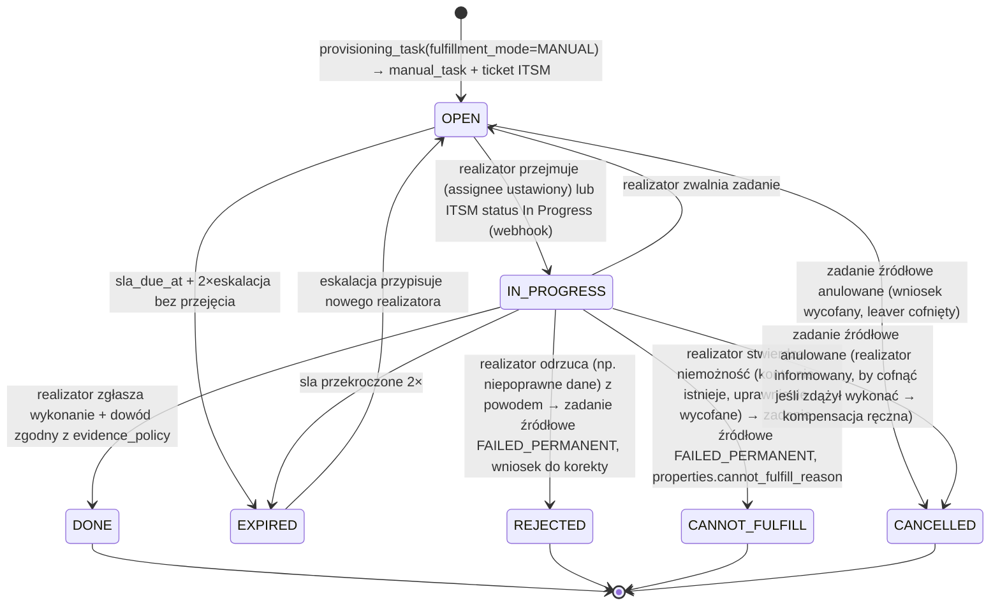
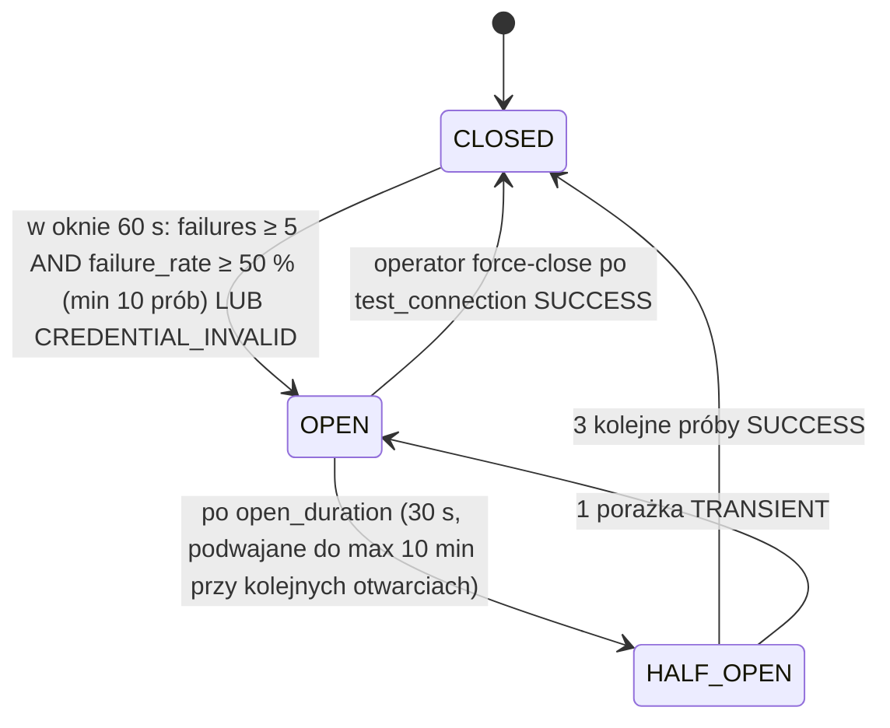
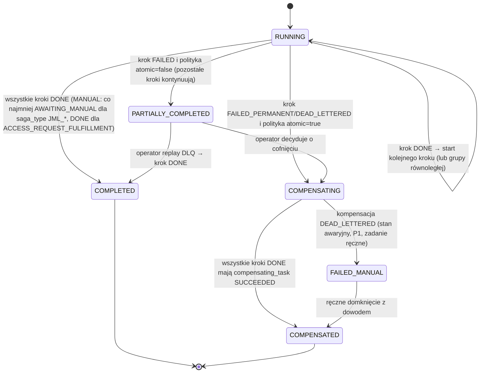

# 5. Architektura Konektorów i Niezawodny Provisioning

## 5.1 Model konektora

Każdy konektor implementuje wspólny interfejs `Connector` (Python Protocol) i jest ładowany jako plugin z rejestru (`entry_points` grupy `ic_iga.connectors`). Konektor **nie zna** modelu IGA; operuje na płaskich strukturach `ProvisioningPayload` i `AggregatedAccount`. Mapowanie między `entitlement_def` a reprezentacją natywną (DN grupy, kod roli SAP, nazwa tabeli) jest utrzymywane w `application.connector_config.entitlement_mapping` i rozwiązywane przez Provisioning Engine przed wywołaniem konektora.

```python
from typing import Protocol, AsyncIterator


class ConnectorCapabilities(ContractModel):
    supports_create: bool
    supports_disable: bool
    supports_delete: bool
    supports_entitlements: bool
    supports_delta_aggregation: bool
    supports_lookup_single: bool
    supports_optimistic_concurrency: bool
    max_parallelism: Annotated[int, Field(ge=1, le=64)]
    default_timeout_seconds: Annotated[int, Field(ge=1, le=600)]


class ConnectorResult(ContractModel):
    outcome: Literal["SUCCESS", "TRANSIENT_FAILURE", "PERMANENT_FAILURE", "ALREADY_IN_DESIRED_STATE"]
    native_id: str | None = None
    observed_state: dict[str, str | bool | list[str]] = Field(default_factory=dict)
    error_code: str | None = None
    error_message: Annotated[str, StringConstraints(max_length=4000)] | None = None
    retry_after_seconds: int | None = None


class AggregatedAccount(ContractModel):
    native_id: str
    immutable_id: str | None = None
    enabled: bool
    attributes: dict[str, str | int | bool | None]
    entitlements_direct: list[str]
    entitlements_effective: list[str]
    last_login_at: AwareDatetime | None = None
    source_watermark: str | None = None


class Connector(Protocol):
    def capabilities(self) -> ConnectorCapabilities:
        """Statyczne możliwości konektora; odczytywane przy rejestracji aplikacji."""

    async def test_connection(self, credentials: DecryptedCredentials) -> ConnectorResult:
        """Sprawdza łączność i poprawność poświadczeń bez skutków ubocznych."""

    async def execute(self, operation: ProvisioningOperation, payload: ProvisioningPayload,
                      credentials: DecryptedCredentials, timeout_seconds: int) -> ConnectorResult:
        """Wykonuje pojedynczą operację idempotentnie; ALREADY_IN_DESIRED_STATE gdy stan docelowy już osiągnięty."""

    async def lookup(self, native_id: str, credentials: DecryptedCredentials) -> AggregatedAccount | None:
        """Odczytuje bieżący stan jednego konta; None gdy konto nie istnieje."""

    async def aggregate(self, credentials: DecryptedCredentials, watermark: str | None,
                        page_size: int) -> AsyncIterator[list[AggregatedAccount]]:
        """Strumieniuje strony kont; watermark=None oznacza pełny odczyt."""
```

### 5.1.1 Typy konektorów

| Typ | Protokół | Model operacji | Agregacja | Idempotencja po stronie systemu docelowego | Specyfika |
|---|---|---|---|---|---|
| **SCIM 2.0 Client** | HTTPS, RFC 7643/7644, OAuth2 client_credentials lub mTLS | `POST /Users`, `PATCH /Users/{id}` (op add/remove na `groups` lub `PATCH /Groups/{id}` members), `PUT` dla pełnej aktualizacji, `active=false` dla DISABLE, `DELETE` | `GET /Users?startIndex&count` + `filter=meta.lastModified gt "{watermark}"` | ETag (`If-Match`) → 412 Precondition Failed traktowany jako TRANSIENT z ponownym `lookup` | Walidacja `ServiceProviderConfig` (patch, filter, etag) przy rejestracji; obsługa `409 uniqueness` jako `ALREADY_IN_DESIRED_STATE` po `lookup` |
| **Direct REST / SOAP API** | HTTPS, JSON/XML, uwierzytelnianie per system (OAuth2, API key w nagłówku, WS-Security) | Mapowanie deklaratywne operacji na endpointy (`connector_config.operations[]` z szablonami Jinja2 request/response i JSONPath/XPath ekstrakcją `native_id`) | Endpoint listujący z paginacją deklaratywną (`offset/limit`, `cursor`, `Link` header) | Zależna od systemu; konektor wykonuje `lookup` przed `execute`, gdy `supports_optimistic_concurrency=false` (read-before-write) | Klasyfikacja błędów po kodzie HTTP i mapie `error_classification` (np. 429/502/503/504 → TRANSIENT; 400/404/422 → PERMANENT; 401/403 → PERMANENT z alertem `credential_invalid`) |
| **Database Table/View** | PostgreSQL / Oracle / MSSQL / DB2 przez SQLAlchemy + sterowniki natywne, TLS wymuszony | Deklaratywne SQL: `insert_user`, `update_user`, `disable_user`, `grant`, `revoke` jako parametryzowane instrukcje; transakcja per operacja | `SELECT` z widoku `v_iga_accounts` i `v_iga_entitlements` (JOIN po stronie bazy), delta po `updated_at` | Instrukcje pisane jako `INSERT INTO t VALUES (v) ON CONFLICT DO UPDATE` / `MERGE`; `revoke` idempotentny (DELETE 0 wierszy = sukces) | Konto techniczne IGA z minimalnymi uprawnieniami (tylko wskazane tabele/widoki); `statement_timeout` po stronie sesji |
| **LDAP / Active Directory** | LDAPS 636 lub StartTLS, Kerberos/Simple bind | `add`, `modify` (`member` add/delete na grupie), `userAccountControl` dla enable/disable, `modDN` dla przeniesienia OU | Paged results (RFC 2696) + `uSNChanged > watermark`; DirSync dla AD | `member` add na istniejącego → `entryAlreadyExists` mapowane na `ALREADY_IN_DESIRED_STATE` | Rozwijanie grup zagnieżdżonych (`memberOf` rekurencyjnie, `LDAP_MATCHING_RULE_IN_CHAIN` w AD) z limitem 20 poziomów |
| **Agent On-Premise** | Agent ↔ Agent Gateway: HTTPS mTLS, long-polling; Agent ↔ system: dowolny z powyższych lub PowerShell/skrypt | Agent wykonuje lokalnie dowolny z powyższych konektorów (ta sama biblioteka) | Agent realizuje `aggregate` i strumieniuje strony do Gateway (`POST /agent/v1/aggregation/{run_id}/pages`) | Jak konektor bazowy + `fencing_token` leasingu | Dla sieci izolowanych; brak połączeń przychodzących do agenta; agent nie przechowuje poświadczeń trwale (otrzymuje DEK-wrapped credentials per zadanie, zeroizacja po użyciu) |
| **Manual Fulfillment** | Człowiek + ITSM + CSV/XLSX | Zadanie dla grupy realizatorów | Import pliku | Dowód realizacji z hashem | Sekcja 5.2 |

### 5.1.2 Architektura agenta pull-based (sieci izolowane)

```mermaid
sequenceDiagram
    autonumber
    participant AG as On-Prem Agent (DMZ / strefa izolowana)
    participant RP as Reverse Proxy (mTLS termination)
    participant GW as Agent Gateway
    participant DB as PostgreSQL
    participant VLT as Vault
    participant TGT as System izolowany

    loop co 5 s lub long-poll 30 s
        AG->>RP: GET /agent/v1/tasks/lease?max=10 (cert klienta agenta)
        RP->>GW: forward + nagłówek X-Client-Cert-Fingerprint
        GW->>DB: SELECT agent WHERE agent_id AND cert_fingerprint AND state=ACTIVE
        GW->>DB: UPDATE provisioning_task SET state=LEASED, lease_expires_at=now()+300s WHERE application_id IN (agent.applications) AND state=QUEUED AND next_attempt_at<=now() ORDER BY priority, created_at FOR UPDATE SKIP LOCKED LIMIT 10 RETURNING *
        GW->>DB: INSERT agent_task_lease(fencing_token = nextval('lease_fencing_seq'))
        GW->>VLT: transit/decrypt(wrapped_dek) → DEK; decrypt(credentials) → plaintext
        GW->>GW: Re-encrypt credentials kluczem publicznym agenta (X25519 z certyfikatu agenta, HPKE RFC 9180)
        GW-->>AG: 200 [{task, payload, fencing_token, credentials_hpke, expires_at}]
    end
    AG->>AG: Weryfikacja payload_hmac; decrypt HPKE; wykonanie z timeoutem
    AG->>TGT: operacja natywna
    TGT-->>AG: wynik
    AG->>AG: zeroizacja poświadczeń w pamięci
    AG->>RP: POST /agent/v1/tasks/{task_id}/result {fencing_token, ConnectorResult}
    RP->>GW: forward
    GW->>DB: UPDATE provisioning_task SET state=wynik WHERE task_id AND state=LEASED AND lease fencing_token == submitted (CAS)
    alt fencing_token nieaktualny (lease wygasł i zadanie zostało ponownie wyleasingowane)
        GW-->>AG: 409 Conflict (wynik odrzucony; zadanie wykonane idempotentnie przez kolejnego leasingobiorcę lub ten sam efekt)
        GW->>DB: audit(agent.stale_result, task_id, agent_id)
    else OK
        GW-->>AG: 200
    end
    Note over GW,DB: Job lease_reaper co 30 s: LEASED z lease_expires_at < now() → QUEUED (attempt_count+1), audit(agent.lease_expired)
```

Gwarancje: zadanie jest wykonane **co najmniej raz**; dzięki `idempotency_key` i semantyce `ALREADY_IN_DESIRED_STATE` w konektorach efekt jest **dokładnie jeden**; `fencing_token` eliminuje nadpisanie stanu przez spóźniony raport „zombie” agenta.

## 5.2 Wzorzec Manual Fulfillment Connector (Konektor Półręczny)

### 5.2.1 Rejestr aplikacji i macierz realizatorów

| Pole `application` | Znaczenie |
|---|---|
| `integration_mode = MANUAL` | Wszystkie operacje realizowane przez ludzi; `HYBRID` = część operacji (np. CREATE) automatyczna, część (np. nadanie roli w module legacy) ręczna, mapowanie per `operation` w `connector_config.manual_operations[]` |
| `fulfillment_group[]` | Grupy realizatorskie z `itsm_assignment_group`, `sla_hours` (domyślnie 72; dla operacji DISABLE leavera 4; EMERGENCY 2), `escalation_identity_id` |
| `manual_instruction_template_id` | Szablon instrukcji (Jinja2) renderowany z payloadu: „W systemie X, menu Y, nadaj użytkownikowi {native_id} rolę {native_name}” |
| `evidence_policy` | `TICKET_REQUIRED`, `ATTACHMENT_REQUIRED`, `TICKET_OR_ATTACHMENT`, `TEXT_ONLY` (dozwolone wyłącznie dla klasy C) |
| `import_schedule_days` | Wymagana częstotliwość importu CSV/XLSX pełnego stanu (domyślnie 30; klasa A: 14) |
| `import_schema_id` | Schemat kolumn pliku (mapowanie kolumn → `native_id`, `enabled`, `entitlements` z separatorem) |

### 5.2.2 Cykl życia zadania ręcznego



Macierz przejść z guardami:

| Z | Do | Guard | Efekt na `provisioning_task` / `account` |
|---|---|---|---|
| OPEN | IN_PROGRESS | `actor ∈ fulfillment_group.members` lub webhook ITSM z podpisem | `provisioning_task.state = AWAITING_MANUAL` (bez zmian) |
| IN_PROGRESS | DONE | `actor == assignee`; dowód spełnia `evidence_policy`; dla `ATTACHMENT_REQUIRED`: plik ≤ 20 MB, typ MIME z listy (png, jpg, pdf), `content_sha256` policzony po stronie serwera; dla `TICKET_REQUIRED`: `itsm_ticket_id` istnieje w ITSM i jest w stanie Resolved/Closed (weryfikacja API ITSM) | `provisioning_task.state = AWAITING_VERIFICATION → SUCCEEDED`; `account.state = CONFIRMED_MANUAL` (nie `VERIFIED_AUTOMATED`); `entitlement_assignment.state = ACTIVE` z `verification_source=CONFIRMED_MANUAL` |
| IN_PROGRESS | REJECTED | `actor == assignee`; komentarz ≥ 20 znaków | `provisioning_task.state = FAILED_PERMANENT(error_code=MANUAL_REJECTED)`; saga: krok FAILED → decyzja kompensacji wg polityki wniosku |
| IN_PROGRESS | CANNOT_FULFILL | jak REJECTED + `cannot_fulfill_reason ∈ {ACCOUNT_NOT_FOUND, ENTITLEMENT_NOT_FOUND, SYSTEM_DECOMMISSIONED, OTHER}` | jak REJECTED; dla `ENTITLEMENT_NOT_FOUND` tworzone zadanie przeglądu `entitlement_def` dla właściciela |
| OPEN / IN_PROGRESS | CANCELLED | zadanie źródłowe → CANCELLED | Jeśli IN_PROGRESS: realizator otrzymuje zadanie kompensacyjne „cofnij, jeśli wykonano” (`manual_task` typu COMPENSATE) |
| OPEN / IN_PROGRESS | EXPIRED | `now() > sla_due_at + 2 × escalation_interval` | Eskalacja do `escalation_identity_id` → właściciel aplikacji → Security Officer (dla DISABLE leavera: natychmiast P1) |

### 5.2.3 Diagram sekwencji: realizacja ręczna z closed-loop verification

```mermaid
sequenceDiagram
    autonumber
    participant PV as Provisioning Engine
    participant MF as Manual Fulfillment Connector
    participant DB as PostgreSQL
    participant ITSM as ITSM (ServiceNow)
    actor FUL as Realizator (grupa SAP-LEGACY-OPS)
    participant UI as Web UI (panel realizatora)
    participant OS as Object Storage
    participant SCH as Scheduler
    actor OWN as Właściciel aplikacji
    participant RS as Reconciliation Service

    PV->>MF: dispatch(provisioning_task: ADD_ENTITLEMENT, app=SAP_LEGACY, fulfillment_mode=MANUAL)
    MF->>DB: INSERT manual_task(state=OPEN, group=SAP-LEGACY-OPS, sla_due_at=now()+72h, instruction_rendered)
    MF->>ITSM: POST /api/now/table/sc_task {assignment_group, short_description, description=instruction, correlation_id=manual_task_id}
    ITSM-->>MF: sys_id, number=TASK0012345
    MF->>DB: UPDATE manual_task SET itsm_ticket_id='TASK0012345'; provisioning_task.state=AWAITING_MANUAL; audit
    FUL->>UI: Otwiera zadanie (lista „Moje zadania” filtrowana po grupie)
    UI->>MF: POST /manual-tasks/{id}/claim
    MF->>DB: state=IN_PROGRESS, assignee=FUL; audit
    FUL->>FUL: Wykonuje w SAP legacy: SU01 → role Z_AP_CLERK dla użytkownika JNOWAK
    FUL->>UI: Zgłasza DONE: ticket TASK0012345 (Resolved), załącznik zrzut ekranu SU01
    UI->>OS: PUT evidence/{manual_task_id}/{uuid}.png (presigned, max 20 MB)
    UI->>MF: POST /manual-tasks/{id}/complete {itsm_ticket_id, attachments[{uri, sha256}], note}
    MF->>ITSM: GET /api/now/table/sc_task/{sys_id} → state == Resolved? assignment_group zgodna?
    MF->>OS: HEAD + GET evidence → recompute SHA-256, porównanie z deklarowanym, skan AV (ClamAV)
    MF->>DB: INSERT manual_task_evidence × 2; manual_task.state=DONE; provisioning_task.state=SUCCEEDED
    MF->>DB: account.state=CONFIRMED_MANUAL; entitlement_assignment.state=ACTIVE(verification_source=CONFIRMED_MANUAL); outbox; audit(manual.evidence_submitted)
    Note over MF,DB: Stan CONFIRMED_MANUAL jest widoczny w UI, raportach i kampaniach jako „potwierdzone przez człowieka, niezweryfikowane maszynowo”
    SCH->>OWN: Dzień 14 od ostatniego importu: przypomnienie o obowiązkowym imporcie stanu SAP_LEGACY (CSV)
    OWN->>UI: Upload users_entitlements_2026-10-15.xlsx
    UI->>OS: PUT imports/{application_id}/{import_id}.xlsx
    UI->>RS: POST /reconciliation/manual-imports {application_id, uri, sha256}
    RS->>DB: INSERT manual_import(state=UPLOADED); walidacja schematu (kolumny, typy, duplikaty native_id) → VALIDATED
    RS->>DB: INSERT reconciliation_run(mode=MANUAL_IMPORT); snapshot z wierszy pliku
    RS->>DB: Diff: CONFIRMED_MANUAL przypisania obecne w pliku → VERIFIED_AUTOMATED (last_verified_at); brakujące → delta MANUAL_MISMATCH; nadmiarowe → OOB_ENTITLEMENT_ADDED
    RS->>DB: manual_import.state=DIFFED (rows_total, rows_matched, rows_delta)
    RS->>MF: Reakcja na MANUAL_MISMATCH: nowy manual_task typu VERIFY dla grupy (SLA 5 dni): „potwierdź lub wykonaj ponownie”
    RS->>DB: manual_import.state=APPLIED; audit(reconciliation.run_completed)
```

### 5.2.4 Rozróżnienie stanów weryfikacji

| `verification_source` | Znaczenie | Jak powstaje | Jak wygasa |
|---|---|---|---|
| `UNVERIFIED` | Operacja zgłoszona jako wykonana przez konektor automatyczny, ale jeszcze nie potwierdzona odczytem | Po `SUCCEEDED` konektora automatycznego | Po ADHOC lookup (60 s) lub najbliższym DELTA/FULL → `VERIFIED_AUTOMATED` |
| `CONFIRMED_MANUAL` | Człowiek zadeklarował wykonanie i dostarczył dowód | Po `manual_task.DONE` | Po imporcie CSV potwierdzającym → `VERIFIED_AUTOMATED`; brak importu przez `import_schedule_days × 2` → flaga `stale_confirmation=true` w raportach i kampaniach, blokada nowych wniosków HIGH/CRITICAL do tej aplikacji (polityka `manual_import_overdue_block`) |
| `VERIFIED_AUTOMATED` | Stan potwierdzony maszynowo odczytem z systemu lub importem | Reconciliation | Przy każdym kolejnym runie odświeżany `last_verified_at`; po wykryciu driftu → `DRIFTED` |

W kampaniach recertyfikacyjnych i scoringu ryzyka pozycje `CONFIRMED_MANUAL` ze `stale_confirmation=true` są oznaczane wizualnie i podnoszą `item_risk` o 10 punktów.

## 5.3 Niezawodność asynchronicznego provisioningu

### 5.3.1 Transactional Outbox

Każda transakcja biznesowa, która ma skutek poza bazą danych (publikacja zdarzenia domenowego, zlecenie provisioningowe, powiadomienie, ticket), zapisuje zamiar w tabeli `outbox_event` **w tej samej transakcji** co zmiana stanu. Relay publikuje zdarzenia do brokera i oznacza `published_at`.

```sql
CREATE TABLE outbox_event (
    event_id        uuid        NOT NULL,
    aggregate_type  text        NOT NULL,
    aggregate_id    uuid        NOT NULL,
    event_type      text        NOT NULL,
    schema_version  int         NOT NULL,
    payload         jsonb       NOT NULL,
    payload_hmac    bytea       NOT NULL,
    partition_key   text        NOT NULL,
    correlation_id  uuid        NOT NULL,
    causation_id    uuid,
    created_at      timestamptz NOT NULL DEFAULT now(),
    published_at    timestamptz,
    publish_attempts int        NOT NULL DEFAULT 0,
    PRIMARY KEY (created_at, event_id)
) PARTITION BY RANGE (created_at);

CREATE INDEX outbox_unpublished_idx ON outbox_event (created_at)
    WHERE published_at IS NULL;
```

Pętla Relay (pseudokod, uruchamiana w 2–6 instancjach):

```python
async def relay_loop(pool, producer, batch=500):
    while True:
        async with pool.transaction() as tx:
            rows = await tx.fetch(
                """
                SELECT event_id, event_type, schema_version, payload, partition_key, correlation_id, causation_id
                FROM outbox_event
                WHERE published_at IS NULL AND created_at > now() - interval '7 days'
                ORDER BY created_at
                FOR UPDATE SKIP LOCKED
                LIMIT $1
                """, batch)
            if not rows:
                await asyncio.sleep(0.2)
                continue
            futures = [producer.send(topic_for(r["event_type"]), key=r["partition_key"].encode(),
                                     value=encode(r), headers=headers_for(r)) for r in rows]
            results = await asyncio.gather(*futures, return_exceptions=True)
            ok_ids = [r["event_id"] for r, res in zip(rows, results) if not isinstance(res, Exception)]
            failed = [r["event_id"] for r, res in zip(rows, results) if isinstance(res, Exception)]
            await tx.execute("UPDATE outbox_event SET published_at = now() WHERE event_id = ANY($1)", ok_ids)
            await tx.execute("UPDATE outbox_event SET publish_attempts = publish_attempts + 1 WHERE event_id = ANY($1)", failed)
        metrics.outbox_publish_lag.observe(lag_seconds(rows))
```

Własności:

- **At-least-once**: jeśli Relay padnie po `producer.send` a przed `COMMIT`, zdarzenia zostaną opublikowane ponownie. Konsumenci są idempotentni po `event_id` (tabela `consumer_inbox(consumer_group, event_id) PRIMARY KEY` z retencją 7 dni; INSERT ON CONFLICT DO NOTHING w transakcji przetwarzania).
- **Kolejność**: zachowana per `partition_key` (np. `identity_id`, `application_id`) dzięki jednemu producentowi na instancję z `enable.idempotence=true`, `max.in.flight.requests.per.connection=5`, `acks=all`. Między instancjami Relay kolejność dla jednego klucza może zostać naruszona tylko wtedy, gdy dwa zdarzenia tego samego klucza zostaną pobrane przez różne instancje w tej samej chwili; konsumenci nie polegają na globalnej kolejności, lecz na wersjach agregatów (`hr_state_version`, `revision_no`, `state_history`).
- **Brak utraty**: zdarzenie istnieje w DB przed publikacją; awaria brokera powoduje wzrost `outbox_publish_lag_seconds` (SLO-11), nie utratę.
- **Partycje dzienne**: usuwanie opublikowanych zdarzeń przez `DROP PARTITION` po 7 dniach; brak DELETE, brak bloatu.
- **Integralność**: `payload_hmac = HMAC-SHA256(key_outbox, canonical(payload))`, klucz z Vault rotowany co 90 dni (dwa aktywne klucze w oknie przejściowym, `key_id` w nagłówku).

### 5.3.2 Kolejka zadań, At-Least-Once, idempotencja

| Mechanizm | Implementacja |
|---|---|
| Kolejka | Topic `provisioning.tasks.v1` (48 partycji, klucz = `application_id`) jako sygnał; **stan zadania w DB** jest źródłem prawdy. Worker po odebraniu sygnału wykonuje CAS: `UPDATE provisioning_task SET state='IN_PROGRESS', started_at=now(), worker_id=$w WHERE task_id=$t AND state IN ('QUEUED','RETRY_WAIT') AND next_attempt_at <= now() RETURNING *`; brak wiersza = zadanie już przejęte lub nieaktualne → ACK bez działania |
| Priorytety | Osobne topiki `provisioning.tasks.emergency.v1` (12 partycji) i pula workerów dedykowana (min. 4 workerów per DC) → brak head-of-line blocking dla leavera emergency; `HIGH` i `NORMAL` na wspólnym topiku z sortowaniem po stronie DB przy fallbacku pollingowym |
| Fallback polling | Worker co 30 s wykonuje `SELECT task_id FROM provisioning_task WHERE state IN ('QUEUED','RETRY_WAIT') AND next_attempt_at <= now() - interval '2 minutes' ORDER BY priority, next_attempt_at FOR UPDATE SKIP LOCKED LIMIT 100` → wychwytuje zadania, których sygnał Kafka zaginął |
| Idempotency key | `idempotency_key` (sekcja 3.4.2) z `UNIQUE`; próba utworzenia zadania o istniejącym kluczu zwraca istniejące zadanie (`INSERT INTO provisioning_task (kolumny) VALUES (wartości) ON CONFLICT (idempotency_key) DO UPDATE SET task_id = provisioning_task.task_id RETURNING task_id`) |
| Rozproszona blokada wykonania | Redis `SET lock:pt:{idempotency_key} {worker_id}:{fencing} NX PX 600000` jako drugi poziom (chroni przed równoległym wykonaniem tego samego zadania przez dwa workery po rebalansie, zanim CAS w DB zostanie zauważony); zwolnienie przez skrypt Lua porównujący wartość; fencing token z `provisioning_attempt.attempt_no` |
| Blokada per konto | `pg_advisory_xact_lock(hashtext(application_id || native_id))` w transakcji CAS → dwa zadania na to samo konto nie wykonują się jednocześnie (unika race ADD/REMOVE na tej samej grupie) |
| Semantyka wyniku | `ALREADY_IN_DESIRED_STATE` traktowany jako `SUCCESS`; po każdym `SUCCESS` w klasie A planowany ADHOC lookup po 60 s (closed-loop) |

### 5.3.3 Polityka ponowień: Exponential Backoff z Full Jitter

```python
import random

BASE_SECONDS = 2.0
CAP_SECONDS = 1800.0          # 30 min
MAX_ATTEMPTS_DEFAULT = 12     # suma oczekiwanych opóźnień ≈ 3 h 10 min

def next_delay(attempt_no: int, retry_after: int | None) -> float:
    """attempt_no zaczyna się od 1. Full Jitter wg AWS Architecture Blog: sleep = random(0, min(cap, base * 2^attempt))."""
    if retry_after is not None:
        return float(min(max(retry_after, 1), CAP_SECONDS))
    return random.uniform(0.0, min(CAP_SECONDS, BASE_SECONDS * (2 ** attempt_no)))
```

| Klasa błędu | Źródło klasyfikacji | Działanie |
|---|---|---|
| `TRANSIENT` | Timeout, connection reset, HTTP 408/429/500/502/503/504, LDAP `busy`/`unavailable`, SQL `serialization_failure`/`deadlock_detected`/`connection_failure`, circuit open | `state=RETRY_WAIT`, `next_attempt_at = now() + next_delay()`, `attempt_count += 1`; po `max_attempts` → `DEAD_LETTERED(reason=MAX_RETRIES)` |
| `PERMANENT` | HTTP 400/404/409 (po lookup niezgodnym)/422, LDAP `noSuchObject`/`constraintViolation`, SQL `integrity_constraint_violation`, `MANUAL_REJECTED`, walidacja payloadu, HMAC mismatch | `state=FAILED_PERMANENT` lub `DEAD_LETTERED(reason=PERMANENT)` zależnie od `operation` (DISABLE/REMOVE leavera zawsze DLQ z alertem P1; ADD z wniosku → FAILED_PERMANENT i saga decyduje) |
| `CREDENTIAL_INVALID` | HTTP 401/403, LDAP `invalidCredentials`, SQL `invalid_authorization_specification` | Circuit breaker konektora → OPEN natychmiast; wszystkie zadania aplikacji → `RETRY_WAIT` z `next_attempt_at = now() + 15 min`; alert P1 `connector.credential_invalid`; po rotacji poświadczeń operator wykonuje `test_connection` i zamyka obwód |

Dla operacji `priority=EMERGENCY` parametry są agresywniejsze: `BASE=1.0`, `CAP=60`, `MAX_ATTEMPTS=30` (ok. 30 min), a po wyczerpaniu DLQ z alertem P1 i równoległym zadaniem MANUAL do grupy dyżurnej (fallback „człowiek wyłącza konto ręcznie”).

### 5.3.4 Circuit Breaker na poziomie konektora

Stan obwodu per `(application_id, connector_pool)` przechowywany w Redis (`cb:{application_id}`) z replikacją do DB co zmianę stanu (audyt).



W stanie `OPEN` worker nie wywołuje konektora: zadanie otrzymuje `provisioning_attempt(outcome=CIRCUIT_OPEN)` bez inkrementacji `attempt_count` (otwarty obwód nie „zużywa” budżetu ponowień zadania) i `next_attempt_at = circuit.next_half_open_at + jitter(0..5 s)`. W `HALF_OPEN` przepuszczane są wyłącznie zadania o najwyższym priorytecie (max 3 równolegle).

### 5.3.5 Dead Letter Queue

| Element | Specyfikacja |
|---|---|
| Składowanie | Tabela `dlq_entry` (widok B ERD) + topic `dlq.provisioning.v1` jako sygnał dla UI/alertów; źródłem prawdy jest tabela |
| Powody | `MAX_RETRIES`, `PERMANENT`, `POISON` (payload nie przechodzi walidacji Pydantic po deserializacji; wskazuje na niezgodność wersji schematu), `HMAC_MISMATCH` (incydent bezpieczeństwa P1), `COMPENSATION_FAILED` |
| Interfejs inspekcji | `GET /dlq?application_id&reason_class&state&from&to` z pełnym kontekstem: zadanie, wszystkie `provisioning_attempt`, saga, wniosek/zdarzenie źródłowe, stan obwodu, ostatni snapshot konta z reconciliation; diff `expected vs observed` |
| Triage | `POST /dlq/{id}/triage {note, state=TRIAGED}`; przypisanie do operatora; SLA triage: EMERGENCY 1 h, HIGH 8 h, NORMAL 3 dni robocze |
| Replay | `POST /dlq/{id}/replay {override_payload?: ProvisioningPayload, reset_attempts: bool}` → tworzy **nowe** `provisioning_task` z `idempotency_key` = oryginalny + `:replay:{n}` (nowa intencja operatora, audytowana), `causation_id` = oryginalny task; oryginał pozostaje `DEAD_LETTERED` z `replayed_task_id`. Zmiana payloadu wymaga dual-control dla operacji na aplikacjach klasy A |
| Masowy replay | `POST /dlq/replay-batch {filter, dry_run}` → podgląd liczby i listy, następnie wykonanie z throttlingiem 10/s; typowe po przywróceniu konektora |
| Discard | `POST /dlq/{id}/discard {justification}` → `state=DISCARDED`; dla operacji REMOVE/DISABLE wymaga roli Security Officer i generuje `sod_violation`/`reconciliation_delta` „expected revoke not executed”, by stan nie zniknął z radaru |
| Retencja | 24 miesiące w DB; eksport do pakietu dowodowego na żądanie |
| Alerty | `HMAC_MISMATCH` → P1 natychmiast; DLQ dla DISABLE/REMOVE leavera → P1; wzrost liczby wpisów OPEN > 100 w 1 h → P2 |

### 5.3.6 Wzorzec Saga (Orchestrated) z transakcjami kompensacyjnymi

Wnioski wieloaplikacyjne, Mover i Leaver są realizowane jako sagi orkiestrowane: Governance Engine (orkiestrator) tworzy `saga` z uporządkowaną listą `saga_step`, każdy krok to jedno `provisioning_task`; orkiestrator reaguje na zdarzenia `provisioning.task_succeeded/failed` i decyduje o kolejnym kroku lub kompensacji.



Reguły kompensacji per operacja:

| Operacja kroku | Operacja kompensująca | Uwagi |
|---|---|---|
| `CREATE_ACCOUNT` | `DISABLE` (nigdy `DELETE` automatycznie; `DELETE` po retencji przez scheduler) | Konto pozostaje w `DISABLED` z adnotacją `compensated_saga_id` |
| `ADD_ENTITLEMENT` | `REMOVE_ENTITLEMENT` | Tylko jeśli uprawnienie nie było posiadane przed sagą (`expected_pre_state` zapisuje stan przed) |
| `REMOVE_ENTITLEMENT` | `ADD_ENTITLEMENT` | **Nie kompensowane** dla sag `JML_LEAVER`, `CERT_REVOKE`, `SOD_REMEDIATION` (odebranie dostępu jest bezpieczniejszym stanem końcowym); dla `JML_MOVER` kompensacja wymaga decyzji operatora |
| `ENABLE` | `DISABLE` | |
| `DISABLE` | `ENABLE` | Tylko dla `JML_SUSPEND` cofniętego; nigdy dla leavera |
| `UPDATE_ATTRIBUTES` | `UPDATE_ATTRIBUTES` z `expected_pre_state` | |
| krok MANUAL `DONE` | `manual_task` typu COMPENSATE do tej samej grupy | Wymaga dowodu |

Kolejność w sadze: kroki `REMOVE_*`/`DISABLE` zawsze przed `ADD_*`/`ENABLE` (guard `ordering=REVOKE_FIRST`), kroki w tej samej aplikacji sekwencyjnie (blokada per konto), kroki w różnych aplikacjach równolegle (grupa `step_order` wspólna). Polityka `atomic` jest atrybutem wniosku: domyślnie `false` dla wniosków użytkownika (częściowa realizacja dopuszczalna, raportowana), `true` dla ról biznesowych oznaczonych `all_or_nothing=true` (np. rola wymagająca spójnego dostępu w SAP i systemie bankowym).

### 5.3.7 Alternatywa brokera: RabbitMQ

Jeśli instalacja wybiera RabbitMQ 3.12+ zamiast Kafka: quorum queues (Raft, 3 węzły), `x-delivery-limit=20`, dead-letter exchange per kolejka, publisher confirms jako odpowiednik `acks=all`, routing po `application_id` przez consistent-hash exchange dla zachowania lokalności per aplikacja. Semantyka Outbox i idempotencji konsumentów pozostaje bez zmian; różnica: brak replay historycznego ze streamu (do odtworzeń używana jest tabela `outbox_event`/`provisioning_task`, nie broker).
