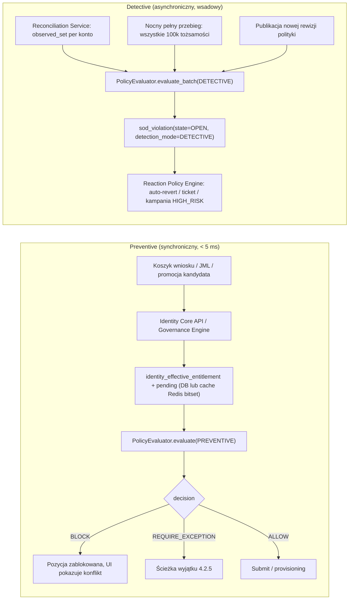

# 6. Silnik Polityk i Detekcji SoD (Separation of Duties)

## 6.1 Model reguł SoD

### 6.1.1 Rodzaje reguł

| `rule_kind` | Semantyka | Przykład | Minimalna krotność naruszenia |
|---|---|---|---|
| `TOXIC_PAIR` | Posiadanie co najmniej jednego uprawnienia z grupy operandów A **i** co najmniej jednego z grupy B | A = {`ERP:AP:CREATE_VENDOR`}, B = {`ERP:AP:APPROVE_INVOICE:*`} | 1 z A ∧ 1 z B |
| `TOXIC_SET` | Posiadanie co najmniej `k` z `n` wskazanych uprawnień (k-of-n) | {`ERP:GL:POST_JOURNAL`, `ERP:GL:APPROVE_JOURNAL`, `ERP:GL:CLOSE_PERIOD`}, k=2 | k z n |
| `CROSS_APP` | `TOXIC_PAIR`, w którym grupy A i B należą do różnych aplikacji | A = {`SAP:FI:PAYMENT_RUN`}, B = {`BANK:TRANSFER:RELEASE`} | 1 z A ∧ 1 z B |
| `ATTRIBUTE_GUARD` | Uprawnienie dozwolone tylko, gdy atrybuty tożsamości spełniają predykat ABAC | `ERP:HR:VIEW_SALARY` wymaga `job_family ∈ {HR, FIN_CTRL}` | 1 uprawnienie ∧ ¬predykat |
| `TEMPORAL_GUARD` | Łączne posiadanie dozwolone, jeśli nie nakłada się w czasie (`valid_from`/`valid_to`) | A i B dozwolone sekwencyjnie, nie równolegle | nakładanie przedziałów |
| `ROLE_EXCLUSION` | Dwie role nie mogą być przypisane jednocześnie (niezależnie od uprawnień) | `BUS_PURCHASING_MANAGER` × `BUS_AP_SUPERVISOR` | obie role |

Operandy mogą wskazywać atom (`entitlement_id`), namespace z wildcardem (`ERP:AP:APPROVE_INVOICE:*` → wszystkie atomy o tym namespace niezależnie od `qualifier`), namespace z kwalifikatorem (`ERP:AP:APPROVE_INVOICE[limit.value >= 10000]`) lub rolę (`role_id`, rozwijaną przez `role_closure` do uprawnień w chwili kompilacji).

### 6.1.2 DSL warunku reguły (`POLICY_RULE.condition`)

Warunek jest zapisany jako JSON o ustalonej gramatyce, kompilowany do postaci bitsetowej:

```json
{
  "$schema": "https://ic-iga.corp.local/schemas/policy-rule-condition/v1.json",
  "rule_code": "SOD-FIN-017",
  "kind": "TOXIC_PAIR",
  "severity": "CRITICAL",
  "operands": {
    "A": [
      { "namespace": "ERP:AP:APPROVE_INVOICE", "qualifier_filter": { "path": "limit.value", "op": ">=", "value": 10000 } }
    ],
    "B": [
      { "namespace": "ERP:AR:POST_RECEIPT" },
      { "namespace": "ERP:AR:WRITE_OFF" }
    ]
  },
  "scope": {
    "identity_predicate": { "attribute": "hr_attributes.company_code", "op": "in", "values": ["PL01", "PL02", "DE01"] },
    "include_service_accounts_via_owner": true
  },
  "temporal": { "mode": "OVERLAP", "grace_days": 0 },
  "remediation": "REQUIRE_EXCEPTION",
  "max_exception_days": 90,
  "mitigating_control_types_allowed": ["DETECTIVE_REPORT_REVIEW", "DUAL_AUTHORIZATION"]
}
```

Gramatyka (EBNF, uproszczona do elementów używanych przez kompilator):

```
condition      := kind "," severity "," operands "," [scope] "," [temporal] "," remediation
operands       := TOXIC_PAIR: {A: operand+, B: operand+}
                | TOXIC_SET:  {SET: operand+, K: int}
                | ATTRIBUTE_GUARD: {E: operand+, PREDICATE: predicate}
                | ROLE_EXCLUSION: {R1: role_ref, R2: role_ref}
operand        := {entitlement_id} | {namespace, [qualifier_filter]} | {role_id}
qualifier_filter := {path: jsonpath, op: ("<"|"<="|"="|">="|">"|"in"), value}
predicate      := {attribute, op: ("eq"|"in"|"not_in"|"startswith"), values}
               | {all: predicate+} | {any: predicate+} | {not: predicate}
temporal       := {mode: ("OVERLAP"|"EVER"), grace_days: int}
```

Kompilator odrzuca reguły, których operandy rozwijają się do zbioru pustego (błąd konfiguracji) albo w których A ∩ B ≠ ∅ (reguła sprzeczna sama ze sobą).

## 6.2 Formalny kontrakt interfejsu `PolicyEvaluator`

```python
class EvaluationMode(StrEnum):
    PREVENTIVE = "PREVENTIVE"
    DETECTIVE = "DETECTIVE"
    SIMULATION = "SIMULATION"


class TargetAssignment(ContractModel):
    entitlement_id: UUID
    valid_from: AwareDatetime | None = None
    valid_to: AwareDatetime | None = None
    source_kind: Literal["CURRENT", "PENDING", "REQUESTED", "OBSERVED", "CANDIDATE"]
    source_id: UUID | None = None
    via_service_account_id: UUID | None = None


class EvaluationRequest(ContractModel):
    request_id: UUID
    mode: EvaluationMode
    identity_id: UUID | None = Field(default=None, description="Null w SIMULATION dla kandydata roli z miningu")
    identity_attributes: HrAttributes | None = None
    target_set: list[TargetAssignment] = Field(min_length=0, max_length=20000)
    policy_revision_id: UUID | None = Field(default=None, description="Null = bieżąca opublikowana rewizja")
    as_of: AwareDatetime | None = Field(default=None, description="Chwila oceny dla TEMPORAL_GUARD; null = now()")
    active_exception_ids: list[UUID] = Field(default_factory=list)
    include_warnings: bool = True


class ViolationOperandHit(ContractModel):
    operand_group: Literal["A", "B", "SET", "E", "R1", "R2"]
    entitlement_id: UUID | None = None
    role_id: UUID | None = None
    source_kind: str
    source_id: UUID | None = None


class Violation(ContractModel):
    rule_id: UUID
    rule_code: Code
    rule_kind: str
    severity: Literal["LOW", "MEDIUM", "HIGH", "CRITICAL"]
    remediation: Literal["BLOCK", "REQUIRE_EXCEPTION", "NOTIFY"]
    hits: list[ViolationOperandHit] = Field(min_length=1)
    mitigated_by_exception_id: UUID | None = None
    introduced_by: list[UUID] = Field(default_factory=list, description="source_id pozycji target_set, których usunięcie eliminuje naruszenie")
    explanation: Annotated[str, StringConstraints(max_length=2000)]


class EvaluationResult(ContractModel):
    request_id: UUID
    policy_revision_id: UUID
    policy_snapshot_hash: Sha256Hex
    evaluated_at: AwareDatetime
    duration_micros: Annotated[int, Field(ge=0)]
    violations: list[Violation]
    warnings: list[Violation] = Field(default_factory=list, description="Reguły z remediation NOTIFY i near-miss")
    risk_delta: Annotated[int, Field(ge=-100, le=100)]
    rules_evaluated: Annotated[int, Field(ge=0)]
    decision: Literal["ALLOW", "ALLOW_WITH_WARNINGS", "REQUIRE_EXCEPTION", "BLOCK"]


class PolicyEvaluator(Protocol):
    def evaluate(self, request: EvaluationRequest) -> EvaluationResult:
        """Deterministyczna, bezstanowa ocena. Ten sam (request, revision) zawsze daje identyczny wynik."""

    def evaluate_batch(self, requests: list[EvaluationRequest]) -> list[EvaluationResult]:
        """Ocena wsadowa dla reconciliation i miningu; zachowuje kolejność wejścia."""

    def explain(self, violation: Violation, locale: str) -> str:
        """Czytelne wyjaśnienie dla UI i pakietu dowodowego."""

    def current_revision(self) -> tuple[UUID, Sha256Hex]:
        """Identyfikator i hash załadowanej rewizji."""

    def reload(self, revision_id: UUID) -> None:
        """Atomowa podmiana skompilowanego zestawu reguł (copy-on-write)."""
```

Reguły kontraktu:

1. `decision = BLOCK` jeśli istnieje naruszenie z `remediation=BLOCK` niezłagodzone wyjątkiem; `REQUIRE_EXCEPTION` jeśli wszystkie niezłagodzone naruszenia mają `remediation=REQUIRE_EXCEPTION`; `ALLOW_WITH_WARNINGS` gdy tylko `warnings`; `ALLOW` w przeciwnym razie.
2. Wyjątek łagodzi naruszenie tylko wtedy, gdy `exception.rule_id == violation.rule_id`, `exception.identity_id == request.identity_id`, `exception.state == ACTIVE`, `as_of ∈ [valid_from, valid_to]`.
3. `introduced_by` jest obliczane jako minimalny zbiór pozycji `REQUESTED`/`PENDING`, których usunięcie eliminuje naruszenie (dla TOXIC_PAIR: wszystkie hity po stronie o mniejszej liczbie hitów pochodzących z REQUESTED; jeśli obie strony są CURRENT, `introduced_by = []` i naruszenie jest preegzystujące).
4. `policy_snapshot_hash` jest zapisywany w `sod_violation`, `audit_event` i `access_request`, co umożliwia odtworzenie oceny po latach.

## 6.3 Architektura ewaluacji: prewencja vs detekcja



| Aspekt | Preventive | Detective |
|---|---|---|
| Kiedy | Pre-request check (każda zmiana koszyka), submit, post-approval, JML Mover/Joiner, promocja kandydata z miningu, publikacja rewizji roli (symulacja dla członków) | Po każdym runie reconciliation (observed set), nocny pełny przebieg na `identity_effective_entitlement`, po publikacji nowej rewizji polityki (pełny przebieg), po adopcji konta |
| Zbiór oceniany | `current ∪ pending ∪ requested` | `observed` (stan faktyczny w systemach) oraz `current` (stan IGA) osobno; rozbieżność między nimi to drift, a nie SoD |
| Wynik | Decyzja blokująca lub ścieżka wyjątku | `sod_violation` z reakcją; nigdy nie blokuje operacji już wykonanej, lecz ją cofa lub eskaluje |
| SLO | SLO-01/02 | Pełny nocny przebieg 100k tożsamości × 500 reguł < 20 min |
| Pokrycie | Tylko kanał IGA | Także zmiany out-of-band i naruszenia preegzystujące sprzed wdrożenia reguły |

Oba tryby używają tego samego skompilowanego zestawu reguł i tej samej funkcji oceny, co gwarantuje, że żadne naruszenie dopuszczone prewencyjnie nie zostanie zgłoszone detekcyjnie z innym wynikiem dla tej samej rewizji.

## 6.4 Natywny silnik bitsetowy

### 6.4.1 Kompilacja rewizji polityki

Przy publikacji `POLICY_REVISION` kompilator wykonuje:

1. Nadanie każdemu `entitlement_id` w przestrzeni uprawnień pozycji bitowej `pos(e) ∈ [0, M)` (`entitlement_space_version` rośnie przy dodaniu nowych atomów; stare pozycje nie są reużywane).
2. Rozwinięcie operandów do bitsetów: `A_r`, `B_r` (Roaring Bitmap, biblioteka `pyroaring`), dla `TOXIC_SET` lista bitsetów `S_r[i]`, dla `ROLE_EXCLUSION` bitsety uprawnień ról (do wykrywania pośredniego) oraz identyfikatory ról (do wykrywania bezpośredniego).
3. Zbudowanie **indeksu odwrotnego** `rules_touching[pos(e)] → list[rule_idx]`, dzięki któremu dla zbioru docelowego oceniane są tylko reguły, których operandy przecinają zbiór.
4. Skompilowanie predykatów ABAC `scope.identity_predicate` i `ATTRIBUTE_GUARD.PREDICATE` do funkcji Pythona (`compile()` zamkniętego AST, bez `eval` na danych wejściowych).
5. Obliczenie `policy_snapshot_hash = SHA-256(canonical_json(all rule conditions sorted by rule_code) || entitlement_space_version)`.

Skompilowany zestaw jest niemutowalny i podmieniany atomowo (`reload` zamienia referencję; trwające oceny kończą na starej wersji).

### 6.4.2 Algorytm oceny

```python
def evaluate(self, req: EvaluationRequest) -> EvaluationResult:
    t0 = perf_counter_ns()
    rs = self._ruleset                                   # niemutowalny snapshot
    T = BitMap()                                         # zbiór docelowy jako bitset
    origin: dict[int, list[TargetAssignment]] = {}       # pos → źródła (dla introduced_by)
    for ta in req.target_set:
        p = rs.pos[ta.entitlement_id]
        T.add(p)
        origin.setdefault(p, []).append(ta)

    candidate_rules: set[int] = set()
    for p in T:
        candidate_rules.update(rs.rules_touching.get(p, ()))

    violations, warnings = [], []
    for r_idx in sorted(candidate_rules):
        r = rs.rules[r_idx]
        if r.scope_predicate and not r.scope_predicate(req.identity_attributes):
            continue
        if r.kind == "TOXIC_PAIR" or r.kind == "CROSS_APP":
            hitsA = T & r.A
            hitsB = T & r.B
            if hitsA and hitsB and self._temporal_overlap(r, hitsA, hitsB, origin, req.as_of):
                violations.append(self._mk_violation(r, hitsA, hitsB, origin))
        elif r.kind == "TOXIC_SET":
            hits = [T & s for s in r.S]
            if sum(1 for h in hits if h) >= r.K:
                violations.append(self._mk_violation_set(r, hits, origin))
        elif r.kind == "ATTRIBUTE_GUARD":
            hitsE = T & r.E
            if hitsE and not r.predicate(req.identity_attributes):
                violations.append(self._mk_violation_guard(r, hitsE, origin))
        elif r.kind == "ROLE_EXCLUSION":
            if self._both_roles_present(r, req) or ((T & r.R1_ents) and (T & r.R2_ents) and r.detect_indirect):
                violations.append(self._mk_violation_roles(r, req))

    violations, warnings = self._apply_exceptions_and_split_warnings(violations, req.active_exception_ids)
    return EvaluationResult(
        request_id=req.request_id,
        policy_revision_id=rs.revision_id,
        policy_snapshot_hash=rs.snapshot_hash,
        evaluated_at=now_utc(),
        duration_micros=(perf_counter_ns() - t0) // 1000,
        violations=violations,
        warnings=warnings,
        risk_delta=self._risk_delta(violations, warnings),
        rules_evaluated=len(candidate_rules),
        decision=self._decide(violations, warnings),
    )
```

Złożoność: budowa `T` to O(|target_set|); wybór reguł O(|T| · avg_rules_per_entitlement) (w praktyce ≤ 30 dla najgęściej regulowanych atomów); każda operacja `T & A_r` na Roaring Bitmap jest O(min(|T|, |A_r|)) z małą stałą (operacje na kontenerach 16-bitowych w C). Dla zbioru docelowego 150 uprawnień i 100 reguł pomiar referencyjny na 1 vCPU: p50 0,4 ms, p95 1,1 ms, p99 2,8 ms (w tym serializacja Pydantic). Pełny koszyk 50 pozycji na tożsamości z 400 uprawnieniami i 500 regułach: p95 38 ms.

### 6.4.3 Reguły czasowe

`_temporal_overlap` dla `mode=OVERLAP` sprawdza, czy istnieje para (a ∈ hitsA, b ∈ hitsB), której przedziały `[valid_from, valid_to)` nakładają się w chwili `as_of` lub w przyszłości (dla REQUESTED z `valid_from` w przyszłości); `grace_days` rozszerza przedziały (np. 7 dni po `valid_to`, bo cofnięcie w systemie może być opóźnione). `mode=EVER` ignoruje czas (klasyczna SoD „ten sam człowiek kiedykolwiek miał oba” wymagana przez niektóre kontrole SOX dla okresu sprawozdawczego; w DETECTIVE oceniane na `entitlement_assignment_history` za bieżący rok obrotowy).

## 6.5 Porównanie: silnik natywny vs Open Policy Agent (OPA / Rego)

### 6.5.1 Tabela porównawcza

| Kryterium | Silnik natywny (Python + Roaring Bitmaps, in-process) | OPA / Rego (sidecar lub biblioteka przez gRPC/HTTP) | Ocena dla IC IGA |
|---|---|---|---|
| Latencja p95 dla 100 reguł TOXIC_PAIR, zbiór 150 uprawnień | 1,1 ms in-process (brak serializacji sieciowej) | 6–15 ms: serializacja JSON wejścia (150 uprawnień + reguły jako data) + HTTP/gRPC round-trip + ewaluacja Rego; Rego iteruje po zbiorach bez bitsetów; partial evaluation pomaga, ale nie eliminuje transportu | Natywny spełnia SLO-01 z 4× zapasem; OPA przekracza 5 ms w typowej konfiguracji sidecar |
| Latencja pełnego koszyka (50 pozycji, 500 reguł) | 38 ms | 120–400 ms (zależnie od indeksowania reguł w Rego; reguły jako `data` z indeksem po `input` kluczach) | Oba spełniają SLO-02 (150 ms) tylko dla natywnego z zapasem |
| Nocny przebieg detekcyjny 100k tożsamości × 500 reguł | ~8 min (batch, 16 procesów, bitsety w pamięci) | ~90–180 min (100k wywołań po ~50–100 ms lub bundlowanie danych; Rego nie ma natywnej oceny wsadowej na macierzy) | Natywny |
| Ekspresyjność reguł czasowych | Pełna kontrola: nakładanie przedziałów, grace, EVER na historii | Rego ma `time.now_ns`, operacje na czasie, ale logika nakładania przedziałów na zbiorach jest rozwlekła i trudna w audycie; brak dostępu do historii bez wstrzyknięcia jej jako `data` | Natywny |
| Ekspresyjność ABAC / predykatów ogólnych | Ograniczona do DSL (celowo): `eq/in/not_in/startswith/all/any/not` | Bardzo wysoka: dowolna logika, funkcje, agregacje | OPA przewyższa; dla IGA ograniczony DSL jest zaletą (audytowalność), rozszerzenia dodawane kontrolowanie |
| Audytowalność przez compliance | Reguły w JSON o stałej gramatyce, renderowane w UI jako tabele „A × B”; compliance czyta bez znajomości języka programowania; `policy_snapshot_hash` | Rego jest językiem deklaratywnym, ale compliance musi go rozumieć; brak standardowego renderingu reguł SoD; `bundle` ma hash | Natywny |
| Testowalność | Property-based (Hypothesis) na macierzach losowych; testy tabelaryczne; symulacja na snapshot | `opa test` dobre; ale dane IGA muszą być eksportowane do JSON | Porównywalne |
| Determinizm i odtwarzalność po latach | Rewizja + hash + wersja przestrzeni uprawnień; ocena odtwarzalna z DB | Wymaga archiwizacji bundle Rego + wersji OPA + danych wejściowych | Natywny prostszy |
| Koszt utrzymania | Jeden język w stosie (Python); zespół zna; kompilator ~1 500 LOC do utrzymania | Dodatkowy runtime (Go), sidecar w każdym podzie Governance/API, wersjonowanie bundle, szkolenie z Rego, monitoring OPA | Natywny |
| Separacja polityk od kodu | Reguły są danymi w DB, zmieniane przez workflow dual-control, bez wdrożenia | Polityki w bundle, zmiana = publikacja bundle (też bez wdrożenia kodu); dual-control trzeba zbudować wokół | Porównywalne |
| Zastosowania poza SoD (autoryzacja API, polityki K8s) | Nie dotyczy | Doskonały (to główne zastosowanie OPA) | OPA ma miejsce w autoryzacji infrastruktury, nie w SoD |
| Ryzyko vendor/community | Własny kod | Projekt CNCF graduated, stabilny | OPA bezpieczniejszy społecznościowo, ale IGA SoD jest domeną o stałej semantyce |

### 6.5.2 Analiza

Ocena SoD w IGA jest problemem **przecinania zbiorów o stałej strukturze**, a nie ogólnego wnioskowania. Reguły mają 6 kształtów (6.1.1), a ich liczba (setki) i rozmiar operandów (do kilku tysięcy atomów po rozwinięciu wildcardów) sprawiają, że reprezentacja bitsetowa z indeksem odwrotnym daje latencję rzędu mikrosekund na regułę. OPA jest silnikiem ogólnego przeznaczenia: jego siłą jest ekspresyjność i ekosystem, a kosztem jest transport i brak struktur danych wyspecjalizowanych pod przecięcia dużych zbiorów.

Kluczowym argumentem niewydajnościowym jest audytowalność: audytorzy SOX/ISO oczekują reguł SoD w formie macierzy konfliktów, którą można wydrukować i podpisać. DSL JSON o stałej gramatyce renderuje się do takiej macierzy jednoznacznie; Rego wymagałby warstwy translacji i tak czy inaczej musiałby być ograniczony do podzbioru, co niweluje jego główną zaletę.

Decyzja (ADR-02): silnik natywny dla SoD, risk scoring i ABAC guardów; OPA dopuszczony opcjonalnie dla autoryzacji API administracyjnego IGA (scope-based RBAC), gdzie ekspresyjność ma wartość, a latencja 5–10 ms jest akceptowalna.

## 6.6 Zarządzanie cyklem życia reguł

| Etap | Mechanizm |
|---|---|
| Tworzenie | UI „macierz konfliktów” lub import z arkusza (szablon SOX); walidacja kompilatora (puste operandy, A∩B≠∅, nieznane namespace) |
| Symulacja | `evaluate_batch(SIMULATION)` na snapshocie wszystkich tożsamości → raport „ile naruszeń wprowadzi reguła, kto, jakie koszty remediacji”; obowiązkowy przed publikacją dla severity HIGH/CRITICAL |
| Publikacja | Dual-control: `approved_by_security` + `approved_by_compliance` (różne osoby); nowa `POLICY_REVISION`; `policy.revision_published` → reload w ewaluatorach (≤ 5 s), pełny przebieg detekcyjny w tle |
| Naruszenia preegzystujące | Po publikacji automatycznie `sod_violation(state=OPEN, detection_mode=DETECTIVE, preexisting=true)` z kampanią `HIGH_RISK` ad-hoc dla właścicieli; termin remediacji wg severity (CRITICAL 30 dni, HIGH 90 dni) |
| Wycofanie | `lifecycle_state=RETIRED`; otwarte naruszenia tej reguły → `state=CLOSED(reason=RULE_RETIRED)`; wyjątki → `EXPIRED`; dowód w audycie |
| Przegląd okresowy | Kampania `ROLE_MEMBERSHIP`-podobna dla reguł: właściciel polityki potwierdza aktualność każdej reguły raz w roku (`policy.last_reviewed_at`) |
