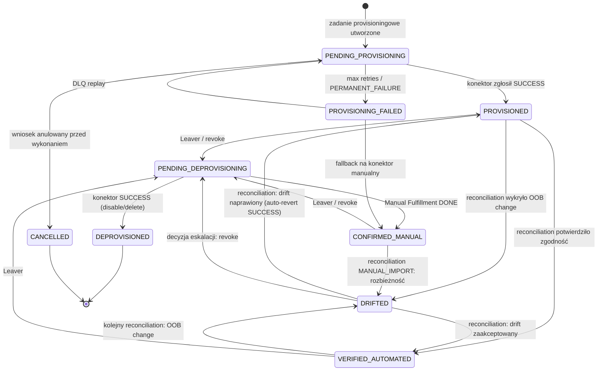

# 9. Decyzje Architektoniczne, Kompromisy i Alternatywy

## 9.1 ADR-01 — Eventual Consistency w provisioningu asynchronicznym

**Kontekst**: Provisioning do systemów docelowych przez kolejkę Outbox + workery jest z natury asynchroniczny. Między wysłaniem zadania a jego wykonaniem istnieje okno, w którym stan IGA i stan systemu docelowego są rozbieżne. To okno musi być obserwowalne i mierzalne, aby nie było "cichą" rozbieżnością.

**Decyzja**: Explicit state machine dla każdego konta (`account.state`) z pełną semantyką każdego stanu. Brak `boolean is_provisioned` — zastąpiony automaem.

**Model stanów konta** (Account State Machine):



Kluczowe rozróżnienia:
- `VERIFIED_AUTOMATED`: reconciliation automatycznie potwierdził stan. Gwarancja: IGA → system docelowy spójne.
- `CONFIRMED_MANUAL`: realizator ręcznie oznaczył `DONE`. Brak automatycznej weryfikacji — stan oznaczony w raportach jako "manual trust".
- `DRIFTED`: wykryta rozbieżność. Stan przejściowy — prowadzi do akcji (revert / akceptacja / eskalacja).

**Konsekwencje**:
- Każde zapytanie o efektywne uprawnienia tożsamości musi uwzględniać konta w `PENDING_*` jako "w trakcie" (nie jako "przyznane").
- SoD preventive check operuje na zbiorze `current ∪ pending ∪ requested` — nie tylko na `PROVISIONED`.
- Okno rozbieżności dla klasy A (krytyczne systemy): p95 < 120 s (SLO-04) dla Leaver emergency.

**Odrzucone alternatywy**:
- **Synchroniczny provisioning**: Zablokowanie transakcji biznesowej do czasu odpowiedzi systemu docelowego. Odrzucone: latencja 0.5–30 s na konektor, brak izolacji awarii (timeout jednego systemu blokuje Joinera), niemożliwe dla manual fulfillment.
- **Saga z synchroniczną weryfikacją**: 2-Phase Commit między IGA a systemem docelowym. Odrzucone: systemy docelowe nie implementują protokołu; XA transactions niedostępne przez konektor.

---

## 9.2 ADR-02 — Natywny silnik SoD vs Open Policy Agent

Szczegółowa analiza porównawcza w sekcji 6.5. Poniżej formalna dokumentacja ADR.

**Kontekst**: System musi ewaluować reguły Separation of Duties (6 rodzajów, sekcja 6.1.1) w czasie rzeczywistym (SLO-01: p95 < 5 ms dla koszyka ≤ 10 pozycji). Reguły zmieniają się przez workflow (nie przy każdym deploymencie). Audytorzy SOX muszą czytać reguły bez znajomości języka programowania.

**Decyzja**: natywny silnik bitsetowy w Pythonie (ADR-02, szczegóły w 6.4). OPA dozwolony opcjonalnie dla autoryzacji API administracyjnego.

**Konsekwencje**: ~1 500 LOC kompilatora + ewaluatora do utrzymania; pełna kontrola nad optymalizacją; brak zależności zewnętrznego procesu runtime w ścieżce krytycznej.

**Odrzucone alternatywy**:
- **OPA/Rego (sidecar)**: latencja 6–15 ms (przekracza SLO-01); Rego nie ma natywnych bitsetów; nocny przebieg 100k tożsamości: ~90–180 min vs ~8 min natywnie; audytorzy muszą znać Rego. Zachowane dla: autoryzacji API IGA (scope-based RBAC).
- **XACML**: XML-heavy, brak implementacji Pythona o odpowiedniej wydajności; model zarządzania politykami skomplikowany.
- **Regula/OpenFGA (graf)**: dobre dla relacyjnych modeli dostępu (Zanzibar); słabe dla macierzy SoD z wildcardami namespace.

---

## 9.3 ADR-03 — Wybór biblioteki UI: NiceGUI

**Kontekst**: wymaganie to pure Python (bez pisanego ręcznie JavaScript/HTML/CSS). Dostępne opcje Python → Browser:
- **NiceGUI**: FastAPI + Svelte under the hood; komponenty Python; `ui.mermaid()` wbudowany.
- **Streamlit**: reaktywna przebudowa całej strony przy każdym widgecie; nie nadaje się do złożonych wielozakładkowych UI.
- **Dash (Plotly)**: React pod spodem; dobry do wizualizacji danych; callback-hell przy złożonym state.
- **Panel (HoloViews)**: dobry do dashboardów analitycznych; trudniejszy w złożonych formach i akceptacji.
- **Gradio**: przeznaczony do ML demo; nie do aplikacji klasy enterprise.

**Decyzja**: NiceGUI.

**Uzasadnienie**:
1. `ui.mermaid()` — wymaganie renderowania diagramów SDD z kodu Python, bez osobnej integracji.
2. Komponentowy model (card, table, dialog, tabs) bliski temu, czego wymaga IGA UI.
3. FastAPI pod spodem pozwala na budowę REST API dla konektorów i agentów w tym samym procesie.
4. Reaktywność oparta o WebSockets (`ui.update()`) — odpowiednia dla live queue monitoring.
5. Nie wymaga Node.js w toolchainie (wymaganie twarde).

**Ograniczenia NiceGUI**:
- Heatmapa User×Entitlement dla 1000×1000 musi być generowana server-side jako SVG/Canvas i serwowana jako obraz, nie jako interaktywny JS widget.
- Brak wbudowanego komponentu tabelarycznego z virtualizing dla 100k wierszy — wymaga paginacji server-side.
- Testowanie UI wymaga headless browser (playwright), bo rendering jest client-side Svelte.

**Alternatywa utrzymana**: Streamlit jest dopuszczony wyłącznie dla standalone raportów analitycznych (np. mining report exportowany jako aplikacja).

---

## 9.4 ADR-04 — Transactional Outbox i abstrakcja brokera

**Kontekst**: zdarzenia domenowe (role nadane, wniosek zatwierdzony) muszą być niezawodnie dostarczane do innych komponentów. Bezpośrednie `publish()` do Kafka w transakcji biznesowej prowadzi do: (a) zdarzenia opublikowanego, transakcja wycofana → zdarzenie bez skutku biznesowego; (b) transakcja zatwierdzona, Kafka niedostępna → zdarzenie zgubione.

**Decyzja**: Transactional Outbox Pattern. Zdarzenia zapisywane do tabeli `outbox_event` w tej samej transakcji co zmiana biznesowa. Osobny Outbox Relay daemon czyta i publikuje do brokera.

```python
class MessageBroker(Protocol):
    """Abstrakcja brokera — pozwala na podmianę Kafka ↔ RabbitMQ ↔ in-process."""
    async def publish(self, topic: str, key: bytes, value: bytes, headers: dict[str, bytes]) -> None: ...
    async def close(self) -> None: ...

class InProcessBroker(MessageBroker):
    """Prototyp: asyncio.Queue per topic. Zero zewnętrznych zależności."""
    ...

class KafkaBroker(MessageBroker):
    """Produkcja: aiokafka, SASL/mTLS, idempotent producer."""
    ...

class RabbitMQBroker(MessageBroker):
    """Alternatywa: aio-pika, quorum queues, publisher confirms."""
    ...
```

Outbox Relay: `SELECT ... FOR UPDATE SKIP LOCKED LIMIT 1000` → `broker.publish()` → `UPDATE outbox_event SET published_at=now()`. Gwarancja at-least-once delivery. Idempotency key w nagłówku zapewnia, że konsument może bezpiecznie zdeduplikować powtórkę.

**Konsekwencje**:
- Latencja publikacji: p99 < 2 s (SLO-11). W zamian: gwarancja niezawodności niedostępna przy direct publish.
- Tabela `outbox_event` musi być monitorowana (wzrost bez przetwarzania = alarm).

**Podmiana w produkcji**: wystarczy zaimplementować `KafkaBroker(MessageBroker)` i zmienić konfigurację wstrzyknięcia zależności (factory w `settings.py`). Cały kod biznesowy pozostaje bez zmian.

---

## 9.5 ADR-05 — Algorytmy Role Mining: Uzasadnienie Ensemble + Kaskady

### 9.5.1 Dlaczego ensemble + kaskada, a nie jeden algorytm

Żaden pojedynczy algorytm role mining nie jest optymalny we wszystkich przypadkach:

| Scenariusz danych | Optymalny miner | Problemy innych |
|---|---|---|
| Wyraźna struktura działowa, dobre atrybuty HR | M1 | M2/M3 ignorują atrybuty; M4 za powolny dla n>50 |
| Brak atrybutów, wyraźne wzorce uprawnień, n≥20 | M2 | M1 bez atrybutów nic nie znajdzie |
| Małe grupy (2–10 osób), różnorodne uprawnienia | M4 + M6 | M2 bez wzorców; M3 degeneruje do singletons |
| 1–2 osoby z unikalnymi uprawnieniami | M10 | Wszystkie inne: brak wspólnych zbiorów |
| Uprawnienia bez wspólnych użytkowników, dobra semantyka nazw | M8 | M2/M3: brak przecięcia = brak wyniku |
| Zaszumione dane (błędne przydziały, tymczasowe dostępy) | M9 | M2/M4: surowe dane, bez tolerancji szumu |

Ensemble łączy wyniki wielu minerów i korzysta z ich komplementarnych mocnych stron. Consensus_score jest naturalną miarą wiarygodności: kandydat znaleziony przez M1 **i** M2 **i** M3 jest wiarygodniejszy niż znaleziony tylko przez M10 fallback.

Kaskada jest konieczna, bo profile danych w organizacjach są skrajnie różne: ensemble na domyślnych parametrach może zwrócić 0 kandydatów dla małych lub unikalnych zbiorów. Kaskada gwarantuje, że wynik zawsze istnieje (zasada 9.1.1 SDD), a `relaxation_trace` komunikuje użytkownikowi, ile rozluźnienia było konieczne.

### 9.5.2 Ryzyka miningu na małej próbie

**Overfitting ról do próby**: przy n < 10 użytkowników każdy znaleziony kandydat może odzwierciedlać indywidualne decyzje administracyjne, a nie powtarzalny wzorzec biznesowy. Mitygacja: `confidence=LOW` dla kandydatów znalezionych tylko przez M4/M6/M10 przy n < 10; automatyczne ostrzeżenie w UI.

**Role 1-osobowe (EXCEPTION)**: statystycznie nieistotne jako wzorzec, ale mogą wskazywać na nadmiarowe uprawnienia (kandydat do odebrania) lub na osobę pełniącą unikalną funkcję (kandydat do udokumentowania wyjątku). Mitygacja: `auto_promote_forbidden=true`, rationale = "Rola jednoosobowa: rozważ odebranie nadmiarowych uprawnień zamiast tworzenia roli".

**Wnioskowanie z przypadku (spurious correlation)**: przy n < 5 dwa użytkownicy mogą mieć 10 wspólnych uprawnień wyłącznie przez zbieg okoliczności (obaj są w projekcie cross-departmentowym). Mitygacja: `dept_entropy` — niska entropia (wszyscy z tego samego działu) podnosi confidence; wysoka entropia przy małej grupie obniża.

**Psucie przez outliery historyczne**: były pracownik z nagromadzonymi dostępami może zniszczyć wzorzec klastra. Mitygacja: M3 używa complete-linkage (outliery odpadają przy przycięciu dendrogramu); M2 wymaga `min_support >= 2` (singleton entitlement ignorowany); konta `TERMINATED` opcjonalnie wykluczone ze scope (konfigurowalne).

**Eksplozja liczby kandydatów (role explosion)**: przy zbyt niskim progu support lub Jaccard możliwa lawina kandydatów EXCEPTION i RESIDUAL. Mitygacja: `max_candidates` per miner; `role_explosion_alert` gdy liczba kandydatów > 10 × n_users; widok trend liczby kandydatów per przebieg.

### 9.5.3 Analiza per-algorytm (tabela)

| Miner | Złożoność | Założenia | Tryby awarii | Min. próba | Uzasadnienie |
|---|---|---|---|---|---|
| M1 | O(A×V×n×M/64) gdzie A=atrybuty, V=wartości | Atrybuty HR proksują role biznesowe; przydziały homogeniczne w grupie | Kardynalność ≈ n → 0 kandydatów; >30% braków → bias | 20/grupę | Jedyna metoda ABAC; niezbędna dla SOX birthright |
| M2 | O(frequent_sets × n/64) w praktyce; O(2^M) worst | Uprawnienia korelują; wzorce powtarzalne | Gęste macierze → explosion; sparse → 0 wzorców | 10 | Wyczerpujący dla wzorców bottom-up; brak redundancji (closed sets) |
| M3 | O(n²×M/64) + O(n² log n) | Jaccard mierzy podobieństwo funkcji | 1 megaklaster przy niskim progu; n>500: przybliżony | 20 par | Odkrywa role z partial overlap; outliery naturalne |
| M4 | O(2^min(n,M)) | Każdy maksymalny bitmask jest rolą | Eksplozja dla n>50 bez limitu | 2–100 | Matematycznie wyczerpujący; deterministyczny; audytowalny |
| M5 | O(iter × n × M/64) | Przydziały obecne = docelowe; minimalizacja liczby ról | Lokalny optimum (greedy) | 1 | Jedyny z jawnym kryterium optymalizacji; redukcja direct assignments |
| M6 | O(E × token_depth) | Namespace ma znaczenie biznesowe | Brak struktury → singletons | 1 | Efektywny dla izolowanych uprawnień; fallback dla bardzo małych grup |
| M7 | O(n²×(attrs+M/64)) | Atrybuty + uprawnienia razem kodują rolę | k za duże → puste przecięcia | k+1 | Hybrydowy HR + uprawnienia; dobry dla zaszumionych danych |
| M8 | O(E²×tokens) | Semantyka nazwy odzwierciedla funkcję | Kryptyczne nazwy → brak | 0 (działa bez użytkowników) | Jedyna metoda dla uprawnień bez wspólnych użytkowników |
| M9 | O(iter × n × k × M/64) | Macierz ma ukryte role z szumem | Lokalny optimum; wolna przy dużych k | 2×k | Tolerancja szumu; nakładające się role |
| M10 | O(n × apps) | Brak | Tylko pusta macierz | 1 | Gwarancja wyniku; zawsze last resort |

---

## 9.6 ADR-06 — Persystencja: SQLite (prototyp) vs PostgreSQL (produkcja)

**Kontekst**: prototyp musi być uruchamialny lokalnie bez infrastruktury. Produkcja wymaga PostgreSQL z Patroni HA.

**Decyzja**: SQLAlchemy 2.x z dialektem SQLite dla prototypu i PostgreSQL dla produkcji. Kod modelu danych jest identyczny. Zakazy specyficzne dla SQLite w schema:
- Brak `CREATE INDEX CONCURRENTLY` (SQLite nie obsługuje) → odpowiednik w migracji Alembic z `--op-class=concurrent` tylko w PostgreSQL.
- Brak `FOR UPDATE SKIP LOCKED` w SQLite → zastąpione przez `SELECT ... LIMIT N` z advisory locking (SQLite exclusive lock per file; dla prototypu akceptowalne, nie dla produkcji).
- Brak partycjonowania zakresowego (SQLite nie obsługuje PARTITION BY) → modele logiczne są gotowe, partycjonowanie aktywowane w Alembic migration z wykrywaniem dialektu.
- JSON operators (`->>` w PostgreSQL) zastąpione przez `json_extract()` (SQLite) przez abstrakcję w SQLAlchemy.

**Konsekwencje dla prototypu**: brak równoległości (plik SQLite z WAL mode), brak `SKIP LOCKED` (atrap idempotentna blokada per-worker lokiem w pamięci), brak partycjonowania (cały audit_log w jednej tabeli, reset co uruchomienie). Prototyp celowo nie obsługuje równoległych workerów — jeden wątek asyncio.

---

## 9.7 ADR-07 — Kolejka in-process (prototyp) vs Kafka/RabbitMQ (produkcja)

**Kontekst**: Kafka wymaga klastra ZooKeeper/KRaft + brokerów; nie do uruchomienia lokalnie bez Dockera.

**Decyzja**: `InProcessBroker` dla prototypu — `asyncio.Queue` per topic, w tym samym procesie. Podmiana na `KafkaBroker` przez zmianę jednego klucza w konfiguracji.

**Implikacje prototypu**: zdarzenia znikają po restarcie procesu (brak persistencji brokera); brak gwarancji at-least-once (przy crashu zadanie z Outbox jest wznawiane przez Relay). Dla demonstracji wszystkich scenariuszy S1–S12 jest wystarczające.

**Podmiana produkcyjna**:
```python
# settings.py (prototyp)
MESSAGE_BROKER_CLASS = "ic_iga.infra.broker.InProcessBroker"

# settings.py (produkcja)
MESSAGE_BROKER_CLASS = "ic_iga.infra.broker.KafkaBroker"
KAFKA_BOOTSTRAP_SERVERS = "kafka-1:9093,kafka-2:9093,kafka-3:9093"
KAFKA_SECURITY_PROTOCOL = "SASL_SSL"
```

---

## 9.8 ADR-08 — Skalowanie do 100 000 tożsamości: indeksy, partycjonowanie, sizing

**Wolumetria docelowa**:

| Tabela | Wiersze (docelowo) | Wzrost | Partycjonowanie |
|---|---|---|---|
| `identity` | 100 000 | ~10k/rok | Brak (mała) |
| `account` | 1 500 000 | ~150k/rok | Brak (średnia) |
| `entitlement_assignment` (bieżące) | 5 000 000 | ~500k/rok | Brak |
| `entitlement_assignment_history` | 50 000 000 / 5 lat | 10M/rok | RANGE po `valid_from` (miesięczne) |
| `audit_event` | 500 000 000 / 5 lat | 100M/rok | RANGE po `occurred_at` (miesięczne) |
| `audit_block` | 500 000 / 5 lat | 100k/rok | Brak |
| `provisioning_task` | 10 000 000 (TTL 2 lata) | 5M/rok | RANGE po `created_at` (kwartalne), archiwizacja po zamknięciu |
| `outbox_event` | ~1 000 aktywnych | — | Brak (wysoka rotacja) |
| `certification_item` | 50 000 000 / 5 lat | 10M/rok | RANGE po `campaign_id` lub `created_at` |

**Kluczowe indeksy**:

```sql
-- Hot path: ocena SoD (current entitlements for identity)
CREATE INDEX idx_ent_asn_identity_active
    ON entitlement_assignment(identity_id)
    WHERE state = 'ACTIVE' AND (valid_to IS NULL OR valid_to > now());

-- Outbox Relay: FOR UPDATE SKIP LOCKED
CREATE INDEX idx_outbox_unpublished
    ON outbox_event(created_at)
    WHERE published_at IS NULL;

-- Provisioning queue worker
CREATE INDEX idx_prov_task_queue
    ON provisioning_task(application_id, priority DESC, next_attempt_at)
    WHERE state IN ('QUEUED', 'RETRY_WAIT');

-- Audit chain verification
CREATE INDEX idx_audit_event_block ON audit_event(block_no, sequence_no);
CREATE INDEX idx_audit_event_correlation ON audit_event(correlation_id);

-- Reconciliation diff (FULL OUTER JOIN)
CREATE INDEX idx_account_app_native ON account(application_id, native_id);

-- Mining: pseudonymized exports
CREATE INDEX idx_ent_asn_identity_ent ON entitlement_assignment(identity_id, entitlement_id)
    WHERE state = 'ACTIVE';
```

**Sizing (produkcja)**:

| Komponent | Minimalne | Zalecane (100k tożsamości) |
|---|---|---|
| PostgreSQL primary | 16 vCPU, 128 GB RAM, 4 TB NVMe | 32 vCPU, 256 GB RAM, 8 TB NVMe SSD |
| PostgreSQL replika (×2) | 16 vCPU, 64 GB RAM | 32 vCPU, 128 GB RAM |
| API/Governance workers (×N) | 4 vCPU, 8 GB RAM per instancja | 8–16 instancji 8 vCPU 16 GB |
| Kafka brokerzy (×5) | 8 vCPU, 32 GB RAM, 2 TB | 16 vCPU, 64 GB RAM, 4 TB |
| Mining Engine | 32 vCPU, 256 GB RAM (dla 100k × 450k) | 64 vCPU, 512 GB RAM na czas jobu |
| MinIO Object Storage | 2 węzły, 50 TB | 4 węzły, 200 TB (7-letnia retencja) |
| Vault + HSM | FIPS 140-2 Level 3 HSM | Luna Network HSM lub Thales payShield |
